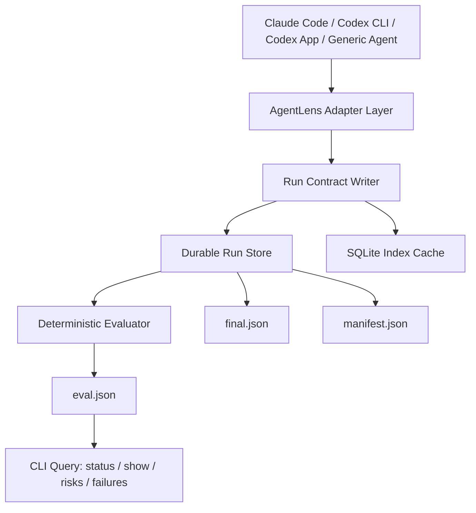

# AgentLens v0 아키텍처 제안서

> AgentLens는 Claude, Codex, 그리고 기타 AI agent 실행을 로컬에 증거로 남기고, 종료 후 결정적 평가를 수행해 리스크와 결함을 사람에게 검토 가능한 형태로 남기는 local-first run evidence system이다.

---

## 0. 요약

AgentLens v0의 목표는 기존 로그를 가져와 분석하는 범용 importer가 아니다. 목표는 앞으로 실행되는 AI agent 작업이 공통 계약을 따라 기록되도록 만들고, 작업 종료 후 다음 파일이 로컬 durable store에 남도록 하는 것이다.

```text
final.json      agent가 주장한 작업 결과, 검증, 남은 리스크
eval.json       AgentLens가 evidence 기반으로 판단한 결과
manifest.json   run artifact 목록, hash, redaction, seal 정보
events.jsonl    실행 중 발생한 최소 이벤트 타임라인
run.json        run 메타데이터
artifacts/      선택적으로 첨부된 증거 파일
```

핵심 방향은 다음이다.

1. **기존 로그는 v0에서 지원하지 않는다.**
2. **Dashboard, MCP, patch queue는 v0 이후로 미룬다.**
3. **SQLite는 source of truth가 아니라 metadata/index/query cache로만 쓴다.**
4. **실제 원본 artifact는 `~/.agentlens/runs/<workspace_id>/<run_id>/`에 durable하게 남긴다.**
5. **Claude Code, Codex CLI, Codex App 통합은 처음부터 고려한다.**
6. **AgentLens가 실패해도 Claude/Codex 작업은 막지 않는다.**
7. **사용자는 쉽게 켜고 끌 수 있어야 한다.**

---

## 1. 문제 정의

현재 `kws-codex-plan-executor`와 `kws-claude-multi-agent-executor`는 실행, 상태 관리, 로깅, 학습, 평가 책임이 한 스킬 안에 섞여 있다.

이 구조의 문제는 다음이다.

- Claude와 Codex 실행 결과를 같은 기준으로 비교하기 어렵다.
- agent가 “성공”이라고 주장한 작업이 실제로 성공했는지 검증하기 어렵다.
- 사용자가 작업 종료 후 리스크, 결함, 잘못 수행된 부분을 다시 찾기 어렵다.
- workspace가 삭제되면 workspace-local 로그도 같이 사라질 수 있다.
- 각 스킬마다 logging/eval/learning 규칙이 중복된다.
- Codex App, Codex CLI, Claude Code가 제공하는 이벤트 표면이 서로 달라 통합 방식이 파편화된다.

따라서 AgentLens는 스킬 내부 로깅을 대체하는 별도 local-first 도구로 분리한다.

---

## 2. 제품 정의

AgentLens v0는 다음을 수행한다.

```text
AI agent 실행 시작
  ↓
최소 이벤트와 checkpoint 기록
  ↓
agent final claim 수집
  ↓
artifact manifest seal
  ↓
deterministic evaluator 실행
  ↓
final/eval/manifest를 durable store에 보존
  ↓
CLI로 최근 run, 실패, 리스크 조회
```

### 2.1 AgentLens v0가 하는 것

- 새로 실행되는 agent run 기록
- durable user-local artifact 보존
- workspace에는 pointer/config만 남김
- deterministic evaluator로 run 성공/실패 판정
- agent가 남긴 residual risk와 evaluator가 찾은 defect를 분리 저장
- Claude Code, Codex CLI, Codex App, generic CLI workflow 통합 기반 제공
- 쉬운 on/off, minimal/full 모드 제공

### 2.2 AgentLens v0가 하지 않는 것

- 기존 Claude/Codex 과거 로그 importer
- live dashboard
- MCP lesson API
- 자동 patch queue
- LLM judge 기반 품질 평가
- cloud sync
- OpenTelemetry/Langfuse/Phoenix 같은 외부 observability 백엔드
- 스킬 자동 수정

이 항목들은 v0 이후 단계로 미룬다.

---

## 3. 전체 아키텍처



### 3.1 Core와 Adapter 분리

AgentLens는 두 부분으로 나눈다.

```text
AgentLens Core
  - CLI
  - durable run store
  - JSON schema validation
  - manifest seal/hash
  - deterministic evaluator
  - SQLite index cache
  - retention/redaction

AgentLens Adapters
  - CLI process shim
  - Claude Code plugin/hooks adapter
  - Codex CLI adapter
  - Codex App app-server/session watcher adapter
  - generic run contract adapter
```

Core는 안정적인 계약을 제공하고, Adapter는 각 agent runtime의 차이를 흡수한다.

---

## 4. Source of Truth와 저장 구조

workspace 아래 `.agentlens/`를 source of truth로 삼으면 workspace 삭제 시 기록이 사라진다. 따라서 v0의 canonical artifact는 user-local durable store에 둔다.

```text
~/.agentlens/
  agentlens.sqlite
  config.yaml
  runs/
    <workspace_id>/
      <run_id>/
        run.json
        events.jsonl
        final.json
        eval.json
        manifest.json
        artifacts/

<workspace>/
  .agentlens/
    config.yaml
    current-run
    runs/
      <run_id>.json
```

### 4.1 Durable store

`~/.agentlens/runs/<workspace_id>/<run_id>/`가 source of truth다.

여기에는 종료 후에도 다음 파일이 남는다.

- `run.json`: 실행 메타데이터
- `events.jsonl`: 실행 중 기록된 이벤트
- `final.json`: agent가 주장한 결과, 검증, 리스크
- `eval.json`: AgentLens evaluator가 판단한 결과
- `manifest.json`: artifact hash, redaction, seal 정보 (eval 이후 re-seal됨, §5 참조)
- `artifacts/`: 첨부 증거 파일

### 4.2 Workspace pointer

workspace의 `.agentlens/`는 가볍게 유지한다.

- workspace별 config
- 현재 활성 run 디렉터리 `current-runs/<run_id>` (동시 다중 run 허용, §4.5)
- run summary pointer

workspace-local 파일은 삭제되어도 canonical run artifact가 손상되지 않아야 한다.

### 4.3 SQLite 역할

SQLite는 다음 용도에만 사용한다.

- run 목록 조회
- 최신 run 조회
- status/failure/risk 검색
- workspace_id와 run_id index
- retention 후보 acceleration (canonical retention은 durable store full-scan)

SQLite에만 있고 JSON artifact에 없는 정보는 만들지 않는다. SQLite가 깨져도 `~/.agentlens/runs/...`를 재스캔해서 재생성할 수 있어야 한다. GC 동작은 SQLite 부재 시에도 동작 가능해야 한다 (full-scan fallback).

### 4.4 `workspace_id` 결정 규칙

`workspace_id`는 동일 워크스페이스에 대한 stable identity여야 한다. v0 규칙:

```text
1. git remote URL 존재 시
   workspace_id = sha256("git:" + remote_url_normalized + ":" + repo_root_relative_path)
   - remote_url_normalized: scheme, trailing .git, trailing / 제거 후 소문자화
   - repo_root_relative_path: git toplevel으로부터 workspace root까지의 상대경로
     (worktree나 sub-checkout 구분용)

2. git remote 없음 또는 git 외부
   workspace_id = sha256("path:" + host_id + ":" + canonical_path_hash)
   - host_id: machine-id 또는 hostname hash (sticky local identity)
   - canonical_path_hash: realpath(workspace_root) hash
```

이 규칙은 다음을 보장한다.

- 같은 remote의 main checkout과 worktree는 서로 다른 id를 갖는다
- 단순 `mv`로 디렉터리만 이동해도 git 기반이면 id가 유지된다
- 두 호스트의 같은 경로는 서로 다른 id를 갖는다

`run.json.workspace`에는 `id_basis: "git" | "path"`를 함께 기록해 향후 재계산 가능하게 한다.

### 4.5 동시성

같은 워크스페이스에서 두 개 이상의 agent run이 동시에 진행될 수 있다 (예: 두 Claude 세션, plan-executor의 병렬 sub-flow).

원칙:

- `<workspace>/.agentlens/current-run` 단일 파일 대신 `current-runs/<run_id>` 디렉터리 마커를 사용한다
- 각 run 디렉터리의 `events.jsonl` 쓰기는 OS-level advisory lock (fcntl/flock)으로 보호한다
- 한 run이 다른 run의 디렉터리에 쓰지 않는다 (run_id가 namespace를 격리한다)
- nested run (자식 agent가 또 다른 agent를 spawn)은 `parent_run_id` 필드로 표현한다

---

## 5. Run Lifecycle

v0 lifecycle은 단순해야 한다.

```text
1. start
   - run_id 생성
   - workspace_id 계산
   - run.json 생성
   - events.jsonl 생성

2. record
   - command/task/checkpoint/artifact 이벤트 append
   - full transcript가 아니라 redacted excerpt 중심

3. final | cancel | abort
   - final: agent outcome / changed_files / verification / residual_risks 기록
   - cancel: SIGINT/SIGTERM 또는 사용자 명시 취소 시
              agent_outcome=cancelled, exit_signal, partial state 기록
   - abort: 정상 final도 cancel도 없이 프로세스 종료 시
              wrapper가 agent_outcome=unknown으로 자동 작성

4. pre-seal
   - run.json, events.jsonl, final.json, artifacts/** hash 계산
   - manifest.json 작성 (sealed_phase: "pre_eval")

5. eval
   - deterministic checks 실행
   - eval.json 작성

6. final-seal
   - eval.json 포함 모든 파일 hash 재계산
   - manifest.json 갱신 (sealed_phase: "final", sealed_at 갱신)
   - 이 단계 실패 시 eval.json은 보존되며 manifest는 pre_eval 상태로 남는다

7. index
   - SQLite metadata 업데이트 (실패 무시, full-scan rebuild 가능)
```

원칙:

- 모든 시간은 UTC ISO8601 + `Z` 표기로 직렬화한다 (스키마 regex로 강제)
- 단계 5/6/7 실패는 agent process exit code에 영향을 주지 않는다 (§11.3)
- 단계 4와 6은 같은 manifest 파일을 사용하되 `sealed_phase` 필드로 구분한다

---

## 6. Minimal Run Contract

AgentLens v0에서 최소 contract는 다섯 파일이다.

```text
run.json
events.jsonl
final.json
eval.json
manifest.json
```

### 6.1 `run.json`

```json
{
  "schema": "agentlens.run.v1",
  "run_id": "run_20260518_001",
  "workspace_id": "ws_abc123",
  "parent_run_id": null,
  "started_at": "2026-05-18T06:00:00Z",
  "agent": {
    "name": "codex_app",
    "mode": "app",
    "version": "0.129.0"
  },
  "workspace": {
    "root_label": "Archive",
    "root_hash": "sha256:...",
    "id_basis": "git",
    "git_remote_hash": "sha256:...",
    "git_branch": "main",
    "commit_before": "abc123"
  },
  "input": {
    "kind": "user_task",
    "summary": "Implement feature X",
    "hash": "sha256:..."
  },
  "recording": {
    "mode": "minimal",
    "adapter": "codex_app_watcher"
  }
}
```

Enum 제약:

- `agent.name`: `claude_code | codex_cli | codex_app | generic`
- `agent.mode`: `cli | app | code | unknown`
- `workspace.id_basis`: `git | path`
- `recording.mode`: `minimal | full` (run 도중 변경 불가, immutable)
- `parent_run_id`: nested run에서만 채워지며 그 외는 `null`

기본값에서는 absolute path를 저장하지 않는다. 필요하면 volatile local cache에만 둘 수 있다.

### 6.2 `events.jsonl`

각 줄은 독립 JSON event다.

```json
{"schema":"agentlens.event.v1","event_id":"evt_001","run_id":"run_20260518_001","ts":"2026-05-18T06:00:01Z","type":"run.started","payload":{}}
{"schema":"agentlens.event.v1","event_id":"evt_002","run_id":"run_20260518_001","ts":"2026-05-18T06:02:10Z","type":"command.finished","payload":{"command_hash":"sha256:...","exit_code":0,"duration_ms":1830}}
```

v0 event type은 아래로 제한한다.

```text
run.started
checkpoint.marked
command.started
command.finished
artifact.attached
task.started
task.finished
failure.observed
run.finalized
```

### 6.3 `final.json`

`final.json`은 agent가 주장한 결과다. AgentLens가 이를 그대로 믿지는 않는다.

```json
{
  "schema": "agentlens.final.v1",
  "run_id": "run_20260518_001",
  "ended_at": "2026-05-18T06:30:00Z",
  "agent_outcome": "success",
  "summary": "Implemented feature X and added tests.",
  "changed_files": [
    {"path_hash": "sha256:...", "path_label": "src/example.ts"}
  ],
  "verification": [
    {
      "kind": "command",
      "command_hash": "sha256:...",
      "status": "passed",
      "excerpt": "12 passed"
    }
  ],
  "residual_risks": [
    {
      "severity": "medium",
      "summary": "Manual QA not performed in browser."
    }
  ]
}
```

### 6.4 `eval.json`

`eval.json`은 AgentLens가 evidence 기반으로 판단한 결과다. 성공/실패 조회에서는 `final.json`보다 `eval.json`을 우선한다.

```json
{
  "schema": "agentlens.eval.v1",
  "run_id": "run_20260518_001",
  "evaluated_at": "2026-05-18T06:30:05Z",
  "status": "failed",
  "agent_outcome": "success",
  "checks": [
    {"name": "schema_valid", "status": "passed"},
    {"name": "verification_present", "status": "passed"},
    {"name": "residual_risks_explicit", "status": "failed"}
  ],
  "failures": [
    {
      "category": "SUCCESS_WITH_RESIDUAL_RISK",
      "severity": "medium",
      "source": "evaluator",
      "summary": "Agent reported success while leaving a medium residual risk.",
      "evidence": ["final.json:residual_risks[0]"]
    }
  ]
}
```

### 6.5 `manifest.json`

```json
{
  "schema": "agentlens.manifest.v1",
  "run_id": "run_20260518_001",
  "sealed_at": "2026-05-18T06:30:08Z",
  "sealed": true,
  "sealed_phase": "final",
  "files": [
    {"path": "run.json", "sha256": "..."},
    {"path": "events.jsonl", "sha256": "..."},
    {"path": "final.json", "sha256": "..."},
    {"path": "eval.json", "sha256": "..."},
    {"path": "artifacts/test-output.txt", "sha256": "..."}
  ],
  "redaction": {
    "absolute_paths": "masked",
    "secret_like_values": "masked",
    "full_prompts": "not_stored",
    "full_command_output": "not_stored"
  }
}
```

`sealed_phase` enum: `pre_eval | final | recording_incomplete`.

- `pre_eval`: §5 단계 4 직후 — `eval.json`은 manifest에 없음
- `final`: §5 단계 6 완료 — `eval.json` 포함, 모든 hash 재계산
- `recording_incomplete`: agent process 중 wrapper crash 또는 disk error로 정상 봉인이 불가했음을 표시

---

## 7. 종료 후 남는 정보

Claude, Codex, 또는 다른 agent가 작업을 마무리하면 다음 정보가 durable store에 남아야 한다.

```text
final.json
  - agent가 말한 작업 요약
  - agent가 주장한 성공/실패
  - 변경 파일
  - 수행한 검증
  - agent가 인정한 residual risk

eval.json
  - AgentLens가 판단한 실제 상태
  - agent claim과 evidence의 불일치
  - 누락된 검증
  - 실패한 command를 무시했는지 여부
  - manifest/hash/schema 문제

events.jsonl
  - 실행 타임라인
  - command/task/checkpoint/failure 이벤트

manifest.json
  - artifact hash
  - seal 여부
  - redaction 정책
```

즉 사용자가 나중에 “그 작업에 리스크나 결함이 있었나?”를 물으면 `eval.json`과 `final.json`을 같이 보면 된다.

---

## 8. Deterministic Evaluator

v0에서는 LLM judge를 쓰지 않는다. 평가 기준은 결정적이고 재현 가능해야 한다.

### 8.1 상태

```text
passed       evidence 기준 통과
failed       evidence 기준 실패
incomplete   final 또는 핵심 evidence 누락
needs_eval   아직 eval.json이 없음
error        evaluator 자체 오류
```

### 8.2 필수 checks

```text
schema_valid
run_started
events_well_formed
final_present
agent_outcome_valid
verification_present
commands_resolved
failed_commands_acknowledged
changed_files_present_when_success
residual_risks_explicit
manifest_sealed
artifact_hashes_valid
```

### 8.3 판정 원칙

아래 경우는 agent가 `success`라고 말해도 실패 또는 incomplete로 본다.

- `final.json`이 없음
- `final.json` schema가 틀림
- 검증 evidence가 없음
- 실패한 command가 있는데 final에서 인정하지 않음
- success라고 했지만 changed file 정보가 없음
- residual risk가 있는데 success와 함께 명시적 설명이 없음
- manifest가 seal되지 않음
- artifact hash가 맞지 않음

---

## 9. Failure와 Risk Taxonomy

single enum으로 실패를 표현하면 나중에 분석이 막힌다. v0부터 multi-axis 모델을 쓴다.

```json
{
  "category": "MISSING_VERIFICATION_EVIDENCE",
  "severity": "high",
  "source": "evaluator",
  "blame_scope": "agent",
  "recoverability": "rerun_or_fix",
  "confidence": 0.92,
  "summary": "Agent claimed success without verification evidence.",
  "evidence": ["final.json:verification"]
}
```

### 9.1 Axis

```text
category
severity: low | medium | high | critical
source: agent_reported | evaluator | user_reported | imported
blame_scope: agent | project | environment | user | unknown
recoverability: informational | retry | rerun_or_fix | needs_user | non_recoverable
confidence
summary
evidence
```

### 9.2 Initial categories

```text
MISSING_FINAL
INVALID_FINAL_SCHEMA
MISSING_VERIFICATION_EVIDENCE
UNACKNOWLEDGED_FAILED_COMMAND
SUCCESS_WITH_RESIDUAL_RISK
ARTIFACT_HASH_MISMATCH
MANIFEST_NOT_SEALED
COMMAND_TIMEOUT
ENVIRONMENT_BLOCKER
DIFF_SCOPE_UNKNOWN
CHANGED_FILES_MISSING
AGENT_REPORTED_GAP
USER_CORRECTION
UNKNOWN
```

---

## 10. Security, Privacy, Retention

AgentLens는 작업 로그를 다루므로 v0부터 보안과 개인정보 보호가 필수 요구사항이다.

### 10.1 기본적으로 저장하지 않는 것

- absolute home path
- secret-like string
- API key, token, password, cookie, authorization header
- private key
- `sk-...` 형태 secret
- full prompt transcript
- full command output
- 대용량 file body

### 10.2 기본적으로 저장 가능한 것

- command argv hash (기본). full argv는 `mode=full` + redaction 통과 시 excerpt로만
- exit code
- duration
- 짧은 stdout/stderr excerpt — **allow-list 추출만**. 자유 텍스트 truncation 금지
- repo-relative path label (workspace root 기준). absolute path는 mask
- git branch
- git commit hash
- artifact hash
- final summary
- residual risk summary

`excerpt` 필드 정책:
- `max_chars`: 4096
- 추출 룰: pytest pass/fail count, exit code line, error type 한 줄 등 규칙으로 제한된 패턴만
- 자유 stdout 슬라이스 저장 금지 (mode=full에서도)

### 10.3 기본 retention

```yaml
retention:
  sealed_runs_days: 30
  large_artifacts_days: 7
  max_artifact_mb_per_run: 50
  max_total_store_gb: 5
  keep_eval_summaries: true

privacy:
  store_absolute_paths: false
  store_full_prompts: false
  store_full_command_output: false
```

`max_total_store_gb` 초과 시 GC는 oldest sealed run부터 artifact 우선 삭제, `eval.json`/`final.json`/`manifest.json` summary는 유지.

### 10.4 Shim 보안

CLI shim은 PATH 우선순위를 차지하므로 supply-chain 표면이 된다. v0 요구사항:

- shim 디렉터리 권한: `0700`, owner=current user
- shim 파일 권한: `0755`, owner=current user
- `agentlens install` 실행 시 PATH 변경에 대해 **명시 동의 prompt** (`--yes`로 우회 가능)
- `agentlens doctor` 매번 shim file hash 검증 후 불일치 시 경고
- shim은 실제 binary path를 `~/.agentlens/shims/<name>.real` lockfile에 기록하고 detect한 path가 바뀌면 재확인 요구

---

## 11. On/Off와 실행 모드

AgentLens는 간단한 작업이나 보안이 중요한 작업에서는 쉽게 꺼져야 한다.

### 11.1 Modes

```text
off
  - 기록하지 않음

minimal
  - 기본값
  - run/final/eval/manifest 중심
  - command output은 짧은 excerpt 또는 hash만 저장

full
  - 더 많은 command/artifact evidence 저장
  - workspace 또는 run 단위 opt-in
```

### 11.2 Priority

설정 우선순위는 다음이다.

```text
command flag
  > environment variable
  > workspace config
  > user config
  > default
```

`AGENTLENS_DISABLE=1`은 모든 설정을 덮어쓴다.

```bash
AGENTLENS_DISABLE=1 claude
AGENTLENS_MODE=off codex
AGENTLENS_MODE=minimal codex
AGENTLENS_MODE=full claude
```

### 11.3 Non-blocking 원칙

AgentLens 오류는 primary agent 작업을 실패시키면 안 된다.

```bash
if command -v agentlens >/dev/null 2>&1; then
  agentlens mark task.started --task-id task_1 || true
fi
```

AgentLens 기록 또는 평가가 실패하면 `eval.json`에 `recording_incomplete` 또는 `evaluator_error`로 남기고, 원래 agent 실행은 계속된다.

---

## 12. Integration Strategy

사용자는 `agentlens run -- ...`을 매번 직접 쓰고 싶어하지 않는다. 따라서 v0부터 install-once integration을 고려해야 한다.

### 12.1 Integration levels

```text
Level 0: off
  - AgentLens 비활성화

Level 1: process shim
  - 사용자가 claude/codex를 평소처럼 실행
  - shim이 run start/final/eval 처리

Level 2: native hooks/plugin
  - Claude Code plugin/hooks처럼 공식 lifecycle event 사용
  - task, command, tool, final 이벤트를 더 정확히 기록

Level 3: app protocol / watcher
  - Codex App처럼 stable hook이 부족한 경우
  - app-server protocol 또는 ~/.codex session watcher 사용
```

### 12.2 `agentlens install`

```bash
agentlens install
agentlens install auto
agentlens doctor integrations
```

`agentlens install`은 환경을 검사해서 가능한 최상위 integration을 설치한다.

예상 출력:

```text
Claude Code: full
Codex CLI: full
Codex App: native-experimental
Fallback watcher: available
```

### 12.3 CLI shim

shim은 사용자가 평소처럼 `claude` 또는 `codex`를 입력해도 AgentLens가 실행을 감쌀 수 있게 한다.

```text
~/.agentlens/shims/claude
~/.agentlens/shims/codex
```

동작 방식:

```text
1. PATH에서 shim이 먼저 실행됨
2. shim이 실제 claude/codex binary 위치를 찾음 (lockfile <name>.real로 고정)
3. AGENTLENS_RUN_ID가 이미 설정되어 있으면 (자식 agent가 또 agent를 부른 경우)
   3a. AGENTLENS_NESTED_POLICY=passthrough(기본): recording 없이 real binary로 exec
   3b. AGENTLENS_NESTED_POLICY=nested: parent_run_id=$AGENTLENS_RUN_ID로 새 run 시작
4. auth/login/update/plugin/mcp 같은 관리 명령은 pass-through
5. recording enabled면 agentlens start
6. AGENTLENS_RUN_ID, AGENTLENS_RUN_DIR 환경변수 설정
7. 실제 claude/codex 실행
8. SIGINT/SIGTERM trap → agentlens cancel --signal <name>
9. exit 후 final/seal/eval 시도
10. 원래 process exit code 반환 (signal 종료 시 128+signum)
```

shim 자체는 `AGENTLENS_RUN_ID`가 자기 PID에서 setup한 값이라는 표지를 두지 않으면 재진입을 구별할 수 없다. 이를 위해 shim이 만든 모든 환경변수는 lockfile에 매핑된 PID-stamp를 함께 갖는다.

### 12.4 Claude Code

Claude Code는 plugin/hooks 기반 full integration이 가능하다.

```text
Claude Code adapter
  - plugin install
  - hooks install
  - process shim fallback
  - --bare 등 hook/plugin 우회 모드에서는 minimal evidence만 기록
```

### 12.5 Codex CLI

Codex CLI는 process shim과 config 기반 integration을 기본으로 한다.

```text
Codex CLI adapter
  - shim
  - config probe
  - session file watcher where available
  - optional app-server protocol probe
```

### 12.6 Codex App

Codex App은 stable hook 기반 full integration을 전제로 잡으면 안 된다. 대신 다음 두 경로를 둔다.

```text
native-experimental
  - app-server protocol 기반 이벤트 관찰
  - 실험적 기능으로 표시

watcher-only
  - ~/.codex/sessions 또는 archived_sessions watcher
  - post-run/minimal evidence 중심
```

Codex App에 대해서는 “full 지원”이라고 약속하지 않고, `native-experimental` 또는 `watcher-only`로 명확히 표시한다.

---

## 13. CLI 설계

v0 CLI는 recording, evaluation, query, configuration에 집중한다.

```bash
# 설치와 진단
agentlens install
agentlens doctor integrations

# 켜기/끄기
agentlens on
agentlens off
agentlens mode minimal
agentlens mode full

# 명시적 실행 wrapper
agentlens run -- claude -p "$PROMPT"
agentlens run -- codex exec "$PROMPT"

# marker
agentlens start --agent codex --mode cli
agentlens mark task.started --task-id task_1
agentlens mark checkpoint.marked --name verification.started
agentlens attach --kind command-output --path /tmp/test-output.txt
agentlens final --outcome success

# 평가와 조회
agentlens eval --latest
agentlens status
agentlens latest
agentlens show --latest
agentlens failures
agentlens risks
agentlens gc

# 취소
agentlens cancel --run-id <id> --reason "user_abort"
```

조회 명령은 모두 `--format json` 표준 플래그를 지원한다. CI/스크립트는 JSON을 소비하고, 기본은 사람이 읽는 텍스트다. doctor 출력에도 `--format json`이 적용된다.

---

## 14. `kws-*` 스킬 통합 방향

기존 로그 importer는 v0에서 만들지 않는다. 대신 두 스킬은 앞으로 AgentLens contract를 얇게 호출하도록 바꾼다.

### 14.1 스킬 책임

```text
- 실행 계획 수행
- task lifecycle 의미를 mark
- 검증 evidence attach
- final summary 작성
- residual risk 명시
```

### 14.2 AgentLens 책임

```text
- 저장
- redaction
- manifest seal
- deterministic eval
- risk/failure classification
- query/index
```

### 14.3 스킬 안에 남길 최소 규칙

```markdown
## AgentLens integration

When AgentLens is available:
- start a root run at execution start
- mark task lifecycle checkpoints
- attach verification evidence
- emit final envelope before completion

When AgentLens is unavailable:
- continue execution
- emit final summary in stdout
```

---

## 15. v0 Roadmap

### Phase 0 - Contract Spec

- JSON schemas
- taxonomy
- redaction policy
- retention policy
- durable directory layout

### Phase 1 - CLI Recorder

- `agentlens start`
- `agentlens mark`
- `agentlens attach`
- `agentlens final`
- `agentlens seal`
- workspace pointer
- SQLite index

### Phase 2 - Deterministic Evaluator

- schema validation
- event validation
- command consistency
- final vs evidence consistency
- manifest hash/seal validation
- `eval.json` generation

### Phase 3 - Wrapper Integration

- `agentlens run -- <command>`
- stdout/stderr excerpt capture
- exit code and duration capture
- Claude/Codex/generic process adapter

### Phase 4 - Agent Workflow Integration

- Claude Code hooks/plugin
- Codex CLI shim/config
- Codex App app-server probe
- Codex App session watcher fallback
- `kws-*` skill marker integration

### Phase 5 - Summary/Query CLI

- `agentlens status`
- `agentlens latest`
- `agentlens show <run_id>`
- `agentlens failures`
- `agentlens risks`
- `agentlens gc`

---

## 16. Deferred Post-v0

다음은 의도적으로 v0에서 제외한다.

```text
Dashboard / Studio
MCP lesson/eval API
automatic patch queue
legacy log importer
LLM judge
cross-run lesson compiler
eval fixture generator
cloud sync
external observability exporter
```

이 항목들은 v0의 run contract와 durable store가 안정화된 뒤 추가한다.

---

## 17. 실현 가능성 메모

2026-05-18 기준 로컬 환경에서 확인한 결과:

```text
claude --version: 2.1.128 (Claude Code)
codex --version: codex-cli 0.129.0
```

### Claude Code

검증된 표면 (2026-05-18, `claude --help` 출력 기준):

```text
--include-hook-events            stream-json 출력 시 모든 hook lifecycle event 포함
--output-format stream-json      실시간 streaming JSON 출력 (--print 전용)
--input-format stream-json       실시간 streaming JSON 입력
--include-partial-messages       partial message chunk 스트림 (--print 전용)
--settings <file-or-json>        설정 JSON 주입 (hook 설치 진입점)
--setting-sources user|project|local
--bare                           hooks/LSP/plugin sync/skills 등 우회
-d --debug [filter]              "hooks" 카테고리 디버그 출력
```

결론:

- `claude --print --output-format stream-json --include-hook-events`는 hook lifecycle 이벤트를 실시간으로 외부 프로세스에 전달할 수 있다 → AgentLens adapter는 이 stream을 소비해 task/command/tool 이벤트를 정확히 기록할 수 있다.
- interactive 모드에서는 `--settings`로 PreToolUse/PostToolUse/SessionStart/SessionEnd hook을 등록해 AgentLens shim binary를 호출하게 한다.
- `--bare`는 hooks/plugins/skills/MCP discovery를 우회한다 → 이 모드에서는 process shim 기반 minimal evidence로 fallback한다.

따라서 Claude Code는 두 경로(stream-json subscription, settings hook injection)로 native lifecycle 이벤트 접근이 확인되어 plugin/hooks 기반 full integration이 현실적이다.

### Codex CLI

검증된 표면 (2026-05-18, `codex --help` 기준):

```text
Commands available:
  exec               Run Codex non-interactively
  review             Run a code review non-interactively
  mcp                Manage external MCP servers
  mcp-server         Start Codex as an MCP server (stdio)
  plugin             Manage Codex plugins
  app-server         [experimental] app server
  exec-server        [EXPERIMENTAL] standalone exec-server
  resume / fork      Resume/fork prior sessions
  apply              Apply latest agent diff
```

결론:

- `codex exec` non-interactive 경로는 process shim 기반 wrapping에 적합하다.
- `mcp-server` / `app-server`는 experimental 표시 → telemetry stable surface로 가정 금지.
- v0 primary는 process shim, secondary는 session file watcher (§4.1 `~/.codex/sessions`).

### Codex App

- `~/.codex/sessions`와 `~/.codex/archived_sessions`에 session JSONL이 존재한다 (Codex 0.129.0 기준 확인).
- `codex app-server --help`로 protocol 가용성 probe 가능하나 `[experimental]` 표시.
- 따라서 v0에서는 `native-experimental` 또는 `watcher-only`로 표시하는 것이 정확하다.
- session JSONL 포맷은 비공식이므로 fixture를 0.129.0에 pin하고 회귀 감지 테스트를 둔다.

---

## 18. 주요 리스크

### 18.1 Codex App integration 안정성

Codex App의 app-server protocol이 장기적으로 stable하다고 가정하면 위험하다. v0는 watcher fallback을 반드시 둬야 한다.

### 18.2 과도한 로그 수집

full transcript와 command output을 저장하면 보안 위험이 커진다. v0 기본값은 minimal이어야 한다.

### 18.3 SQLite source of truth 오해

SQLite가 canonical store가 되면 손상 복구가 어려워진다. JSON artifact를 canonical로 두고 SQLite는 재생성 가능한 index로 제한해야 한다.

### 18.4 agent success claim 신뢰

agent가 success라고 말한 것을 그대로 믿으면 AgentLens의 가치가 사라진다. `final.json`은 claim, `eval.json`은 judgment로 분리해야 한다.

### 18.5 너무 빠른 Dashboard/MCP/patch queue

core contract가 안정화되기 전에 UI나 patch automation을 만들면 제품 복잡도가 급격히 커진다. v0에서는 제외한다.

---

## 19. 최종 권장 판단

AgentLens v0는 “AI agent 실행 블랙박스”로 시작해야 한다.

가장 중요한 산출물은 화려한 dashboard가 아니라, 작업이 끝난 뒤에도 남는 아래 evidence set이다.

```text
~/.agentlens/runs/<workspace_id>/<run_id>/
  run.json
  events.jsonl
  final.json
  eval.json
  manifest.json
  artifacts/
```

최종 한 줄 아키텍처:

> AgentLens는 Claude/Codex/기타 agent 실행을 install-once adapter로 수집하고, durable local run contract로 보존한 뒤, deterministic evaluator로 agent claim과 evidence를 비교해 리스크와 결함을 남기는 local-first run evidence system이다.

