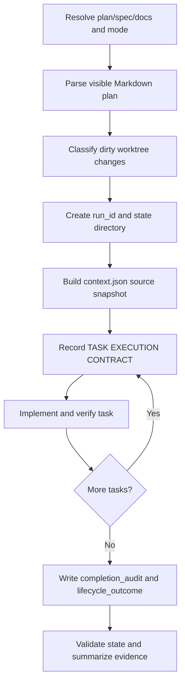

# kws-codex-plan-executor

`kws-codex-plan-executor` executes an implementation plan in Codex, or exports a
fresh-session/handoff prompt from the same source files.

This README is an index for maintainers and future agents. Runtime instructions
remain in [SKILL.md](SKILL.md); detailed contracts are split by topic so agents
can load only the context they need.

## Current Contract

- Skill version: `1.5.0`
- Package version: `kws-skills` `2.13.0`
- Primary state: `.codex-orchestrator/runs/<run_id>/state.json`
- Compatibility state: `.codex-orchestrator/state.json`
- Source snapshot: `.codex-orchestrator/runs/<run_id>/context.json`
- Learning log: `~/.codex/learning/kws-codex-plan-executor/`

## Read Order

For normal use:

1. [SKILL.md](SKILL.md) - trigger, arguments, hard boundaries, mode matrix.
2. [references/execution-cycle.md](references/execution-cycle.md) - interactive
   run phases.
3. [references/headless-runner.md](references/headless-runner.md) - detached
   `codex exec` runs.
4. [references/prompt-export-checklist.md](references/prompt-export-checklist.md)
   - prompt/handoff export checks.

For maintenance or follow-up work:

1. [docs/how-it-works.md](docs/how-it-works.md) - end-to-end runtime model.
2. [docs/state-and-logging.md](docs/state-and-logging.md) - state, context,
   learning logs, privacy rules.
3. [docs/evals-and-verification.md](docs/evals-and-verification.md) - how evals
   are organized and run.
4. [docs/decisions.md](docs/decisions.md) - why the current design exists.
5. [docs/risks-limitations-deferrals.md](docs/risks-limitations-deferrals.md) -
   known risks, limits, and intentional deferrals.
6. [docs/future-agent-guide.md](docs/future-agent-guide.md) - safe change path
   and suggested next improvements.

For behavior history:

- [HISTORY.md](HISTORY.md) - versioned skill-level changes.
- [ARCHITECTURE.md](ARCHITECTURE.md) - stable design summary.
- [docs/experiments/2026-05-14-oh-my-codex-adoption/PLAN.md](docs/experiments/2026-05-14-oh-my-codex-adoption/PLAN.md)
  and
  [IMPLEMENTATION.md](docs/experiments/2026-05-14-oh-my-codex-adoption/IMPLEMENTATION.md)
  - source analysis and implementation plan behind v1.5.0.

## Modes

| Mode | Purpose | Mutates repo | Logging |
| --- | --- | --- | --- |
| `interactive` | Execute the plan in the current Codex session. | Yes | Yes, notable boundaries only |
| `headless` | Execute via supervised `codex exec`. | Yes unless `read-only` blocks | Yes, notable boundaries only |
| `prompt` | Export a fresh-session execution prompt. | No | No |
| `handoff` | Export a continuation prompt from existing state. | No | No |

Subagents are opt-in only. Use them only when the user explicitly asks for
subagents, delegation, parallel work, or passes `subagents=on`.

## Runtime In One Pass



The critical gates are:

- no edits before a five-field `TASK EXECUTION CONTRACT`
- no execution without visible `Files` blocks in execution modes
- no successful finish without `lifecycle_outcome=finished` and a passing
  `completion_audit`
- no resume/handoff reliance on implicit session memory; use `context.json` and
  `state.json`

## Key Commands

From this directory:

```bash
python3 scripts/parse_plan.py --help
python3 scripts/build_context_snapshot.py --help
python3 scripts/validate_state.py --help
python3 evals/check_state_schema.py
python3 evals/check_learning_log.py
python3 evals/check_skill_contract.py --skill SKILL.md
bash evals/run.sh
python3 /Users/kws/.codex/skills/.system/skill-creator/scripts/quick_validate.py .
```

`bash evals/run.sh` launches real `codex exec` fixture runs and can take longer
than the deterministic unit checks. Use the narrower checks first when iterating.

## Maintenance Rule

Before changing runtime behavior, read
[references/change-protocol.md](references/change-protocol.md). Behavior changes
must update matching deterministic checks so prompt export, headless execution,
state validation, and runtime docs cannot drift independently.
