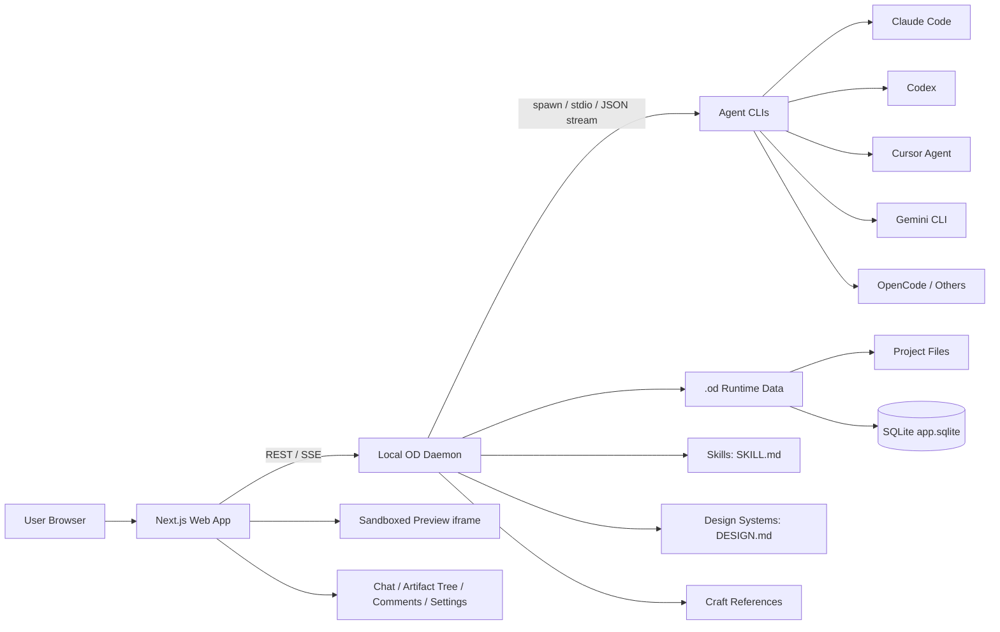

# nexu-io/open-design 레포지토리 분석 보고서

- **분석 대상:** <https://github.com/nexu-io/open-design>
- **분석일:** 2026-05-06
- **기준 브랜치:** `main`
- **분석 방식:** GitHub 공개 README, 공식 문서, 주요 `package.json`, 데몬/웹/에이전트/스킬/디자인시스템/DB/프롬프트 관련 소스 파일 정적 분석
- **주의:** 이 실행 환경에서는 `git clone`이 DNS 오류(`Could not resolve host: github.com`)로 실패하여, 로컬 빌드·테스트·실행 검증은 수행하지 못했다. 아래 평가는 공개 저장소의 정적 소스와 문서 기반 분석이다.

---

## 1. Executive Summary

`nexu-io/open-design`은 **자연어 디자인 브리프를 HTML/프로토타입/덱/템플릿/디자인 시스템/미디어 산출물로 변환하는 로컬 우선(local-first) 디자인 생성 제품**이다. 핵심 포지셔닝은 “Claude Design의 오픈소스 대안”이지만, 단순 디자인 생성기가 아니라 **사용자 로컬에 이미 설치된 코드 에이전트 CLI를 오케스트레이션하는 디자인 작업 셸(shell)**에 가깝다.

프로젝트의 중요한 특징은 다음과 같다.

| 항목 | 요약 |
|---|---|
| 제품 성격 | Next.js 웹 앱 + 로컬 Node/Express 데몬 + 코드 에이전트 CLI 오케스트레이터 |
| 핵심 가치 | 사용자가 이미 쓰는 Claude Code, Codex, Cursor Agent, Gemini CLI, OpenCode 등 외부 CLI를 활용 |
| 확장 모델 | `skills/*/SKILL.md`, `design-systems/*/DESIGN.md`, `craft/*.md` 같은 파일 기반 확장 |
| 실행 모델 | 로컬 데몬이 에이전트를 spawn하고, 브라우저 UI는 REST/SSE로 진행 상태와 산출물을 표시 |
| 저장 모델 | `.od` 런타임 데이터 디렉터리, 프로젝트 파일, SQLite 메타데이터 |
| 보안 방향 | 로컬 우선, BYOK, loopback daemon 검증, preview iframe sandbox, read-only MCP 노출 |
| 성숙도 | README 기준 “early implementation”이며 core loop는 end-to-end로 동작하지만, 일부 기능은 roadmap/partial 상태 |

가장 강한 차별점은 **모델·에이전트·스킬 카탈로그를 제품 내부에 고정하지 않고 외부화**했다는 점이다. 이 덕분에 특정 모델 업체에 종속되지 않고, 사용자가 이미 인증해 둔 CLI와 워크플로를 활용할 수 있다. 반면 그만큼 **외부 CLI 버전 차이, 권한 모델 차이, 스트리밍 포맷 차이, 프롬프트 품질 회귀**가 제품 안정성의 주요 리스크가 된다.

---

## 2. 프로젝트 정체성

### 2.1 한 줄 정의

> **Open Design은 자연어 브리프를 편집 가능하고 미리보기 가능한 디자인 산출물로 바꾸기 위해, 사용자의 로컬 코드 에이전트 CLI를 감지·실행·스트리밍하는 로컬 우선 디자인 제품이다.**

README와 `docs/spec.md`는 이 프로젝트를 다음 네 가지 축으로 설명한다.

1. **Local-first**
   - 데몬과 산출물은 사용자 머신에 존재한다.
   - API 키와 에이전트 인증 상태는 외부 서비스가 아니라 사용자 환경에 남는다.

2. **BYO-agent**
   - Open Design이 직접 모델 루프를 소유하지 않는다.
   - Claude Code, Codex, Cursor Agent, Gemini CLI, OpenCode, Devin, Copilot 등 기존 CLI를 감지하고 실행한다.

3. **Skills as files**
   - 디자인 기능은 `SKILL.md` 기반 스킬 폴더로 배포된다.
   - 스킬은 Markdown + frontmatter + assets/references 구조를 가진다.

4. **Design systems as files**
   - 브랜드·제품 스타일은 `DESIGN.md`로 표현된다.
   - 데몬은 디자인 시스템을 읽어 프롬프트에 주입하고, UI에는 swatch/summary 등을 표시한다.

### 2.2 “제품”이라기보다 “디자인 에이전트 런타임”

Open Design은 “디자인 생성 앱”이지만 내부 구조상 더 정확히는 다음 세 가지를 묶는 런타임이다.

- **프롬프트/스킬 런타임:** 어떤 디자인 작업을 어떤 방식으로 수행할지 지시
- **에이전트 런타임:** 사용자 로컬 CLI를 어떤 인자로 실행하고 어떤 스트림 포맷으로 해석할지 관리
- **아티팩트 런타임:** 생성된 파일을 저장, 미리보기, comment/refine, import/export, deploy하는 인터페이스 제공

이 구조 때문에 Open Design의 경쟁력은 단일 UI보다 **스킬, 디자인 시스템, 에이전트 어댑터, 프롬프트 컴포저의 결합 품질**에 있다.

---

## 3. 저장소 메타데이터와 현재 상태

README 및 GitHub 페이지 기준으로 확인한 현재 상태는 다음과 같다.

| 항목 | 값 |
|---|---|
| 저장소 | `nexu-io/open-design` |
| 라이선스 | Apache-2.0 |
| 기본 브랜치 | `main` |
| 루트 패키지 버전 | `0.4.0` |
| 패키지 매니저 | `pnpm@10.33.2` |
| Node 엔진 | `~24` |
| 워크스페이스 | `packages/*`, `apps/*`, `tools/*`, `e2e` |
| 최신 릴리스 | README/GitHub 페이지 기준 `Open Design 0.4.0`, 2026-05-05 |
| 성숙도 | README 기준 early implementation, core loop는 end-to-end 동작 |

### 3.1 문서 숫자 표기의 불일치

README와 GitHub repo summary에는 스킬/디자인시스템 개수 표기가 일부 다르게 나타난다.

- README 상단은 “31 skills + 72 design systems”라고 설명한다.
- README의 “At a glance”에서는 “Design systems built-in: 129”라고도 표기한다.
- GitHub repo title/about 쪽에는 “19 Skills and 71 Design Systems”라는 문구가 보인다.

이는 저장소가 빠르게 변하는 초기 프로젝트라는 점을 보여준다. 실제 count는 로컬 clone 후 `skills/*/SKILL.md`, `design-systems/*/DESIGN.md`를 직접 세는 것이 가장 정확하지만, 본 분석 환경에서는 clone이 실패했으므로 README 본문과 소스 구조를 기준으로 판단했다.

---

## 4. 전체 아키텍처

Open Design의 현재 구조는 크게 다음 네 영역으로 나뉜다.



### 4.1 Web App

`apps/web`는 Next.js 기반 UI다.

역할:

- 프로젝트 생성/선택
- 채팅 UI
- 에이전트 선택
- 스킬/디자인 시스템 선택
- 생성된 파일 트리 표시
- HTML/JSX/문서 산출물 preview
- comment/refinement UI
- settings, media, template, deploy 관련 화면

`apps/web/package.json` 기준으로 주요 의존성은 다음과 같다.

| 구분 | 주요 패키지 |
|---|---|
| 프레임워크 | `next ^16.2.4`, `react ^18.3.1`, `react-dom ^18.3.1` |
| AI SDK | `openai ^6.35.0`, `@anthropic-ai/sdk ^0.32.1` |
| 내부 패키지 | `@open-design/contracts`, `@open-design/platform`, `@open-design/sidecar`, `@open-design/sidecar-proto` |
| 테스트/타입 | `vitest`, `typescript`, `@types/*` |

### 4.2 Local Daemon

`apps/daemon`은 Express 기반 로컬 서버다. 핵심 책임은 다음과 같다.

- `localhost` 기반 REST/SSE API 제공
- 에이전트 CLI 감지 및 실행
- 에이전트 stdout/stderr stream parsing
- 프로젝트/파일/대화/메시지/preview comment/deployment 메타데이터 저장
- `skills`, `design-systems`, `craft` 로딩
- media generation wrapper
- Claude Design ZIP import
- artifact lint
- Vercel deploy
- connector route 등록
- MCP/read-only tool endpoint 지원
- static web app serving 또는 local desktop sidecar 연동

`apps/daemon/package.json` 기준으로 주요 의존성은 다음과 같다.

| 구분 | 주요 패키지 |
|---|---|
| 서버 | `express`, `multer` |
| DB | `better-sqlite3` |
| 파일 감시 | `chokidar` |
| ZIP 처리 | `jszip` |
| MCP | `@modelcontextprotocol/sdk` |
| 내부 패키지 | `@open-design/contracts`, `@open-design/platform`, `@open-design/sidecar`, `@open-design/sidecar-proto` |

### 4.3 Agent CLI Layer

Open Design은 에이전트 루프를 직접 재구현하지 않는다. 대신 각 CLI의 headless 실행 방식을 어댑터화한다.

소스상 `apps/daemon/src/agents.ts`의 `AGENT_DEFS`에는 다음 계열이 포함되어 있다.

| Agent ID | 실행 방식 요약 | 스트림/프로토콜 |
|---|---|---|
| `claude` | `claude -p`, stream-json, permission bypass, add-dir 지원 | `claude-stream-json` |
| `codex` | `codex exec --json`, workspace-write sandbox | `json-event-stream` |
| `devin` | `devin ... acp` | `acp-json-rpc` |
| `gemini` | stdin prompt, stream-json, `--yolo` | `json-event-stream` |
| `opencode` | `opencode run --format json` | `json-event-stream` |
| `hermes` | ACP mode | `acp-json-rpc` |
| `kimi` | ACP mode | `acp-json-rpc` |
| `cursor-agent` | `--print`, stream-json, workspace 지정 | `json-event-stream` |
| `qwen` | stdin/`-`, yolo | `plain` |
| `copilot` | `copilot -p`, `--allow-all-tools`, JSON output | `copilot-stream-json` |
| `pi` | RPC mode | `pi-rpc` |
| `kiro`, `kilo`, `vibe` | ACP 계열 | `acp-json-rpc` |
| `deepseek` | `deepseek exec --auto` | plain text |

이 레이어가 Open Design의 가장 중요한 설계 선택이다. 장점은 외부 생태계를 빠르게 흡수할 수 있다는 점이고, 단점은 CLI별 버전·권한·출력 스키마 변화에 강하게 의존한다는 점이다.

---

## 5. 저장소 구조 분석

README 기준 주요 디렉터리는 다음과 같다.

```text
open-design/
├── apps/
│   ├── daemon/              # Express daemon, CLI orchestration, DB, routes
│   └── web/                 # Next.js app
├── packages/
│   ├── contracts/           # Shared API/event schemas
│   ├── platform/            # Runtime/spawn helpers
│   ├── sidecar/             # Sidecar shared logic
│   └── sidecar-proto/       # Sidecar protocol types
├── tools/
│   ├── tools-dev/           # Local dev orchestration
│   └── tools-pack/          # Packaging/build helpers
├── skills/                  # Built-in design skills
├── design-systems/          # DESIGN.md catalog
├── craft/                   # Universal craft rules
├── assets/
│   ├── frames/              # Device frame HTML assets
│   └── community-pets/
├── prompt-templates/        # Media prompt gallery
├── templates/               # Project/template seeds
├── docs/                    # Architecture/spec/protocol docs
├── scripts/                 # Guard/sync/seed scripts
├── e2e/                     # End-to-end tests
├── package.json
└── pnpm-workspace.yaml
```

### 5.1 Monorepo 설계

루트 `pnpm-workspace.yaml`은 다음 네 영역만 워크스페이스로 포함한다.

- `packages/*`
- `apps/*`
- `tools/*`
- `e2e`

이는 전형적인 제품형 monorepo 구조다. 핵심 앱과 내부 공통 패키지, 개발/패키징 도구, E2E 테스트가 분리되어 있다.

### 5.2 루트 package.json

루트 `package.json`은 제품 메타데이터와 워크스페이스 수준 명령을 정의한다.

주목할 점:

- `bin.od`가 `./apps/daemon/dist/cli.js`를 가리킨다.
- `postinstall`에서 별도 설치 후처리가 실행된다.
- `tools-dev`, `tools-pack`이 내부 도구로 분리되어 있다.
- `typecheck`는 workspace 전체와 scripts TypeScript를 모두 검사한다.
- `node ~24`, `pnpm >=10.33.2 <11`로 런타임 요구사항이 꽤 최신이다.

---

## 6. 실행 및 개발 워크플로

README 기준 기본 실행 흐름은 다음과 같다.

```bash
git clone https://github.com/nexu-io/open-design.git
cd open-design
corepack enable
pnpm install
pnpm tools-dev run web
```

의미:

1. `pnpm install` 후 root postinstall이 실행된다.
2. `pnpm tools-dev run web`이 로컬 개발 루프를 시작한다.
3. 웹 UI와 데몬이 함께 떠서 브라우저가 데몬의 `/api/*` 엔드포인트를 사용한다.
4. 데몬은 설치된 에이전트 CLI를 감지한다.
5. `.od` 런타임 데이터가 생성된다.
6. 사용자가 프로젝트를 생성하면 `.od/projects/<id>`에 산출물이 생성된다.

### 6.1 Node 24 요구사항

`node ~24`는 이 프로젝트의 진입 장벽이다. 최신 Node를 전제로 하는 이유는 다음으로 추정된다.

- 최신 ESM/TypeScript runtime tooling
- Electron/sidecar/packaging 경로
- 최신 Next.js 16
- spawn/process handling 및 cross-platform 안정성
- OpenAI/Anthropic 최신 SDK

다만 조직 도입 관점에서는 Node 24 고정이 CI/CD, 개발자 머신 표준화, Docker image 준비의 부담이 될 수 있다.

---

## 7. 데몬 상세 분석

### 7.1 `server.ts`의 역할

`apps/daemon/src/server.ts`는 매우 많은 책임을 가진 중앙 파일이다. import 목록만 보아도 다음 기능들이 모여 있다.

- 에이전트 감지/실행
- 스킬 목록/선택
- 디자인 시스템 목록/선택
- 프로젝트 파일 CRUD
- DB persistence
- conversation/message 관리
- preview comments
- live artifacts
- media generation
- prompt templates
- artifact lint
- connectors/composio
- Vercel deployment
- Claude Design ZIP import
- ACP / Pi RPC / Claude / Copilot / JSON event stream handlers
- MCP tool endpoint authorization
- local daemon request validation
- sidecar/runtime path resolution

이 파일은 제품이 빠르게 성장한 흔적을 보여준다. 기능을 빠르게 통합하는 데는 좋지만, 장기 유지보수 관점에서는 route grouping, service 분리, middleware 분리, 테스트 가능한 단위 분할이 필요해 보인다.

### 7.2 Runtime Data Directory

소스 기준 런타임 데이터 디렉터리는 다음 방식으로 결정된다.

- `OD_DATA_DIR`이 없으면 `<projectRoot>/.od`
- `OD_DATA_DIR`이 있으면 `~` expansion 또는 상대/절대 경로 처리
- 디렉터리를 생성하고 writable 여부를 검사
- 프로젝트 파일은 `${RUNTIME_DATA_DIR}/projects`
- artifact 관련 경로도 `.od` 아래에 둔다

이 설계는 local-first와 잘 맞는다. 동시에 운영 관점에서는 `OD_DATA_DIR`을 명시해 workspace 밖 안전한 위치로 분리하는 것이 좋다.

### 7.3 Local Request Validation

`server.ts`에는 daemon 요청을 loopback으로 제한하는 방어 코드가 있다.

주요 체크:

- `req.socket.remoteAddress`가 loopback인지 검사
- `Host` 헤더가 loopback daemon address인지 검사
- `Origin` 헤더가 있으면 loopback origin인지 검사
- CORS 헤더를 제한적으로 설정
- `Vary: Origin` 설정

이는 로컬 데몬이 브라우저와 통신하는 구조에서 중요한 보호 장치다. 특히 “사용자 머신의 로컬 HTTP 서버”는 다른 웹사이트에서 CSRF/drive-by 요청을 받을 위험이 있으므로, host/origin/peer address 검증은 필수에 가깝다.

### 7.4 Tool Token Authorization

daemon은 `/api/tools/*` 성격의 wrapper endpoint에 대해 bearer token을 검증한다.

- `OD_TOOL_TOKEN`을 agent runtime env로 전달할 수 있다.
- agent에게는 이 토큰을 출력·저장·오버라이드하지 말라는 prompt가 주어진다.
- endpoint와 operation 단위로 권한 검증을 수행한다.

이는 에이전트가 daemon의 일부 tool API를 안전하게 호출하게 하기 위한 장치다. 다만 토큰이 agent process env에 들어간다는 점은 신뢰 경계를 명확히 해야 한다. 악성 스킬 또는 악성 에이전트는 이 토큰을 유출할 수 있으므로, token scope와 TTL이 중요하다.

---

## 8. Persistence / 데이터 모델

`apps/daemon/src/db.ts`는 SQLite 기반 persistence를 제공한다.

### 8.1 DB 파일

- 기본 위치: `.od/app.sqlite`
- `better-sqlite3` 사용
- `journal_mode = WAL`
- `foreign_keys = ON`

### 8.2 주요 테이블

| 테이블 | 목적 |
|---|---|
| `projects` | 프로젝트 이름, skill/design system, pending prompt, metadata |
| `templates` | 저장된 템플릿과 파일 snapshot |
| `conversations` | 프로젝트별 대화 세션 |
| `messages` | user/assistant 메시지, agent 정보, run 상태, event JSON, attachment JSON |
| `preview_comments` | iframe preview에서 선택한 요소에 대한 comment/refine 데이터 |
| `tabs` | 프로젝트별 열린 파일 탭 상태 |
| `deployments` | 파일별 배포 URL, provider, status, deployment count |

### 8.3 중요한 구현 포인트

1. **마이그레이션이 코드 내장형**
   - `CREATE TABLE IF NOT EXISTS`
   - `PRAGMA table_info` 후 missing column `ALTER TABLE`
   - 별도 migration framework는 보이지 않는다.

2. **대화와 run 상태를 메시지에 결합**
   - `run_id`, `run_status`, `last_run_event_id`, `started_at`, `ended_at` 필드가 있다.
   - 프로젝트 목록에서 최신 run status를 계산한다.

3. **question-form 기반 awaiting input 감지**
   - assistant 마지막 메시지 content에 `<question-form`이 포함되어 있고, 이후 user reply가 없으면 awaiting_input으로 판단한다.
   - 이는 제품의 discovery-form UX와 persistence가 직접 연결되어 있음을 보여준다.

4. **preview comment는 DOM element target 기반**
   - `file_path`, `element_id`, `selector`, `label`, `position_json`, `html_hint`
   - `selection_kind`가 `element` 또는 `pod`가 될 수 있다.
   - 여러 DOM 요소를 하나의 design region으로 다루는 확장도 고려되어 있다.

---

## 9. Agent Adapter Layer 분석

### 9.1 설계 철학

`docs/agent-adapters.md`는 “OD는 agent loop를 위임한다”고 명시한다. 이는 매우 중요한 선택이다.

Open Design이 직접 처리하지 않는 것:

- 모델 호출
- tool-use loop
- context management
- permission prompt
- resume/cancel 내부 의미
- provider billing
- 에이전트별 memory/config

Open Design이 처리하는 것:

- CLI 감지
- 실행 인자 구성
- prompt composition
- working directory 구성
- stdout/stderr stream parsing
- UI event normalization
- file/project 상태 반영

### 9.2 장점

- 새로운 CLI를 빠르게 추가할 수 있다.
- 사용자가 이미 로그인한 provider를 그대로 쓸 수 있다.
- 모델 라우터/결제/인증을 직접 운영하지 않아도 된다.
- Claude Code에만 묶이지 않는 디자인 셸이 된다.
- skill은 agent-agnostic하게 작성할 수 있다.

### 9.3 리스크

| 리스크 | 설명 |
|---|---|
| CLI version drift | 각 CLI의 argument, stream schema, model list가 바뀌면 깨질 수 있음 |
| 권한 posture | `--yolo`, `dangerous`, `bypassPermissions`, `--allow-all-tools` 등 headless 실행을 위해 강한 권한 옵션을 쓰는 경우가 있음 |
| prompt size | 일부 CLI는 stdin을 지원하지만, 일부는 prompt를 argv로 받아 Windows에서 ENAMETOOLONG 위험 |
| stream normalization | Claude/Codex/Gemini/Copilot/ACP/Pi RPC가 모두 다른 event schema를 가짐 |
| auth detection | CLI가 설치되어 있어도 로그인/조직/키 상태가 다를 수 있음 |
| capability mismatch | comment-mode/surgical edit이 agent마다 품질 차이가 큼 |

### 9.4 Windows 대응

소스 주석에는 Windows `ENAMETOOLONG` 대응이 반복적으로 등장한다.

- 가능한 경우 prompt를 stdin으로 전달
- `.cmd`/`.bat` shim command line budget 검사
- direct exe command line budget 검사
- prompt temp file bootstrap fallback
- `OD_NODE_BIN`, `OD_BIN`을 이용해 bare `od` 충돌 방지

이는 실제 사용자 피드백 기반으로 많이 다듬어진 부분으로 보인다.

---

## 10. Skill System 분석

### 10.1 기본 구조

스킬은 일반적으로 다음 구조를 갖는다.

```text
skills/<skill-name>/
├── SKILL.md
├── assets/
│   └── template.html
└── references/
    ├── layouts.md
    ├── components.md
    └── checklist.md
```

`apps/daemon/src/skills.ts`는 각 스킬 폴더의 `SKILL.md`를 읽고 frontmatter와 body를 파싱한다.

### 10.2 반환되는 skill metadata

소스 기준으로 skill record에는 다음 필드가 포함된다.

| 필드 | 의미 |
|---|---|
| `id`, `name` | frontmatter `name` 또는 folder name |
| `description` | 스킬 설명 |
| `triggers` | 추천/자동 선택 trigger |
| `mode` | `prototype`, `deck`, `template`, `design-system`, `image`, `video`, `audio` 등 |
| `surface` | `web`, `image`, `video`, `audio` |
| `craftRequires` | 필요한 craft reference slug |
| `platform` | `desktop`, `mobile` 등 |
| `scenario` | `marketing`, `finance`, `engineering` 등 |
| `previewType` | 기본 `html` |
| `designSystemRequired` | 디자인 시스템 주입 여부 |
| `defaultFor` | 기본 적용 맥락 |
| `featured` | gallery 우선순위 |
| `fidelity`, `speakerNotes`, `animations` | 생성 UI의 기본값 hint |
| `examplePrompt` | fast-create prompt |
| `body` | 실제 agent prompt에 들어갈 스킬 본문 |
| `dir` | 스킬 경로 |

### 10.3 Side file preamble

스킬에 `assets`나 `references` 파일이 있으면 `skills.ts`는 스킬 본문 앞에 “skill root preamble”을 붙인다.

핵심 목적:

- agent의 cwd는 `.od/projects/<id>`이므로, 스킬 폴더의 상대경로가 그대로는 안 맞을 수 있다.
- daemon은 active skill을 프로젝트 내부 `.od-skills/<folder>/`로 stage한다.
- prompt에는 다음 두 경로를 알려준다.
  - 프로젝트 상대 alias: `.od-skills/<folder>/`
  - 절대 fallback path
- Claude/Copilot 같은 agent에는 `--add-dir`로 절대 경로 접근도 열 수 있다.

이 구현은 agent 권한 sandbox와 스킬 assets 접근 문제를 실제로 해결하려는 설계다.

### 10.4 Mode inference

`od.mode`가 없으면 스킬 body/description을 보고 mode를 추론한다.

예:

- `image`, `poster`, `illustration` → `image`
- `video`, `motion`, `animation` → `video`
- `audio`, `music`, `tts` → `audio`
- `ppt`, `deck`, `slide`, `presentation` → `deck`
- `design-system`, `DESIGN.md`, `design tokens` → `design-system`
- `template` → `template`
- 그 외 → `prototype`

기존 Claude Code 스킬을 수정 없이 받아들이려는 의도가 강하다.

---

## 11. Design System 분석

### 11.1 DESIGN.md registry

`apps/daemon/src/design-systems.ts`는 `design-systems/*/DESIGN.md`를 스캔한다.

추출하는 정보:

| 항목 | 추출 방식 |
|---|---|
| `id` | 폴더명 |
| `title` | 첫 번째 H1 |
| `category` | `> Category: ...` blockquote |
| `summary` | H1 이후 첫 문단 |
| `surface` | `> Surface: web/image/video/audio` |
| `swatches` | Markdown 내 color token을 정규식으로 추출 |
| `body` | DESIGN.md 원문 |

### 11.2 Swatch extraction

`extractSwatches`는 DESIGN.md에서 대표 색상 네 개를 추출한다.

기본 순서:

1. background
2. support/border/muted
3. foreground/text
4. accent/brand/primary

이를 통해 UI에서 디자인 시스템 선택 시 작은 색상 strip을 보여줄 수 있다.

### 11.3 분석 의견

DESIGN.md를 파일로 다루는 방식은 강점이 크다.

- Git으로 리뷰 가능
- 팀 공유 가능
- 스킬과 분리 가능
- prompt context로 안정적으로 주입 가능
- brand-specific token과 universal craft rule을 분리 가능

다만 실제 품질은 DESIGN.md의 schema 일관성에 크게 의존한다. 추출기가 정규식 기반이므로, 디자인 시스템 authoring convention을 엄격하게 유지해야 UI/agent 양쪽에서 안정적이다.

---

## 12. Prompt Composition 분석

Open Design의 실질적인 품질 엔진은 `apps/daemon/src/prompts/system.ts`와 `discovery.ts`다.

### 12.1 Prompt stack

`composeSystemPrompt`는 다음 순서로 시스템 프롬프트를 조립한다.

1. `DISCOVERY_AND_PHILOSOPHY`
2. 공식 designer prompt
3. active design system
4. active craft references
5. active skill
6. project metadata
7. template reference
8. deck framework directive
9. media generation contract

중요한 점은 **discovery/philosophy layer를 가장 먼저 두어 hard rule이 뒤의 softer prompt보다 우선하도록 설계**했다는 점이다.

### 12.2 Discovery form rule

`discovery.ts`는 새 디자인 작업의 첫 응답을 거의 강제한다.

- Turn 1: 짧은 문장 + `<question-form id="discovery">` + stop
- Turn 2: brand answer에 따라 branch
  - “Pick a direction for me” → direction-card form
  - “I have a brand spec / reference site / screenshot” → brand extraction
  - 그 외 → TodoWrite plan
- Turn 3+: TodoWrite plan, live progress, build, self-check, artifact emit

이 구조는 디자인 생성에서 흔한 문제인 “모델이 곧바로 generic 결과물을 생성하는 문제”를 줄이려는 매우 명확한 제품 철학이다.

### 12.3 Anti-AI-slop

프롬프트에는 명시적인 anti-AI-slop checklist가 있다.

예:

- 과한 보라색 gradient
- generic emoji icons
- 왼쪽 border accent card
- hand-drawn SVG humans
- display face로 Inter/Roboto/Arial 남용
- 출처 없는 “10× faster”, “99.9% uptime”
- filler copy
- heading마다 icon
- 모든 배경에 gradient

이 리스트는 Open Design이 단순 “코드 생성”보다 **디자인 품질과 취향의 안정화**를 제품 핵심으로 본다는 증거다.

### 12.4 Preflight directive

`system.ts`의 `derivePreflight`는 스킬 본문에서 다음 파일 참조를 찾는다.

- `assets/template.html`
- `references/layouts.md`
- `references/themes.md`
- `references/components.md`
- `references/checklist.md`

참조가 있으면 skill body 앞에 “이 파일들을 먼저 읽어라”는 hard preflight rule을 붙인다.

이는 agent가 스킬의 seed/template/checklist를 무시하고 처음부터 임의 CSS를 쓰는 문제를 줄이기 위한 장치다.

---

## 13. Preview / Artifact 모델

### 13.1 Preview iframe

README와 architecture doc 기준 preview는 iframe sandbox 기반이다.

목표:

- artifact code가 host app의 cookie, window, parent DOM에 접근하지 못하게 함
- HTML/JSX 산출물 hot reload
- deck, dashboard, mobile prototype 같은 다양한 surface 지원

현재 소스에는 live artifact preview header에서 CSP를 엄격히 지정하는 코드가 보인다.

예:

- `default-src 'none'`
- `script-src 'none'`
- `object-src 'none'`
- `connect-src 'none'`
- `frame-ancestors 'self'`
- `img-src 'self' data: blob:`
- `sandbox allow-same-origin`

단, architecture doc의 일반 preview 설명은 `allow-scripts` 기반 HTML/JSX preview를 언급한다. live artifact preview route는 `script-src 'none'`을 쓰므로 route 종류별 preview 정책이 다를 가능성이 있다. 보안 관점에서는 좋은 방향이지만, 어떤 preview에서 script가 허용되는지 명확한 문서화가 필요하다.

### 13.2 Artifact tree

프로젝트 파일은 `.od/projects/<id>/` 아래에 생성된다. daemon의 `projects.ts`는 파일 list/read/write/delete/search/archive 등을 제공하는 것으로 보인다. 생성된 HTML, assets, screens, deck files 등이 이 경로에 위치한다.

### 13.3 Export / Deploy

README와 server imports 기준 지원 또는 구현된 것으로 보이는 기능:

- ZIP archive
- HTML self-contained export
- PDF/print flow
- Claude Design ZIP import
- Vercel deploy
- deployment status/reachability check
- templates
- live artifacts

PPTX export는 docs에는 언급되지만 현재 README에서는 PDF/ZIP/HTML 중심으로 보이며, 실제 지원 범위는 스킬별 산출물과 export route 확인이 추가로 필요하다.

---

## 14. Media Generation / HyperFrames

README 기준 Open Design은 이미지/비디오/오디오 생성도 다룬다.

주요 구성:

- Image: OpenAI image 계열, ByteDance Seedream 계열
- Video: Seedance, Sora 계열, HyperFrames HTML-to-MP4
- Audio: TTS, music, SFX 계열
- Prompt gallery: media prompt templates
- Media config: BYOK provider key 관리

`server.ts`에는 `generateMedia`, `MEDIA_PROVIDERS`, `IMAGE_MODELS`, `VIDEO_MODELS`, `AUDIO_MODELS_BY_KIND` 등이 import되어 있다.

### 14.1 HyperFrames의 의미

HyperFrames는 HTML/CSS/JS 모션 디자인을 MP4로 렌더링하는 로컬/도구형 기능으로 보인다. 이는 Open Design의 중요한 차별점이다.

일반 text-to-video는 결과 통제가 어렵지만, HTML-to-MP4는 다음 장점이 있다.

- deterministic layout
- CSS animation 기반 정밀 제어
- 브랜드 typography/color 유지
- deck/motion graphic 산출물과 잘 맞음
- local-first 제품 철학과 부합

---

## 15. Security / Privacy 분석

### 15.1 강점

| 영역 | 구현/방향 |
|---|---|
| Local-first | daemon과 산출물이 사용자 머신에 있음 |
| BYOK | API key를 제품 서버가 아닌 로컬/브라우저 설정에 둠 |
| Loopback validation | host/origin/remoteAddress 검증 |
| Preview isolation | sandbox iframe, CSP, no-store headers |
| MCP | read-only server로 설계되어 외부 tool이 파일을 직접 수정하지 않도록 제한 |
| Runtime data relocation | `OD_DATA_DIR`로 데이터 경로 분리 가능 |
| Tool token | endpoint/operation scope 기반 bearer token 검증 |

### 15.2 주의할 점

| 리스크 | 설명 | 권장 대응 |
|---|---|---|
| Agent 권한 | 일부 CLI 실행 인자가 non-interactive auto-approve에 가깝다 | 격리된 workspace에서 실행, 민감 파일 없는 디렉터리 사용 |
| Skill trust | `SKILL.md`가 agent에게 파일 읽기/쓰기/명령 실행을 유도할 수 있음 | 검증된 스킬만 사용, 외부 스킬은 코드 리뷰 |
| BYOK leakage | agent env/prompt/tool output에 key가 섞일 수 있음 | provider key scope 제한, 테스트 계정 사용 |
| Local daemon | 로컬 HTTP API가 공격면이 될 수 있음 | loopback 검증 유지, tunnel 사용 시 auth 필수 |
| Preview script | HTML preview에서 script 허용 여부 route별 확인 필요 | CSP 정책 문서화, untrusted artifact 격리 |
| External CLI drift | CLI 업데이트가 보안/권한 의미를 바꿀 수 있음 | CLI version pinning 또는 compatibility matrix 유지 |

### 15.3 MCP read-only 설계

README는 MCP server가 read-only라고 설명한다. 이는 좋은 결정이다. MCP를 통해 외부 IDE나 agent가 Open Design 상태를 볼 수 있게 하면서도, write 권한은 daemon의 프로젝트 API와 tokenized tool path로 제한하는 구조가 더 안전하다.

---

## 16. 공식 문서와 현재 소스의 차이

`docs/spec.md`, `docs/architecture.md`는 2026-04-24 draft 성격이 강하고, 현재 README/소스와 일부 차이가 있다.

### 16.1 차이 예시

| 항목 | 초기 문서 | 현재 README/소스 |
|---|---|---|
| Desktop app | `docs/spec.md`에는 “desktop app을 ship하지 않는다”는 non-goal이 있음 | README에는 optional Electron desktop shell 및 sidecar IPC가 언급됨 |
| Persistence | architecture doc 일부는 artifact metadata/history 중심, SQLite를 피하는 설명이 있음 | 현재 `db.ts`는 `.od/app.sqlite`에 projects/conversations/messages 등 저장 |
| Skill marketplace/CLI | docs에는 `od skill add/list/remove` 구상이 있음 | README roadmap에는 `npx od init`, skill marketplace 등이 pending으로 보임 |
| Topology C direct API | docs에는 Vercel direct API fallback 설명이 있음 | 현재 README는 local daemon/core loop 중심이며 실제 direct mode 구현 범위는 추가 확인 필요 |

이런 차이는 나쁜 신호라기보다 빠른 초기 개발의 흔적이다. 다만 외부 contributor나 조직 도입자에게는 현재 구현 기준 문서와 설계 초안 문서를 명확히 구분해 주는 것이 필요하다.

---

## 17. 강점

### 17.1 명확한 차별화

대부분의 디자인 생성 도구는 자체 모델/API 또는 단일 vendor에 묶인다. Open Design은 반대로 **에이전트 루프를 사용자의 로컬 CLI에 위임**한다. 이는 강력한 차별화다.

### 17.2 확장성 있는 파일 기반 모델

- `SKILL.md`
- `DESIGN.md`
- `craft/*.md`
- `prompt-templates`
- `assets/frames`

이 구조는 Git 친화적이고, 팀/커뮤니티가 확장하기 쉽다.

### 17.3 프롬프트 품질에 대한 강한 문제의식

discovery form, direction picker, TodoWrite, preflight, checklist, 5-dimensional critique, anti-AI-slop은 단순 기능 목록이 아니라 실제 생성 품질을 높이기 위한 체계다.

### 17.4 다양한 agent adapter

많은 CLI를 한 UI에 묶는 것은 유지보수 비용이 크지만, 제품 전략상 큰 장점이다. 특히 Claude Code 외에도 Codex, Cursor, Gemini, OpenCode 등을 쓰는 사용자를 흡수할 수 있다.

### 17.5 Local-first와 BYOK

조직이나 power user에게 중요한 요소다. 디자인 산출물과 key가 외부 SaaS에 잠기지 않는다는 점은 adoption narrative가 좋다.

---

## 18. 약점과 리스크

### 18.1 `server.ts`의 비대화

`server.ts`가 너무 많은 책임을 가진다. 빠른 실험에는 좋지만, 장기적으로 다음 리팩터링이 필요하다.

- route module 분리
- service layer 분리
- agent run orchestration 분리
- connector/media/deploy/live-artifact 독립 모듈화
- middleware/security 분리
- API contract 기반 integration test 강화

### 18.2 외부 CLI 의존성

제품 품질이 Open Design 코드만으로 결정되지 않는다.

- CLI가 설치되어 있어야 한다.
- CLI가 로그인되어 있어야 한다.
- CLI 버전이 지원 인자/출력 포맷을 제공해야 한다.
- CLI permission mode가 예상대로 작동해야 한다.

따라서 “설치 후 5분 안에 성공”을 보장하려면 agent detection UX와 failure recovery가 매우 중요하다.

### 18.3 Prompt stack 회귀 테스트 어려움

프롬프트가 길고 복잡하며, 품질 규칙이 많다. 이런 시스템은 정량 테스트가 어렵다.

권장:

- golden prompt snapshots
- skill별 smoke test prompt
- artifact manifest assertion
- generated HTML lint
- screenshot diff 또는 visual regression
- known-bad anti-slop regression prompts

### 18.4 문서 drift

README, GitHub title/about, docs 사이에 숫자와 구현 상태 차이가 있다. 프로젝트가 빠르게 움직이는 것은 장점이지만, contributor가 혼란스러울 수 있다.

### 18.5 권한 posture

headless UX를 위해 `--yolo`, `dangerous`, `bypassPermissions`, `--allow-all-tools` 같은 옵션이 필요해 보인다. 이는 사용자 경험을 위해 현실적인 선택이지만, 보안 문서에서는 더 명확히 설명해야 한다.

---

## 19. 조직/개인 도입 권장 방식

### 19.1 개인 실험

1. 최신 Node 24와 pnpm 10.33.x 준비
2. Claude Code 또는 Codex 중 하나를 먼저 정상 로그인
3. 빈 workspace에서 Open Design 실행
4. 민감 파일이 없는 프로젝트만 연결
5. 기본 built-in skill로 prototype/deck 생성
6. `.od/projects/<id>` 산출물 확인
7. 마음에 드는 artifact만 별도 repo로 이동/커밋

### 19.2 팀 도입

팀 환경에서는 다음 guardrail을 권장한다.

| 영역 | 권장 |
|---|---|
| Agent | 팀에서 승인한 CLI와 버전만 사용 |
| Workspace | 민감 파일 없는 sandbox repo 사용 |
| Skills | 사내 검증된 `skills/`만 허용 |
| Design system | 사내 `DESIGN.md`를 versioned repo로 관리 |
| Keys | 최소권한 API key, 개인 key 금지 또는 provider policy 적용 |
| Output review | 생성 HTML/JS/CSS를 PR 리뷰 대상으로 취급 |
| Test | skill별 expected manifest/lint/screenshot test 추가 |
| Docs | 사용 가능한 agent/기능/제한 사항 internal guide 작성 |

---

## 20. Contributor 관점의 개선 제안

### 20.1 우선순위 높음

1. **현재 구현 기준 architecture 문서 업데이트**
   - SQLite persistence
   - desktop/sidecar
   - actual runtime dirs
   - current API surface

2. **server route/service 분리**
   - `routes/projects.ts`
   - `routes/chat.ts`
   - `routes/media.ts`
   - `routes/connectors.ts`
   - `services/agent-runner.ts`
   - `services/artifact-store.ts`

3. **Agent compatibility matrix 자동화**
   - CLI version
   - supported args
   - stream format
   - promptViaStdin
   - known limitations
   - auth detection status

4. **Skill test harness 강화**
   - built-in skills smoke test
   - side-file preflight assertion
   - HTML lint + manifest validation
   - anti-slop text/style rules

5. **문서 count 자동 생성**
   - README의 skill/design-system/media-template counts를 script로 업데이트
   - GitHub about과 README 불일치 제거

### 20.2 중기 개선

1. **Plugin/connector security model 문서화**
2. **Preview CSP matrix 문서화**
3. **디자인 시스템 authoring validator**
4. **Visual regression E2E**
5. **Skill signing 또는 trusted source model**
6. **Local daemon tunnel hardening**
7. **Telemetry opt-in/diagnostics story**
8. **Fail-fast setup doctor**
   - Node version
   - pnpm version
   - agent path
   - auth status
   - writable OD_DATA_DIR
   - browser/daemon connectivity

---

## 21. 핵심 파일별 분석 요약

| 파일 | 역할 | 분석 포인트 |
|---|---|---|
| `package.json` | 루트 package metadata | Node 24, pnpm 10.33.2, `od` bin, workspace typecheck |
| `pnpm-workspace.yaml` | monorepo scope | `apps`, `packages`, `tools`, `e2e` |
| `apps/daemon/package.json` | daemon package | Express, SQLite, MCP, chokidar, jszip, workspace deps |
| `apps/web/package.json` | web app package | Next 16, React 18, OpenAI/Anthropic SDK |
| `apps/daemon/src/server.ts` | daemon 중심 서버 | API, agent, persistence, media, deployment, connector, security가 집중 |
| `apps/daemon/src/agents.ts` | agent definitions | Claude/Codex/Gemini/Copilot/ACP/Pi 등 adapter contract와 spawn args |
| `apps/daemon/src/skills.ts` | skill registry | `SKILL.md` parsing, mode inference, skill side-file preamble |
| `apps/daemon/src/design-systems.ts` | design system registry | `DESIGN.md` parsing, category/summary/swatch/surface extraction |
| `apps/daemon/src/db.ts` | SQLite persistence | projects, templates, conversations, messages, comments, tabs, deployments |
| `apps/daemon/src/prompts/system.ts` | prompt composer | discovery, designer prompt, DESIGN.md, craft, skill, metadata, deck/media contract stack |
| `apps/daemon/src/prompts/discovery.ts` | design workflow prompt | question-form, direction picker, TodoWrite, checklist, critique, anti-slop |
| `docs/spec.md` | product spec draft | 제품 철학과 core bets 설명, 일부 현재 구현과 drift 있음 |
| `docs/architecture.md` | architecture draft | topology와 data flow 설명, 일부 persistence/desktop 내용은 구버전 |
| `docs/skills-protocol.md` | skill protocol | `SKILL.md` + `od:` extension 설계 |
| `docs/agent-adapters.md` | adapter 설계 | agent loop 위임 철학과 capability-driven UI |

---

## 22. 종합 평가

Open Design은 매우 흥미로운 방향의 프로젝트다. 단일 AI 디자인 SaaS를 만드는 대신, 이미 존재하는 로컬 코드 에이전트 생태계를 디자인 산출물 생성에 연결한다. 이 접근은 오픈소스 프로젝트로서 전략적으로 타당하다.

특히 다음 조합이 강하다.

- **Next.js web UI**
- **local daemon**
- **agent CLI adapters**
- **file-based skills**
- **file-based design systems**
- **strict prompt workflow**
- **sandboxed preview**
- **SQLite-backed local state**

다만 현재 상태는 README 표현대로 early implementation에 가깝다. 기능 범위가 빠르게 넓어졌고, 그만큼 문서 drift와 중앙 서버 파일 비대화가 보인다. 제품을 안정적으로 키우려면 지금부터는 “기능 추가”보다 **테스트, 문서 정합성, agent compatibility, 보안 경계, route/service modularization**이 중요하다.

### 결론

- **개인 실험/프로토타이핑:** 매우 적합
- **오픈소스 contributor 관점:** 기여 지점이 많고 방향성이 명확함
- **팀/조직 도입:** 가능하지만, sandbox workspace와 agent/skill trust policy가 필요
- **프로덕션 디자인 시스템 자동화:** 잠재력 큼. 단, skill/design-system validator와 regression test가 더 필요

---

## 23. 참고한 주요 소스

| 구분 | URL |
|---|---|
| GitHub README / repo page | <https://github.com/nexu-io/open-design> |
| Root package | <https://github.com/nexu-io/open-design/blob/main/package.json> |
| pnpm workspace | <https://github.com/nexu-io/open-design/blob/main/pnpm-workspace.yaml> |
| Daemon package | <https://github.com/nexu-io/open-design/blob/main/apps/daemon/package.json> |
| Web package | <https://github.com/nexu-io/open-design/blob/main/apps/web/package.json> |
| Daemon server | <https://github.com/nexu-io/open-design/blob/main/apps/daemon/src/server.ts> |
| Agent definitions | <https://github.com/nexu-io/open-design/blob/main/apps/daemon/src/agents.ts> |
| Skill registry | <https://github.com/nexu-io/open-design/blob/main/apps/daemon/src/skills.ts> |
| Design-system registry | <https://github.com/nexu-io/open-design/blob/main/apps/daemon/src/design-systems.ts> |
| SQLite persistence | <https://github.com/nexu-io/open-design/blob/main/apps/daemon/src/db.ts> |
| Prompt composer | <https://github.com/nexu-io/open-design/blob/main/apps/daemon/src/prompts/system.ts> |
| Discovery prompt | <https://github.com/nexu-io/open-design/blob/main/apps/daemon/src/prompts/discovery.ts> |
| Product spec | <https://github.com/nexu-io/open-design/blob/main/docs/spec.md> |
| Architecture doc | <https://github.com/nexu-io/open-design/blob/main/docs/architecture.md> |
| Skills protocol | <https://github.com/nexu-io/open-design/blob/main/docs/skills-protocol.md> |
| Agent adapters doc | <https://github.com/nexu-io/open-design/blob/main/docs/agent-adapters.md> |
