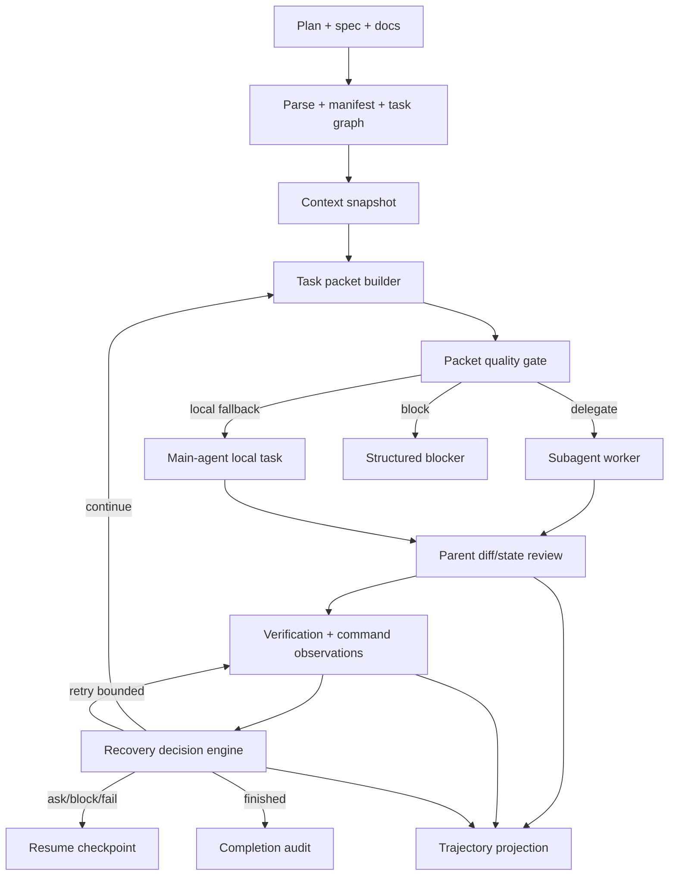

# CPE 서브에이전트 품질 개선 설계

작성일: 2026-06-07
대상: `skills/kws-codex-plan-executor`
상태: 구현 완료
연결 구현 문서: `docs/superpowers/plans/2026-06-07-cpe-subagent-quality-improvement-implementation.md`

## 목표

`kws-codex-plan-executor`는 이미 중요한 뼈대를 갖고 있다. 실행은 전용
worktree에서 하고, 오케스트레이션 상태는
`~/.codex/orchestrator/<run_id>/state.json`에 남기며, 작업 단위는 task
packet으로 자르고, eligible write-capable task는 `subagents=on` 기본값으로
서브에이전트 우선 실행한다. Drift reconciliation, state validation,
AgentLens best-effort 이벤트도 이미 있다.

다음 개선의 목표는 이 구조를 더 운영 가능한 실행기로 만드는 것이다.

1. 메인 에이전트가 원문 plan/spec/log/subagent 출력 전체를 계속 들고 있지
   않아도 되도록, 필요한 정보만 task packet과 요약 상태로 승격한다.
2. 작업 중 문제가 생겼을 때 `retry`, `bootstrap`, `local fallback`,
   `block`, `fail`, `continue`를 정책적으로 고르게 한다.
3. 작업이 끝난 뒤 `state.json`, trajectory, command observation만 보고도
   어떤 지점에서 품질이 낮아졌고 스킬을 어디서 개선해야 하는지 파악할 수
   있게 한다.

이 문서는 최초 작성 시점에는 런타임 동작을 바꾸지 않는 설계 문서였고,
2026-06-07 구현에서 연결된 구현 계획 문서를 따라 CPE 스킬에 반영됐다.

## 구현 결과

2026-06-07 구현은 `skills/kws-codex-plan-executor`에 다음 변경을 반영했다.

- `scripts/build_task_packet.py`와 `scripts/build_spec_manifest.py`가 packet
  component budget, section signal, spec mapping evidence, decision filtering,
  acceptance contract, unit manifest를 기록한다.
- `scripts/preflight_dispatch.py`가 red packet, full spec fallback, missing
  acceptance, broad write scope, packet hash drift, dirty overlap을
  delegate/local fallback/block 결정에 반영한다.
- `scripts/validate_state.py`, `templates/headless-output-schema.json`,
  `references/headless-result-schema.md`가 structured `current_blocker`,
  `failure_decision`, recovery attempt, trajectory/progress fields를 검증한다.
- `scripts/classify_recovery.py`, `scripts/append_trajectory_event.py`,
  `scripts/update_progress_ledger.py`, `scripts/inspect_runs.py`가 recovery
  decision, trajectory projection, progress ledger, resume inspection을
  deterministic helper로 제공한다.
- 관련 deterministic eval과 CPE README/architecture/user guide/reference docs가
  함께 갱신됐다.

구현 커밋은 `9a4bb6b Improve CPE subagent quality controls`이며, 이후 로컬
`main`에 포함됐다.

## 근거

### 현재 CPE에서 확인한 강점

- `SKILL.md`는 `subagents=on`을 기본값으로 두고, 서브에이전트에게 전체
  plan/spec가 아니라 task packet을 주도록 요구한다.
- `references/context-intelligence.md`는 `context.json`,
  `spec_manifest.json`, `task_packets/task_<N>.json`, `DECISIONS.md`를
  통해 compaction 후에도 상태 중심으로 이어가도록 설계되어 있다.
- `scripts/build_task_packet.py`는 spec section slicing을 지원한다.
- `scripts/preflight_dispatch.py`는 state, packet, write scope, forbidden
  glob, dirty overlap을 확인한다.
- `scripts/validate_state.py`는 finished 상태에서 subagent review,
  dispatch block, prompt audit, command observation residual risk 등 일부
  위험을 이미 막는다.

### 현재 CPE의 품질 병목

- `manifest_fallback=full_spec_on_blocker`가 기본이라 spec 매핑 실패 시
  큰 spec 전체가 task packet으로 들어갈 수 있다.
- `decisions_register`가 task 관련성으로 필터링되지 않고 packet에 통째로
  들어간다.
- `acceptance.command`가 packet에서 비어 있어 worker가 검증 방법을 다시
  추론해야 한다.
- packet budget은 전체 문자 수만 알려주고, 어느 component가 예산을
  소비했는지 알려주지 않는다.
- dispatch preflight가 `context_budget.status=red`, full spec fallback,
  missing acceptance, broad write scope 같은 packet 품질 문제를 아직
  충분히 보지 않는다.
- `blocked`와 `failed`의 차이가 상태 스키마에 구조적으로 표현되지 않고
  `handoff_reason` 문자열에 많이 의존한다.
- `command_observations`는 category는 있지만 severity, retryability,
  root signature, owner, recovery action, resolved_by가 없다.
- 실행 후 분석용 compact trajectory가 없어, 품질 저하 원인을 보려면
  transcript나 여러 산출물을 사람이 다시 조합해야 한다.

### Codex 공식 문서에서 가져올 원칙

공식 Codex 매뉴얼의 현재 내용은 CPE 개선 방향과 잘 맞는다.

- 좋은 prompt는 goal, context, constraints, done criteria를 포함해야 한다.
- 복잡한 작업은 작고 집중된 단계로 나눌수록 테스트와 리뷰가 쉽다.
- Worktree는 병렬 작업이 foreground checkout을 방해하지 않게 한다.
- Skill은 progressive disclosure를 사용한다. 처음에는 name, description,
  path만 노출하고, 필요할 때 `SKILL.md`를 읽는다.
- Subagent는 context pollution/context rot을 줄이기 위해 noisy exploration,
  test, log analysis를 main thread 밖으로 보낸다.
- Subagent는 read-heavy exploration, triage, summarization에 특히 유용하고,
  write-heavy delegation은 file scope 충돌을 조심해야 한다.
- `codex exec --json`과 `--output-schema`는 자동화에서 event stream과
  machine-readable result를 남기는 방향을 권장한다.

공식 출처:

- [Codex best practices](https://developers.openai.com/codex/learn/best-practices.md)
- [Codex prompting](https://developers.openai.com/codex/prompting.md)
- [Codex worktrees](https://developers.openai.com/codex/app/worktrees.md)
- [Codex skills](https://developers.openai.com/codex/skills.md)
- [Codex subagents](https://developers.openai.com/codex/subagents.md)
- [Codex subagent concepts](https://developers.openai.com/codex/concepts/subagents.md)
- [Codex non-interactive mode](https://developers.openai.com/codex/noninteractive.md)
- [Codex SDK](https://developers.openai.com/codex/sdk.md)

### 공개 오케스트레이션 코드/문서에서 가져올 패턴

- LangGraph: `thread_id`, checkpoint, replay, interrupt/resume는 long-running
  workflow가 어디서 멈췄고 어디서 다시 시작할지 명확히 한다.
- Magentic-One: orchestrator가 task ledger와 progress ledger를 유지하고,
  진척이 멈추면 ledger 기반으로 재계획한다.
- CrewAI: Flow는 제어 흐름과 상태를 담당하고, Task는 expected output,
  guardrail, retry로 결과 계약을 강하게 둔다.
- AutoGen/Semantic Kernel: manager가 next speaker/agent selection,
  termination condition, participant state를 분리한다.
- OpenHands/SWE-agent: 실행 trajectory와 inspector를 통해 agent 행동을
  사후 분석 가능한 산출물로 만든다.

참고 출처:

- [LangGraph persistence](https://docs.langchain.com/oss/python/langgraph/persistence)
- [LangGraph durable execution](https://docs.langchain.com/oss/python/langgraph/durable-execution)
- [LangGraph interrupts](https://docs.langchain.com/oss/python/langgraph/interrupts)
- [Magentic-One overview](https://microsoft.github.io/autogen/stable/user-guide/agentchat-user-guide/magentic-one.html)
- [Microsoft Agent Framework Magentic orchestration](https://learn.microsoft.com/en-us/agent-framework/workflows/orchestrations/magentic)
- [CrewAI flows](https://docs.crewai.com/en/concepts/flows)
- [CrewAI tasks](https://docs.crewai.com/concepts/tasks)
- [CrewAI crews](https://docs.crewai.com/en/concepts/crews)
- [AutoGen teams API](https://microsoft.github.io/autogen/stable/reference/python/autogen_agentchat.teams.html)
- [AutoGen termination](https://microsoft.github.io/autogen/stable/user-guide/agentchat-user-guide/tutorial/termination.html)
- [OpenHands sandbox overview](https://docs.openhands.dev/openhands/usage/sandboxes/overview)
- [OpenHands SDK conversation event log](https://docs.openhands.dev/sdk/api-reference/openhands.sdk.conversation)
- [SWE-agent trajectories](https://github.com/SWE-agent/SWE-agent/blob/main/docs/usage/trajectories.md)
- [SWE-agent inspector](https://swe-agent.com/latest/usage/inspector/)

## 설계 원칙

1. `state.json`이 권위 소스다. 채팅 히스토리는 compaction 이후 버려질 수
   있는 작업 공간으로 본다.
2. 메인 에이전트는 요구사항, scope, merge review, final audit를 소유한다.
3. 서브에이전트는 task packet과 명시 write scope만 받는다.
4. raw log, raw prompt, raw subagent transcript는 main context가 아니라
   evidence artifact다.
5. 자동 복구는 항상 bounded policy와 evidence를 남겨야 한다.
6. finished state는 pass만 말하지 말고, skip, substitute, retry, residual
   risk를 같이 설명해야 한다.
7. Replan은 task 순서, local fallback, 검증 범위 축소만 다룬다. file claim
   확장이나 acceptance 변경은 operator decision 없이는 하지 않는다.

## 목표 아키텍처



## 개선 축 1: 메인 컨텍스트 절감

### Task Packet Component Budget

모든 task packet에 `context_components`를 추가한다. 목적은 packet이 왜
커졌는지, 어떤 component를 줄이면 되는지, 어떤 source가 포함됐는지 바로
보이게 하는 것이다.

```json
{
  "context_components": [
    {
      "role": "task_summary",
      "source_path": "plans/example.md",
      "source_ref": "task_2",
      "chars": 840,
      "estimated_tokens": 210,
      "sha256": "...",
      "inclusion_reason": "active task contract",
      "reducible": false
    },
    {
      "role": "spec_slice",
      "source_path": "specs/example.md",
      "source_ref": "S3",
      "chars": 3900,
      "estimated_tokens": 975,
      "sha256": "...",
      "inclusion_reason": "explicit Spec Refs",
      "reducible": true
    }
  ]
}
```

`context_budget`는 전체 문자 수뿐 아니라 component breakdown도 가진다.

```json
{
  "context_budget": {
    "estimated_chars": 12000,
    "max_chars": 60000,
    "status": "green",
    "largest_component": {
      "role": "spec_slice",
      "chars": 3900,
      "source_ref": "S3"
    },
    "component_totals": {
      "task": 1200,
      "spec": 6400,
      "decisions": 1800,
      "write_policy": 500,
      "acceptance": 400
    }
  }
}
```

### Spec Mapping 개선

`spec_manifest.sections[*].signals`를 추가한다.

```json
{
  "signals": {
    "title_tokens": ["recovery", "policy"],
    "path_literals": ["scripts/validate_state.py"],
    "code_identifiers": ["current_blocker", "recovery_attempts"],
    "task_ids": ["task_3"]
  }
}
```

매핑 우선순위:

1. 명시 `Spec Refs`
2. task file path literal match
3. code identifier match
4. title token match
5. fallback policy

Fallback이 발생하면 packet에 `mapping_reason`, `candidate_scores`,
`requires_parent_mapping`을 남긴다. 특히 full spec fallback은 subagent
dispatch에서 위험 신호로 본다.

### Decision Filtering

모든 decision을 packet에 넣지 않는다. 현재 task와 관련 있는 decision만
포함한다.

포함 기준:

- `task_ids`가 현재 task와 일치
- `files`가 task file/write scope와 일치
- `spec_section_ids`가 선택된 spec section과 일치
- superseded되지 않은 global decision

packet에는 `included`, `omitted_count`, `selection_reason`을 남긴다.

### Acceptance Contract

Worker가 검증 방법을 추론하지 않게 packet에 acceptance를 구조화한다.

```json
{
  "acceptance": {
    "has_acceptance_criteria": true,
    "command": "python3 evals/check_recovery_policy.py",
    "source": "plan.acceptance",
    "honest_substitute_allowed": true,
    "honest_substitute": "python3 -m py_compile scripts/*.py evals/*.py"
  }
}
```

## 개선 축 2: 문제 발생 시 자동 판단

### 새 상태 필드

`current_blocker`:

```json
{
  "current_blocker": {
    "id": "B7",
    "category": "diff_scope_gap",
    "subtype": "generated_artifact_unclaimed",
    "severity": "blocking",
    "recoverability": "operator_decision_required",
    "owner": "operator",
    "affected_tasks": ["task_3"],
    "affected_files": ["reports/generated.json"],
    "evidence_refs": ["run_dir/evidence/check_run_diffs-task_3.json"],
    "retry_count": 0,
    "retry_budget": 0,
    "next_action_kind": "ask_user",
    "unblock_condition": "Plan file claims or allowed_write_globs explicitly include the generated artifact."
  }
}
```

`recovery_attempts`:

```json
{
  "recovery_attempts": [
    {
      "id": "R3",
      "blocker_id": "B5",
      "attempted_at": "2026-06-07T12:30:00Z",
      "action": "retry_verification",
      "command": "bun test src/foo.test.ts",
      "root_signature": "timeout:foo.test.ts:testName",
      "outcome": "failed_same_root",
      "next_policy": "retry_exhausted"
    }
  ]
}
```

`resume_checkpoint`:

```json
{
  "resume_checkpoint": {
    "run_id": "example-20260607-120000",
    "state_path": "~/.codex/orchestrator/example-20260607-120000/state.json",
    "last_completed_task": "task_2",
    "current_task": "task_3",
    "current_phase": "verification",
    "active_blocker_id": "B7",
    "pending_commands": ["python3 evals/check_run_diffs.py"],
    "dirty_status": {
      "related_dirty_files": [],
      "unrelated_dirty_files": []
    },
    "context_artifacts": {
      "context_json": "context.json",
      "current_task_packet": "task_packets/task_3.json",
      "decisions": "DECISIONS.md"
    },
    "next_action_kind": "ask_user"
  }
}
```

### Decision Taxonomy

| Category | 예시 subtype | 기본 처리 |
| --- | --- | --- |
| `operator_input_required` | ambiguous plan, approval needed | block and ask |
| `workspace_precondition` | missing dependency, missing SDK | bounded bootstrap |
| `plan_contract_gap` | missing files block, unknown spec ref | block |
| `diff_scope_gap` | forbidden edit, unclaimed generated artifact | block |
| `execution_source_failure` | edited source caused test failure | RED/GREEN loop |
| `transient_tooling_or_resource` | timeout, OOM, flaky test | bounded retry |
| `state_integrity_drift` | context hash mismatch, open carried acceptance | safe repair or block |
| `subagent_coordination` | unreviewed run, overlapping scope | review/fallback/block |
| `observability_degraded` | AgentLens unavailable, Graphify unavailable | continue with risk if non-critical |

### Blocked와 Failed의 차이

`blocked`는 외부 조건이 바뀌면 이어갈 수 있는 상태다.

- 여러 active run 중 어떤 state를 resume할지 골라야 함
- plan에 file scope가 빠져 있음
- operator가 scope 확장을 승인해야 함
- local dependency나 SDK 설치가 필요함
- sandbox/approval 정책 변경이 필요함

`failed`는 현재 run이 더 진행하면 위험하거나 의미가 없는 상태다.

- 같은 root failure가 retry budget을 소진함
- state invariant가 safe repair 범위를 벗어남
- executor script/tool bug로 state validation을 신뢰할 수 없음
- bounded investigation 후에도 root cause가 unknown임
- subagent들이 충돌 diff를 만들어 parent가 안전하게 리뷰할 수 없음

### Recovery Policy

| Observation | 정책 | 필요한 evidence |
| --- | --- | --- |
| `dependency_bootstrap` | repo 규칙상 안전한 install/bootstrap 1회 | 전후 command observation |
| `missing_local_env` | 문서화된 setup이 없으면 block | 필요한 env/SDK 명시 |
| `timeout_or_hang` | 좁은 범위로 1회 retry 후 root 분류 | duration, root signature |
| `flaky_test` | retry budget 내 재시도 | pass/fail sequence |
| `resource_oom` | 더 작은 scope로 1회 retry 후 block/failed | exit/memory evidence |
| `permission_or_sandbox` | block, 자동 bypass 금지 | denied command |
| `tooling_bug` | 안전한 tool restart만 허용 | tool error signature |
| `unknown` | finished에서 숨기지 않음 | residual risk 연결 |

## 개선 축 3: 로그와 사후 분석

### Trajectory Projection

AgentLens는 best-effort이고 state가 권위 소스다. 여기에 더해 로컬
trajectory projection을 둔다.

경로:

```text
~/.codex/orchestrator/<run_id>/trajectory.jsonl
```

예시:

```json
{
  "schema_version": "1",
  "seq": 12,
  "event": "TASK_DISPATCHED",
  "task_id": "task_2",
  "at": "2026-06-07T12:30:00Z",
  "state_ref": "state.json",
  "packet_ref": "task_packets/task_2.json",
  "summary": "Delegated task_2 to worker with docs/** write scope.",
  "evidence_refs": ["dispatch-task_2.json"],
  "context": {
    "packet_chars": 12400,
    "budget_status": "green",
    "full_spec_fallback": false
  }
}
```

권장 event:

- `RUN_INITIALIZED`
- `CONTEXT_SNAPSHOT_CREATED`
- `TASK_PACKET_BUILT`
- `TASK_CONTRACT_RECORDED`
- `TASK_DISPATCH_DECIDED`
- `TASK_DISPATCHED`
- `SUBAGENT_COMPLETED`
- `PARENT_DIFF_REVIEWED`
- `COMMAND_OBSERVED`
- `RECOVERY_DECIDED`
- `PROGRESS_LEDGER_UPDATED`
- `TASK_COMPLETED`
- `DRIFT_RECONCILED`
- `COMPLETION_AUDITED`
- `RUN_BLOCKED`
- `RUN_FAILED`

### Progress Ledger

Magentic-One의 ledger 아이디어를 CPE 방식으로 좁게 가져온다.

```json
{
  "progress_ledger": {
    "task_3": {
      "goal_satisfied": false,
      "progress_made": true,
      "stall_count": 0,
      "last_progress_at": "2026-06-07T12:35:00Z",
      "next_action": "Run GREEN verification after local fallback.",
      "needs_operator": false
    }
  }
}
```

업데이트 시점:

- task packet build
- dispatch decision
- subagent completion
- verification failure
- recovery decision
- task completion
- blocker/failure

### Inspect Runs 개선

`scripts/inspect_runs.py`는 active run을 나열할 때 다음 정보를 보여줘야 한다.

- `run_id`
- `lifecycle_outcome`
- `current_task`
- `last_completed_task`
- `current_blocker.category`
- `next_action_kind`
- `handoff_ready`
- `context_budget.status`
- `state_path`

이렇게 하면 `resume=latest`가 ambiguous일 때도 사용자가 상태를 바로 고를 수
있고, 미래 executor는 자동 resume 후보를 더 안전하게 좁힐 수 있다.

## 가져오면 안 되는 것

- LangGraph/AutoGen/CrewAI/OpenHands/SWE-agent를 CPE runtime dependency로
  추가하지 않는다. 패턴만 가져온다.
- raw prompt/query/transcript를 redaction 없이 durable log에 저장하지 않는다.
- generated artifact가 allowed globs 밖에 생겼다고 자동으로 write scope를
  확장하지 않는다.
- sandbox/approval 우회를 자동화하지 않는다.
- LLM replan이 승인된 plan contract나 file claim을 바꾸게 하지 않는다.

## 완료 기준

1. Task packet이 component-level context budget과 inclusion reason을 가진다.
2. Subagent preflight가 packet 품질, full spec fallback, broad write scope,
   missing acceptance, dirty overlap을 보고 delegate/local fallback/block을
   결정한다.
3. `blocked`와 `failed`가 `handoff_reason` 문자열이 아니라 구조화된 상태로
   구분된다.
4. Command observation이 recovery decision과 retry attempt에 연결된다.
5. Finished state가 unknown observation, unreviewed subagent, unresolved
   dispatch block, unmentioned residual risk를 숨길 수 없다.
6. Compact trajectory projection만으로도 run의 주요 판단과 실패 원인을
   조사할 수 있다.
7. Deterministic eval이 context packet, dispatch policy, recovery taxonomy,
   state validation, resume checkpoint, trajectory projection을 검증한다.
