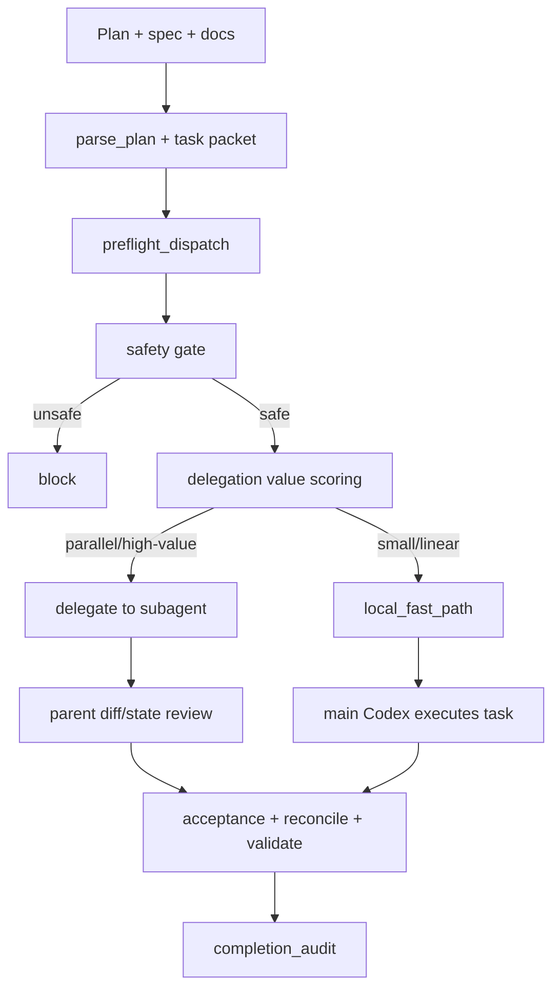

# CPE Adaptive Delegation 설계

작성일: 2026-06-18
대상: `skills/kws-codex-plan-executor`
상태: 사용자 스펙 검토 대기
우선순위: C(subagent 정책 재설계) -> A(fast path) -> B(검증 자동화)

## 목표

`kws-codex-plan-executor`는 v2.20 이후 `subagents=on`을 기본값으로 두고,
eligible write-capable task를 task packet 기반 subagent-first로 처리한다.
이 구조는 context pollution, scope 충돌, raw full-plan delegation 위험을 줄이는
데 효과적이었다. 하지만 최신 Codex 본체 성능이 좋아진 상태에서는 작은 단일
scope 작업까지 매번 subagent dispatch, run record, parent review loop를 거치면
오히려 실행 마찰이 커진다.

이번 개선의 목표는 품질 방어선을 낮추지 않고 delegation 정책을 더 똑똑하게
만드는 것이다.

1. `subagents=on`의 안전 의도는 유지하되, 실제 dispatch는 task size, risk,
   scope, 병렬 이득을 보고 결정한다.
2. 작은 작업은 `local_fast_path`로 Codex 본체가 직접 처리하게 하되, worktree
   격리, task contract, diff scope check, acceptance verification, state
   validation은 유지한다.
3. subagent를 쓰지 않은 이유를 실패 서사가 아니라 deterministic policy
   decision으로 기록한다.
4. 구현 범위는 CPE skill package 내부로 제한하고, Waygent runtime이나 true
   write hook으로 확장하지 않는다.

## 현재 상태

확인 시점의 deterministic checks는 통과했다.

```bash
cd skills/kws-codex-plan-executor
./evals/run.sh
python3 -m py_compile scripts/*.py evals/*.py
bash -n evals/run.sh
```

현재 구조의 강점은 유지해야 한다.

- 코드 변경은 dedicated worktree 아래에서만 수행한다.
- orchestration state는 `~/.codex/orchestrator/<run_id>/state.json`이 권위
  소스다.
- task packet은 plan/spec/docs 전체가 아니라 task 단위 context와 write
  policy를 제공한다.
- `preflight_dispatch.py`는 packet/state/write scope/dirty overlap을 보고
  `delegate`, `local_fallback`, `block`을 결정한다.
- finished state는 `completion_audit`, `context_health`, `validate_state.py`,
  `reconcile_state.py`로 닫힌다.

현재 병목은 subagent-first가 너무 넓게 적용된다는 점이다.

- 작은 docs-only task도 subagent dispatch 후보가 된다.
- subagent tool policy가 unavailable 또는 explicit-request-required면 local
  fallback이 "실패 후 대체"처럼 기록된다.
- `preflight_dispatch.py`는 안전성은 보지만, "subagent를 쓰는 가치"를 충분히
  평가하지 않는다.
- 최신 Codex가 혼자 처리해도 충분한 단일 scope 작업에서 run/state/review
  overhead가 커진다.

## 설계 원칙

1. 품질 방어선은 유지한다. fast path는 검증 생략 경로가 아니다.
2. delegation은 permission이 아니라 value decision이다.
3. local fallback은 실패만 의미하지 않는다. 정책상 local이 더 적합한 경우도
   first-class outcome이다.
4. deterministic helper가 판단 근거를 남긴다. 사람이 쓴 설명 문자열에만
   의존하지 않는다.
5. finished state는 local fast path를 명확히 설명해야 한다.
6. broad scope, dirty overlap, risky files는 여전히 block 또는 full review
   대상이다.
7. 기존 v2.20-v2.22 state compatibility를 깨지 않는다.

## 목표 아키텍처



## 개선 1: Adaptive Delegation Policy

`preflight_dispatch.py`에 safety decision과 value decision을 분리한다.

Safety gate는 지금처럼 delegation이 가능한지 확인한다.

- state file exists and is writable
- task packet exists and hash matches state when recorded
- allowed write globs are non-empty
- write scope is not broad
- write scope does not match forbidden globs
- dirty files do not overlap write scope
- packet context budget is not red
- full spec fallback is not oversized
- acceptance command or honest substitute exists

Value gate는 subagent를 쓰는 이득이 있는지 판단한다.

추천 입력 신호:

- task packet estimated chars
- task body/component chars
- allowed write glob count
- declared file count
- task dependency count
- task can run independently from neighboring tasks
- risk markers in changed paths
- acceptance command cost
- explicit user delegation intent
- spawn policy availability

추천 outcome:

```json
{
  "decision": "local_fallback",
  "reason": "adaptive_policy_local_fast_path_small_scope",
  "delegation_policy": {
    "requested_mode": "on",
    "effective_mode": "local_fallback",
    "policy_kind": "adaptive",
    "safety_gate": "passed",
    "value_gate": "local_fast_path",
    "signals": {
      "declared_file_count": 1,
      "allowed_write_glob_count": 1,
      "packet_budget_status": "green",
      "explicit_user_delegation_request": false,
      "risk_markers": []
    }
  }
}
```

`delegate`는 아래 조건이 맞을 때 선택한다.

- 독립 write scope가 명확하다.
- 병렬 이득이 있다.
- task packet이 충분히 작고 acceptance가 명확하다.
- parent가 post-diff/state review로 쉽게 검증할 수 있다.
- 사용자가 명시적으로 subagent/parallel/delegation을 요청했거나, plan이 여러
  독립 task로 나뉘어 있다.

`local_fallback`은 아래 조건에서 정상 정책 결정으로 선택한다.

- 단일 docs 파일 또는 단일 package 내부의 작은 변경이다.
- task dependency가 선형이다.
- 병렬화 비용이 구현 비용보다 크다.
- spawn policy가 explicit request를 요구하고 사용자가 명시하지 않았다.
- Codex 본체가 task packet을 충분히 처리할 수 있다.

`block`은 아래 조건에서 유지한다.

- dirty overlap이 있다.
- write scope가 broad pattern이다.
- forbidden write glob과 충돌한다.
- packet hash가 state와 다르다.
- packet budget이 red다.
- full spec fallback이 크고 acceptance가 불명확하다.

## 개선 2: Local Fast Path

`local_fast_path`는 subagent를 쓰지 않는 최적화 경로다. 검증을 생략하지
않는다.

적용 조건:

- packet budget이 green 또는 yellow다.
- allowed write scope가 좁다.
- changed files가 1-3개 수준이고 같은 ownership boundary 안에 있다.
- acceptance command 또는 honest substitute가 있다.
- dirty overlap이 없다.
- lockfile, migration, auth, security, infra-wide 변경이 아니다.
- task dependencies가 선형이고 병렬 이득이 낮다.

유지할 절차:

- dedicated worktree
- dirty related block
- `TASK EXECUTION CONTRACT`
- behavior/code change의 `using-superpowers` 및 `test-driven-development`
- RED evidence and GREEN evidence when applicable
- `scripts/check_run_diffs.py`
- acceptance command or honest substitute
- `scripts/reconcile_state.py --check`
- `scripts/validate_state.py`

줄일 절차:

- subagent spawn attempt
- `subagent_runs` record creation
- delegated output review loop
- parallel write-scope split
- "failed to delegate, then local" 형식의 불필요한 서사

State 표현은 기존 호환성을 위해 `subagent_strategy.mode=local_fallback`을
유지한다. 대신 reason과 delegation policy를 구체화한다.

허용할 reason 예시:

- `adaptive_policy_local_fast_path_small_scope`
- `adaptive_policy_local_fast_path_docs_only`
- `adaptive_policy_local_fast_path_linear_task`
- `adaptive_policy_local_fast_path_low_parallel_value`
- `spawn_policy_requires_explicit_user_request`

## 개선 3: 최소 검증 자동화

이번 개선에서 자동화는 policy evidence를 검증하는 정도로 제한한다.

### `preflight_dispatch.py`

추가할 출력:

- `policy_kind`: `legacy` 또는 `adaptive`
- `safety_gate`: `passed` 또는 `failed`
- `value_gate`: `delegate`, `local_fast_path`, `block`
- `signals`: value decision에 사용한 작은 JSON object
- `reason`: deterministic reason enum

기존 callers와 state validator가 깨지지 않도록 기존 top-level fields는
유지한다.

### `validate_state.py`

finished run에서 다음을 검증한다.

- `subagents_requested=true`이고 write-capable completed task가 local fallback이면
  reason이 비어 있으면 안 된다.
- adaptive local fast path reason은 허용 reason set에 포함되어야 한다.
- `dispatch_decisions[].decision=block`은 finished state에 남을 수 없다.
- local fast path task도 `unit_manifest`, diff scope check, verification
  evidence를 가져야 한다.

### Evals

추가하거나 갱신할 deterministic eval:

1. Small docs task:
   - expected decision: `local_fallback`
   - expected reason: `adaptive_policy_local_fast_path_docs_only`
   - no `subagent_runs` required
2. Small single-package script+eval task:
   - expected decision: `local_fallback`
   - expected reason: `adaptive_policy_local_fast_path_small_scope`
3. Multi-file independent task:
   - expected decision: `delegate` when spawn policy is available
4. Dirty overlap task:
   - expected decision: `block`
5. Broad scope task:
   - expected decision: `block`
6. Explicit user delegation request:
   - small task may still delegate only if policy says explicit request should
     override low value; otherwise expected reason must record why local was
     still safer.

## Files To Change In Implementation

Expected implementation scope:

- `skills/kws-codex-plan-executor/scripts/preflight_dispatch.py`
- `skills/kws-codex-plan-executor/scripts/validate_state.py`
- `skills/kws-codex-plan-executor/evals/check_preflight_dispatch.py`
- `skills/kws-codex-plan-executor/evals/check_state_schema.py`
- `skills/kws-codex-plan-executor/SKILL.md`
- `skills/kws-codex-plan-executor/README.md`
- `skills/kws-codex-plan-executor/ARCHITECTURE.md`
- `skills/kws-codex-plan-executor/HISTORY.md`
- `skills/kws-codex-plan-executor/references/pre-dispatch-pipeline.md`
- `skills/kws-codex-plan-executor/references/execution-cycle.md`
- `skills/kws-codex-plan-executor/references/state-schema.md`
- `skills/kws-codex-plan-executor/docs/evals-and-verification.md`
- `skills/kws-codex-plan-executor/docs/how-it-works.md`
- `skills/kws-codex-plan-executor/docs/verification-log.md`

Graphify output may change if `graphify update .` refreshes tracked
`graphify-out/` files after implementation.

## Non-Goals

- Do not remove dedicated worktree execution.
- Do not remove state validation or reconciliation.
- Do not change the public default to `subagents=auto` in this iteration.
- Do not add true runtime write interception hooks.
- Do not move CPE execution into Waygent runtime.
- Do not revive legacy AgentRunway or Python AgentLens routing.
- Do not make prompt/handoff modes create runtime artifacts.
- Do not weaken TDD/RED-GREEN requirements for behavior or code changes.

## Acceptance Criteria

The implementation is done when:

1. `preflight_dispatch.py` emits adaptive policy evidence while preserving
   existing schema compatibility.
2. Small low-risk tasks choose deterministic local fast path instead of
   subagent dispatch.
3. Large or parallel-worthy tasks still choose `delegate` when safe.
4. Dirty, broad, stale, or forbidden-scope tasks still block.
5. Finished state validation accepts adaptive local fast path only when it has
   reason, unit manifest, diff scope, and verification evidence.
6. Docs explain that local fast path is a quality-preserving optimization, not
   a verification skip.
7. Deterministic evals cover local fast path, delegate, and block outcomes.
8. Required verification passes:

```bash
cd skills/kws-codex-plan-executor
python3 evals/check_preflight_dispatch.py
python3 evals/check_state_schema.py
./evals/run.sh
python3 -m py_compile scripts/*.py evals/*.py
bash -n evals/run.sh
cd /Users/kws/source/private/Archive
git diff --check
```

If implementation changes code or meaningful documentation structure in this
Graphify-aware repository, run:

```bash
graphify update .
python3 skills/kws-codex-plan-executor/scripts/check_graphify_freshness.py \
  --repo-root /Users/kws/source/private/Archive \
  --update-ran \
  --output /tmp/cpe-adaptive-delegation-graphify-audit.json
```

Record whether tracked or ignored Graphify outputs changed.

## Risks And Mitigations

| Risk | Mitigation |
| --- | --- |
| Fast path is misread as "skip review" | Keep task contract, diff check, acceptance, reconcile, validate as non-negotiable. |
| Small task heuristic hides risky files | Risk markers force `block` or non-fast-path review. |
| Default `subagents=on` semantics become confusing | Document that `on` means subagents are allowed and preferred when value is high, not blindly forced. |
| State validator rejects older runs | Keep new adaptive fields optional and preserve existing top-level fields. |
| Too many reason strings drift | Use deterministic reason enum in tests and docs. |
| Explicit user delegation request is ignored unexpectedly | Record explicit intent in `delegation_policy.signals` and make override behavior explicit in evals. |

## Self-Review

- Placeholder scan: no unfinished placeholder markers remain.
- Internal consistency: default remains `subagents=on`; adaptive policy changes
  dispatch choice, not the invocation default.
- Scope check: one implementation plan can cover scripts, evals, and docs
  without changing Waygent runtime.
- Ambiguity check: local fast path keeps verification requirements; the design
  explicitly lists which steps are retained and which are skipped.
