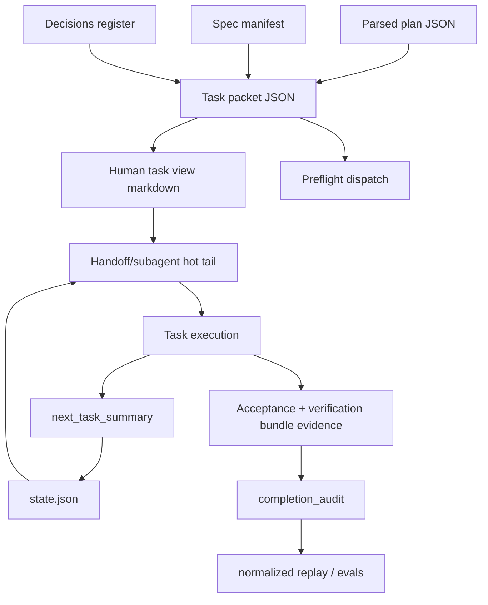

# CPE Human-Readable Harness Umbrella Design

작성일: 2026-07-02
상태: DRAFT SPEC FOR REVIEW
대상 표면: `skills/kws-codex-plan-executor`, task packets, handoff/prompt export, completion audit, deterministic evals

## Problem

`kws-codex-plan-executor`는 이미 machine-first 계약이 강하다. 실행은 task
packet JSON, state schema, preflight dispatch, run readiness, completion audit,
Graphify audit, normalized replay evidence를 중심으로 안전하게 닫힌다.

최근 비교한 세 외부 harness는 CPE보다 안전 경계는 약했지만, 사람이 읽고 운영하기
쉬운 표면에서는 배울 점이 있었다.

- task가 `stepN.md`처럼 “읽을 파일 / 작업 / AC / 검증 / 금지사항”으로 보인다.
- 이전 step 결과의 짧은 summary가 다음 step prompt에 들어간다.
- markdown case 기반 eval이 harness 의도를 빠르게 읽게 해준다.
- Stop hook이 프로젝트별 기대 검증 묶음을 명시한다.
- PR review risk rubric이 남은 위험을 사람이 분류하기 쉽게 만든다.

이번 개선은 CPE의 source of truth를 바꾸는 작업이 아니다. 기존 structured state와
JSON task packet을 유지하면서, operator와 subagent가 읽는 표면을 더 명확하게 만드는
작업이다.

## Goals

- Task packet에서 파생되는 human-readable markdown view를 추가한다.
- Handoff/prompt/subagent context에서 사람이 먼저 읽는 task surface를 강화한다.
- 완료 task의 다음 task용 1줄 summary를 hot-tail context로 보존한다.
- Dirty worktree, resume ambiguity, unsafe verification, subagent fallback 같은 판단을
  markdown golden-case eval로 회귀 테스트한다.
- Completion audit에 프로젝트별 verification bundle evidence를 명시한다.
- Residual risk를 advisory rubric으로 더 읽기 쉽게 분류한다.
- 기존 CPE machine contract, state schema validation, acceptance command,
  completion gate를 약화하지 않는다.

## Non-goals

- `--dangerously-bypass-approvals-and-sandbox`나 dangerous skip 계열 실행을 도입하지 않는다.
- Repo 내부에 CPE runtime state를 저장하지 않는다.
- `git add -A` 같은 broad staging workflow를 CPE 실행 규칙으로 가져오지 않는다.
- Markdown view를 source of truth로 만들지 않는다.
- One-line summary로 task completion, dispatch decision, verification evidence를 대체하지 않는다.
- LLM judge나 external API key를 기본 deterministic eval gate에 넣지 않는다.
- PR risk rubric을 merge gate, finished 판단, release blocker 판정의 source of truth로 쓰지 않는다.
- 기존 `completion_audit.passed`, `validate_state.py`, `reconcile_state.py`,
  acceptance command 계약을 완화하지 않는다.

## Reviewed Approaches

### A. Markdown-First Harness로 전환

외부 repo처럼 `phases/*/stepN.md`를 CPE의 primary task representation으로 삼는다.

장점:

- 사람이 읽는 task 표면이 매우 단순하다.
- phase/step 파일만 봐도 실행 흐름을 이해하기 쉽다.

단점:

- CPE가 이미 가진 task packet JSON, state validation, context budget, spec mapping
  evidence와 중복된다.
- Markdown parsing이 source of truth가 되면 state drift와 ambiguity가 늘어난다.
- 기존 CPE의 deterministic eval과 replay 구조를 약화한다.

이 접근은 거부한다.

### B. Documentation-Only로 설명만 보강

문서에 “task packet을 이렇게 읽어라”, “completion audit을 이렇게 해석하라”를 추가하고
코드는 바꾸지 않는다.

장점:

- 구현 위험이 낮다.
- 기존 state compatibility가 완전히 유지된다.

단점:

- Subagent/handoff prompt가 실제로 더 읽기 쉬워지지 않는다.
- Golden-case eval과 verification bundle evidence가 생기지 않는다.
- 외부 harness에서 얻은 실질 장점을 CPE 실행 표면에 반영하지 못한다.

이 접근은 충분하지 않다.

### C. Recommended: Machine Contract 위에 Human View와 Advisory Evidence 추가

기존 JSON packet과 state schema를 source of truth로 유지하고, 그 위에 읽기용 markdown
view, one-line summary, markdown golden cases, verification bundle, advisory risk rubric을
얇게 추가한다.

장점:

- CPE의 안전 경계와 deterministic validation을 유지한다.
- Operator, handoff 수신자, subagent가 task를 더 빨리 이해한다.
- Markdown은 파생물이라 drift를 테스트로 잡을 수 있다.
- 외부 harness의 장점만 가져오고 위험한 실행 방식은 가져오지 않는다.

단점:

- Packet JSON과 markdown view 사이 parity eval이 추가로 필요하다.
- State schema에 optional summary/evidence fields가 늘어난다.
- Prompt/handoff hot-tail boundary를 다시 점검해야 한다.

선택한 접근은 C다.

## Design

### 1. Human Task View Renderer

새 renderer는 task packet JSON을 입력으로 받아 markdown view를 만든다.

예상 CLI:

```bash
python3 scripts/render_task_packet_view.py \
  --task-packet "$RUN_DIR/task_packets/task_0.json" \
  --output "$RUN_DIR/task_packets/task_0.md"
```

Markdown shape:

```md
# Task task_0: <task_title>

## 읽을 파일
- <file or context component source>

## 작업
<task_body 요약 또는 원문>

## AC
- <acceptance criteria or missing marker>

## 검증
- <acceptance command or honest substitute>

## 금지사항
- <forbidden write glob>
- <CPE safety invariant>

## Context Notes
- spec sections: <section ids>
- context budget: <green|yellow|red>, <estimated chars>/<max chars>
- decisions included: <count>
```

Rules:

- JSON task packet remains authoritative.
- Markdown view is generated, not manually edited.
- Renderer fails if required packet fields are absent or malformed.
- `acceptance.command=null` must render an explicit honest-substitute marker, not an empty verification section.
- `write_policy.forbidden_write_globs` and unit manifest forbidden globs must be visible.
- Full-spec fallback must be visible as a warning-style note, but the renderer itself does not block.

Integration points:

- Handoff export may include the markdown view before raw packet metadata.
- Subagent task prompts should prefer the markdown view plus selected machine fields instead of raw full-plan context.
- Prompt cache strategy keeps stable instructions in the prefix and places generated task view in the hot tail.

### 2. Completed Task Summary Hot-Tail

Completed tasks may record a one-line summary for the next task.

State shape:

```json
{
  "tasks": {
    "task_0": {
      "next_task_summary": "Added packet view renderer and covered null acceptance rendering."
    }
  },
  "context_health": {
    "status": "green",
    "next_action": "Run task_1 with task_0 summary in hot-tail context.",
    "handoff_ready": true,
    "hot_tail_summaries": [
      {
        "task_id": "task_0",
        "summary": "Added packet view renderer and covered null acceptance rendering."
      }
    ]
  }
}
```

Rules:

- Summary is optional for older states.
- Summary is advisory context only.
- Completion still requires structured timing, verification evidence, reconciliation, and validation.
- Summary must be one line and should not contain raw secrets, absolute home paths, full prompts, or transcripts.
- If a summary is omitted, CPE still works; inspection may report a non-blocking context-quality follow-up.

### 3. Markdown Golden-Case Eval

CPE already has deterministic Python fixture checks. This design adds a small markdown case layer for
operator-readable policy scenarios.

Directory:

```text
skills/kws-codex-plan-executor/evals/golden-cases/
  dirty-related-block.md
  resume-ambiguous-block.md
  unsafe-verification-block.md
  subagent-local-fallback.md
  task-packet-human-view.md
```

Case format:

```md
# dirty-related-block

## Scenario
The source checkout has dirty changes in files claimed by the next task.

## Input
- mode: interactive
- dirty_files:
  - path: src/auth/session.ts
    relation: related

## Must
- stop before edits
- report related dirty worktree blocker

## Must Not
- create completion_audit.passed=true
- classify related dirty files as unrelated

## Expected Decision
block

## Expected Risk
dirty_related_worktree
```

Eval behavior:

- A parser reads markdown into structured expectations.
- Deterministic checks assert that each case has `Scenario`, `Input`, `Must`,
  `Must Not`, `Expected Decision`, and `Expected Risk`.
- Policy-specific checks may map cases to existing fixture runners or static decision helpers.
- These cases complement existing YAML/Python evals; they do not replace them.

Initial coverage:

- Dirty related worktree must block before edits.
- Multiple active resume candidates must block and ask which run/state to resume.
- Unsafe verification substitute must not pass finished completion.
- Subagent fallback must record a concrete local fallback reason.
- Human task view must preserve files, AC, verification, forbidden globs, and full-spec fallback warning.

### 4. Verification Bundle Evidence

External Stop hooks are useful because they encode the project-level verification bundle operators actually
expect. CPE should record that bundle as evidence without turning it into an unstructured shell hook.

Completion audit shape:

```json
{
  "completion_audit": {
    "passed": true,
    "verification_evidence": [
      {
        "class": "acceptance_command",
        "command": "python3 evals/check_task_packet.py",
        "status": "passed",
        "required": true
      },
      {
        "class": "verification_bundle",
        "name": "cpe_skill_change",
        "commands": [
          "./evals/run.sh",
          "python3 -m py_compile scripts/*.py evals/*.py",
          "bash -n evals/run.sh",
          "git diff --check"
        ],
        "status": "passed",
        "required": false
      }
    ]
  }
}
```

Rules:

- Acceptance command remains the per-task verification contract.
- Verification bundle is completion evidence classification, not a replacement for acceptance.
- Bundle commands may be recommended by repo instructions, skill change protocol, or operator context.
- If a bundle command cannot run, evidence records the honest reason and residual risk.
- `required=false` means it is advisory evidence; a repository may still require a command through its own instructions.

### 5. Advisory Residual Risk Rubric

CPE already allows structured residual risk objects with `owner`, `class`, `summary`, and
`blocks_release`. This design standardizes a small advisory rubric for readability.

Suggested classes:

- `external_credentials`: blocked by missing token, key, account, host, or deploy secret.
- `environment_gap`: local machine cannot provide required runtime, device, service, or dependency.
- `test_scope_gap`: verification covered a narrower path than the requested production behavior.
- `third_party_drift`: external API, model, dependency, or provider behavior may change outside CPE.
- `manual_review_needed`: operator must inspect generated content, UX, legal/security judgment, or release notes.
- `known_executor_debt`: CPE evidence quality debt that does not block product correctness.

Rules:

- Rubric is advisory.
- `blocks_release=true` cannot coexist with `completion_audit.passed=true`.
- Risk score, if present, is display-only and must not drive finished lifecycle.
- Source of truth remains completion audit, validation scripts, and state schema.

## Data Flow



## State And Compatibility

Compatibility rules:

- Existing runs without markdown views remain valid.
- Existing task packets remain valid until renderer-specific tests require a new field.
- New fields are optional unless a run claims the new feature in metadata.
- Generated markdown view paths live under `~/.codex/orchestrator/<run_id>/task_packets/`, not in the repo.
- Repo worktrees remain free of CPE runtime artifacts.
- State validation should reject malformed claimed feature output, but should not reject older states that lack these optional fields.

Possible state additions:

```json
{
  "tasks": {
    "task_0": {
      "task_packet_view_path": "/Users/example/.codex/orchestrator/run/task_packets/task_0.md",
      "task_packet_view_sha256": "abc123",
      "next_task_summary": "Implemented human packet view renderer."
    }
  },
  "completion_audit": {
    "verification_evidence": [
      {
        "class": "verification_bundle",
        "name": "cpe_skill_change",
        "status": "passed"
      }
    ],
    "residual_risk": [
      {
        "owner": "operator",
        "class": "test_scope_gap",
        "summary": "No API-key LLM judge was run; deterministic harness covered parser and policy behavior.",
        "blocks_release": false
      }
    ]
  }
}
```

## Error Handling

- Renderer input missing required fields: fail with a clear error and do not write partial markdown.
- Renderer output path outside orchestrator task packet directory: block unless explicitly running an eval temp directory.
- Packet/view hash mismatch after generation: rerun renderer or block finalization if the run claims a view path.
- Summary contains forbidden durable-output patterns: reject before storing or report validation failure.
- Markdown golden-case parser finds missing sections: eval fails with the case path and missing section names.
- Verification bundle command fails: record command, status, and residual risk; do not silently mark bundle passed.
- Advisory risk object has `blocks_release=true` with passed completion: state validation fails.

## Testing Strategy

Required deterministic coverage:

- `check_task_packet_view.py`
  - renders files, task, AC, verification, forbidden globs, context budget, and decisions count.
  - renders missing acceptance as honest substitute.
  - shows full-spec fallback warning.
  - fails on malformed packet input.
- `check_context_summary.py`
  - accepts one-line summaries.
  - rejects multiline summaries and forbidden durable-output patterns.
  - confirms summaries are optional for older states.
- `check_markdown_golden_cases.py`
  - validates required markdown sections.
  - checks initial policy cases and expected decisions.
- `check_verification_bundle.py`
  - accepts structured bundle evidence.
  - rejects bundle evidence that lacks status or command/name.
  - confirms acceptance command evidence remains distinct from bundle evidence.
- `check_cpe_replay.py`
  - includes residual risk classes and verification bundle classes in normalized replay output.

Required command set for implementation closeout:

```bash
cd skills/kws-codex-plan-executor
./evals/run.sh
python3 -m py_compile scripts/*.py evals/*.py
bash -n evals/run.sh
cd /Users/kws/source/private/Archive
git diff --check
```

If docs or runtime structure changes meaningfully, also run Graphify update/freshness checks according to
the repository instructions.

## Rollout Plan

1. Add renderer and task packet view eval.
2. Add optional state fields and validation for view path/hash and one-line summary.
3. Add context hot-tail summary behavior to prompt/handoff/subagent prompt assembly.
4. Add markdown golden-case parser and initial policy cases.
5. Add verification bundle evidence validation and normalized replay fields.
6. Document operator behavior in CPE docs and update `SKILL.md` only where runtime contract changes.
7. Update eval coverage docs, verification log, and history.

## Acceptance Criteria

- Human task view is generated from task packet JSON and never becomes source of truth.
- Handoff/subagent prompts can include the human view without losing machine contract fields.
- Completed task one-line summaries are stored only as hot-tail hints.
- Markdown golden-case evals cover the initial five policy scenarios.
- Completion audit can classify verification bundle evidence separately from acceptance command evidence.
- Residual risk rubric improves readability but cannot override finished validation.
- Existing CPE eval suite passes.
- Archive root `git diff --check` passes.

## Open Questions Resolved By This Spec

- Should CPE adopt external repo dangerous bypass defaults? No.
- Should CPE store phase state in the implementation repo? No.
- Should markdown step files replace task packets? No.
- Should PR risk score become a gate? No.
- Should project-level verification bundles replace acceptance commands? No.
