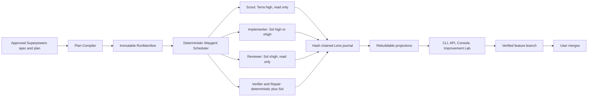

# Waygent Codex Superpowers Production Harness Design

작성일: 2026-07-10
상태: APPROVED DESIGN SPEC
대상: Waygent CLI/API/Console, orchestrator, runway control, Codex adapter,
Lens store/projectors, native kernel, `skills/waygent`
제품 경계: 개인 로컬용, Codex 전용, 사용자가 최종 merge만 수행

## Summary

Waygent를 승인된 Superpowers 설계 문서와 구현 계획을 실제 제품 품질로
실행하는 Codex 전용 로컬 에이전트 플랫폼으로 만든다.

핵심 경계는 다음과 같다.

- Superpowers는 brainstorming, planning, TDD, debugging, review,
  verification 방법론과 품질 계약을 소유한다.
- Waygent는 계획 컴파일, 상태 전이, worktree, scheduling, provider 실행,
  검증, 복구, 증거, 비용, Console 관측을 소유한다.
- Lead Agent는 제품 의미와 예외를 판단하지만 전체 대화나 실행 상태를
  기억하지 않는다.
- Codex worker는 한 역할과 한 bounded task만 수행한다.
- Lens hash-chain event journal이 실행 기록의 canonical source가 되고,
  `state.json`, API, Console은 rebuildable projection이 된다.
- Waygent는 feature branch와 merge-ready 보고서까지 자동으로 만들지만
  보호 branch merge는 제공하지 않는다.

이 설계는 기존 Waygent에 CPE 또는 CME를 runtime dependency로 추가하지
않는다. 두 executor skill의 deterministic manifest, event integrity, attempt
lineage, verification bundle 아이디어는 참고할 수 있지만 active runtime은
계속 TypeScript Waygent와 Lens 경로다.

## Approved Product Boundary

사용자가 승인한 v1 경계는 다음과 같다.

- single-user, local-first;
- Codex Desktop/CLI 및 localhost Console 중심;
- Codex만 first-class provider로 지원;
- 승인된 Superpowers spec/plan을 실행 입력으로 사용;
- 작업 분해, model routing, 병렬화, 구현, review, repair, verification,
  task commit, feature branch 통합은 Waygent가 자동 결정;
- 명세 충돌, credential 부재, 비가역 외부 작업, merge만 중단 조건;
- `main` 또는 지정된 보호 branch merge는 사용자가 직접 수행;
- v1은 remote push를 실행하지 않고 로컬 feature branch와 merge-ready
  보고서까지만 생성;
- 품질이 비용과 단일 작업 latency보다 우선한다.

Waygent의 standing autonomy policy는 중간 선택을 자동화할 권한이지 사용자
승인을 허위로 기록할 권한이 아니다. 자동 설계 또는 자체 개선 결정은
`approval_basis=standing_autonomy_policy`로 기록하고 `user_approved`로
표시하지 않는다.

사용자 판단을 요구하는 pause와 기술적 fail-closed는 구분한다.

- 사용자 판단 pause: 승인 문서 간 의미 충돌, 비가역 외부 작업, credential
  제공이 필요한 작업, 최종 merge;
- 자동 technical block: provider/skill/model preflight 실패, policy denial,
  journal integrity 실패, 검증되지 않은 fallback, budget/circuit exhaustion.

Technical block은 Waygent가 근거와 안전한 다음 행동을 기록하고 종료한다.
일반적으로 사용자의 제품 판단을 요구하지 않으며, 조건이 복구되면 deterministic
resume으로 이어간다.

## Problem And Evidence

### Current strengths

현재 Waygent는 다음 기반을 이미 갖고 있다.

- task DAG와 safe-wave scheduling;
- task별 worktree와 file claim;
- plan preflight와 Superpowers plan normalization;
- spec slicing과 task packet;
- provider process evidence와 model attestation;
- verification, checkpoint, review, repair, completion audit, reconciliation;
- Lens filesystem store, projectors, read API, Console;
- fake-provider deterministic scenarios와 native kernel tests.

2026-07-10에 다음 baseline을 직접 실행했다.

| Command | Result |
| --- | --- |
| `bun run check` | 820 pass, 10 skip, 0 fail |
| `bun run platform:demo` | trusted, 16 events |
| `bun run waygent:scenarios` | 15 pass, 0 fail |
| `cd apps/console && bun test src` | 15 pass, 0 fail |
| `cd apps/console && bun run build` | success |
| `cd native/kernel && cargo test --workspace` | success |

이 baseline은 deterministic/offline 구조가 강하다는 증거다. live provider와
운영 내구성이 production-ready라는 증거는 아니다.

### Current production gaps

2026-07-10의 로컬 run store를 읽기 전용으로 집계한 결과는 다음과 같다.

- state 147개: blocked 119, running 25, completed 2, applied 1;
- event journal 148개, event 9,803개;
- `runway.worker_result` 981개;
- `runway.verification_result` 1,002개;
- `runway.review_result` 45개;
- `runway.recovery_decision_required` 81개;
- `runway.apply_blocked` 270개;
- `method_evidence_required=true`인 state 0개.

대표적인 코드 간극도 확인했다.

1. `packages/provider-adapters/src/processAdapters.ts`는 worker용 임시
   `CODEX_HOME`에 auth와 최소 config만 구성하고 기본
   `sandbox_mode="danger-full-access"`, `approval_policy="never"`를 사용한다.
   Superpowers skill bundle과 정상 사용자 Codex 설정은 이 경로에 없다.
2. Codex worker prompt는 `method_audit` 반환을 요구하지만 실제 skill load와
   invocation을 구조적으로 증명하지 않는다.
3. `packages/orchestrator/src/evidencePolicy.ts`는 worker result의
   `evidence.method_audit` 자기보고를 method evidence로 인정한다.
4. `packages/orchestrator/src/reviewRunner.ts`의 current deterministic review는
   patch ref가 있으면 issue 없는 승인 artifact를 만들 수 있다. 독립 Codex
   reviewer가 실제 diff를 검토하는 구조가 아니다.
5. `packages/lens-store/src/eventJournal.ts`는 append write만 수행하고 hash
   chain, writer fencing, explicit sync가 없다.
6. `packages/orchestrator/src/runState.ts`는 state를 직접 덮어쓰며 event append와
   state update가 하나의 durable transition으로 묶이지 않는다.
7. `apps/api/src/server.ts`의 SSE는 snapshot과 현재 event를 한 번 전송한 뒤
   끝나며 wildcard CORS를 사용한다.
8. recovery table은 `verification_failed`를 evidence retry 대상으로 보지만
   동일 command/environment/failure fingerprint가 변하지 않았는지 검사하지
   않는다.

`WAYGENT_LIVE_PROVIDER=codex bun run waygent:live-smoke`는 0 pass, 1 fail로
종료됐다. provider executable shim failure가 adapter crash로 시작된 뒤
유효하지 않은 verification/repair 경로로 진행되는 문제가 재현됐다. 별도의
실제 run에서는 공백이 포함된 `Application Support`
worktree 경로가 Java classpath 인자로 잘못 전달돼 같은 검증이 반복됐다.
이 사례들은 product bug, harness bug, provider startup, environment blocker를
먼저 구분해야 함을 보여준다.

## Research Basis

### Official Codex constraints

2026-07-10 기준 공식 Codex 문서와 `openai/codex` source를 검토했다.

- subagent는 noisy exploration, tests, log analysis처럼 parent context를
  오염시키는 bounded work에 적합하다;
- parallel write는 conflict와 coordination cost 때문에 보수적으로 사용해야
  한다;
- child는 parent sandbox와 permission을 상속하므로 역할별 권한 차이가 크면
  별도 root thread가 낫다;
- skill 목록은 progressive disclosure와 context budget 때문에 생략될 수 있어
  implicit matching에 의존할 수 없다;
- App Server는 explicit skill input, thread lifecycle, structured output,
  approvals, diff, token, compaction, collaboration event를 제공한다;
- hooks는 유용하지만 모든 tool path를 막는 enforcement boundary가 아니다;
- `codex exec --json --output-schema`는 batch/CI fallback으로 사용할 수 있다;
- model과 reasoning은 blanket maximum이 아니라 task eval로 선택해야 한다.

References:

- <https://developers.openai.com/codex/subagents>
- <https://developers.openai.com/codex/skills>
- <https://developers.openai.com/codex/app-server>
- <https://developers.openai.com/codex/noninteractive>
- <https://developers.openai.com/codex/hooks>
- <https://developers.openai.com/codex/agent-approvals-security>
- <https://developers.openai.com/codex/config-reference>
- <https://developers.openai.com/api/docs/models>

### Public harness patterns

실제 source와 관련 tests를 clone해 비교한 결과, 하나의 framework를 도입하는
것보다 다음 패턴을 현재 TypeScript Waygent에 선택적으로 구현하는 편이 맞다.

| Source | Commit inspected | Transferable pattern | Do not copy |
| --- | --- | --- | --- |
| OpenHands SDK/server | `dc20998a` | branchable event store, worktree, lease generation fencing, stuck detection | LLM judge를 완료 gate로 사용 |
| LangGraph | `95af6a0` | explicit DAG readiness, interrupt, checkpoint, retry semantics | Python runtime dependency |
| OpenAI Codex | `6138909` | filtered context, sandbox, structured event/thread protocol | LLM이 전체 scheduler를 소유 |
| Goose | `b7eb1e9` | declared recipe와 shell success check | shared cwd와 host-shell retry |
| SWE-agent | `1132b3e` | clean retry, trajectory, replay | reviewer score를 완료 증명으로 사용 |
| Aider | `5dc9490` | token-budgeted repo map, architect/editor separation | shared checkout single loop |
| CrewAI | `7baf8f9` | checkpoint branch와 event graph | generic framework surface 전체 |
| AutoGen | `027ecf0` | typed envelopes와 cancellation | caller-dependent durability |
| Claude Code Action | `536f2c3` | trusted-base config, cleanup, failure UX | closed provider dependency |

## Considered Approaches

### A. Codex main-agent orchestration

Codex main thread가 subagent를 직접 만들고 대화로 실행 상태를 관리한다.

장점은 초기 구현이 작다는 것이다. 단점은 context pollution, chat-dependent
state, write collision, resume ambiguity가 커진다는 것이다. Waygent가 이미
소유한 worktree, scheduling, verification, Lens 역할도 약화한다.

이 접근은 선택하지 않는다.

### B. Incremental `codex exec` hardening

현재 process adapter를 유지하면서 prompt, method evidence, retry, Console만
보강한다.

가장 빠른 migration path이지만 explicit skill injection, live thread control,
approval forwarding, rich event normalization에 한계가 있다. stable fallback과
초기 migration 단계로 유지하되 최종 구조로 선택하지 않는다.

### C. Waygent control plane plus Codex worker plane

Waygent가 deterministic control plane과 canonical state를 소유하고 Codex App
Server root thread를 role-scoped worker로 사용한다. Superpowers 문서는 immutable
manifest와 method evidence gate로 컴파일한다.

이 접근을 선택한다. App Server version drift를 막기 위해 Codex version과
generated schema compatibility를 pin하고 `codex exec` fallback을 유지한다.

## Target Architecture



### Responsibility boundary

| Component | Owns | Must not own |
| --- | --- | --- |
| Superpowers | design and engineering methods | runtime state and retries |
| Waygent kernel | DAG, transitions, budgets, isolation, evidence | arbitrary product decisions |
| Lead Agent | spec interpretation and exceptional semantic decisions | raw logs and durable state |
| Codex worker | one bounded role and task | scheduler or recursive delegation |
| Lens | canonical journal and read projections | runtime decisions |
| Operator | final merge | routine execution steering |

## Immutable RunManifest

Waygent compiles approved documents before worker dispatch. The manifest contains
at least:

- manifest schema/version and immutable ID;
- spec/plan paths, content hashes, selected excerpts;
- repository identity, source branch, base commit;
- task DAG, `spec_refs`, task type and risk;
- required Superpowers skill names, resolved paths, content hashes;
- role, model class, reasoning floor, allowed tools;
- sandbox, network, read/write roots, file claims;
- declared acceptance commands;
- parallelization and integration constraints;
- worker, attempt, token, time and cost budgets;
- Codex binary/App Server version and schema compatibility;
- recovery policy, retention policy, protected branch policy;
- standing autonomy policy and merge prohibition.

Manifest mutation is forbidden. A semantic change creates a new manifest revision
with `supersedes` lineage. Resume never reinterprets the original plan from chat.

## Thin Lead Agent And Bounded Context

The Lead Agent performs semantic orchestration while the deterministic kernel
performs mechanical orchestration.

It is invoked only for:

- manifest ambiguity that cannot be resolved by declared rules;
- spec conflict or dependency replan;
- failure-class ambiguity after deterministic observation;
- repair direction when multiple evidence-backed hypotheses remain;
- final residual-risk synthesis.

Waygent builds a bounded `DecisionPacket` containing:

- goal and relevant spec excerpts;
- current DAG position and checkpoint;
- completed/blocked task summary;
- changed-file and sealed-diff summary;
- normalized failure fingerprints and prior actions;
- test/review results and artifact references;
- the one decision requested and a strict output schema.

Raw transcripts, repeated stdout/stderr and full spec copies are excluded. Large
evidence remains content-addressed and is loaded on demand. Lead decisions are
stored as structured `continue`, `repair`, `replan` or `block` records with
rationale and evidence refs, not hidden reasoning.

## Superpowers Method Contract

### Skill preflight

Waygent maintains a Skill Registry with name, resolved path, version and content
hash. Required skills are exposed through a controlled Codex discovery path and
passed as explicit App Server skill input items.

Preflight calls `skills/list(forceReload)` or the equivalent pinned protocol and
fails before dispatch when a required skill is missing, disabled or hash-mismatched.
The run continues using its skill snapshot even if files change later.

### Role method profiles

| Work | Required method |
| --- | --- |
| Feature implementation | `using-superpowers`, `test-driven-development` |
| Bug repair | `systematic-debugging`, then `test-driven-development` |
| Code review | `requesting-code-review` and an independent task review packet |
| Review correction | `receiving-code-review`, then applicable TDD |
| Final verification | `verification-before-completion` |
| Plan repair | `writing-plans` |
| Waygent self-improvement | `brainstorming`, `writing-plans`, `test-driven-development`, `requesting-code-review`, `verification-before-completion` |

Docs/config/generated work may receive an explicit waiver only when the manifest
records why TDD is unsuitable and declares replacement checks.

### Evidence, not self-report

`method_audit` text alone is insufficient. A task gate requires the applicable
combination of:

- skill resolution and injection event;
- public output artifact and sealed diff;
- command observation with cwd, exit code and output refs;
- TDD red-to-green sequence for feature/bug work;
- observe, hypothesize, reproduce, fix and regress steps for debugging;
- independent review findings and disposition;
- fresh final verification.

Every named method in the selected role profile must have Skill Registry
resolution, explicit injection and provider-event evidence. Similar prose or a
prompt that imitates a Superpowers workflow does not satisfy the gate.

Waygent does not store private chain-of-thought. Reproducible commands, artifacts,
diffs and structured decisions are the evidence contract.

### Quality gates

```text
G0 Document contract: spec/plan hashes and task/spec mapping
G1 Environment: provider, skill, git, worktree and dependency preflight
G2 Method: role-specific Superpowers evidence
G3 Task: declared acceptance commands
G4 Review: independent spec and quality review
G5 Integration: whole diff, tests, lint, build and policy
G6 Merge ready: journal integrity, residual risk and clean feature branch
```

No LLM score replaces deterministic verification.

## Codex Worker Plane

### Adapter strategy

The primary adapter is a version-pinned Codex App Server client. It uses:

- root threads per role/attempt;
- explicit skill input items;
- structured output schema;
- thread/turn start, turn interrupt/steer, and owned App Server process shutdown;
- diff, token, compaction, tool and approval events;
- task-specific sandbox and writable roots.

Batch or compatibility execution uses `codex exec --json --output-schema` and
normalizes both paths into the same Lens events. An App Server schema mismatch
fails preflight or selects the validated fallback; it does not parse unknown
events optimistically.

### Worker roles

| Role | Default boundary | Output |
| --- | --- | --- |
| Scout | read-only, network off | evidence inventory and repo map |
| Implementer | task worktree write only | tests, code, sealed diff, evidence |
| Reviewer | sealed diff and spec read-only | findings and verdict |
| Verifier | sealed worktree read-only where possible | fresh command results |
| Repairer | clean repair worktree write only | root-cause fix and regression evidence |
| Integrator | run feature branch only | verified task commit integration |
| Lead | read-only projection packet | structured decision |

Workers cannot recursively spawn Codex subagents in v1. Waygent performs all
fan-out so permissions, cost, lineage and write sets remain observable.

### Task capsule

Every worker receives only:

- exact goal and done-when conditions;
- relevant `spec_refs` excerpts;
- public dependency decisions;
- token-budgeted repo map and relevant files;
- permitted write scope and forbidden operations;
- explicit required skill inputs;
- declared verification commands;
- relevant normalized failure evidence;
- result schema and artifact refs.

## Model Routing Policy

Quality is the primary objective. 2026-07-10의 current local Codex model catalog에
`gpt-5.6-sol`, `gpt-5.6-terra`, `gpt-5.6-luna`, `gpt-5.5`, `gpt-5.4`,
`gpt-5.4-mini`가 확인됐다. Public docs에서는 GPT-5.6이 preview이므로 Waygent는
항상 runtime model listing을 확인하고 exact resolved model metadata를 manifest에
기록한다.

### Approved defaults

| Work | Model | Reasoning |
| --- | --- | --- |
| Mechanical file/search/log extraction | `gpt-5.6-terra` | high |
| Semantic code exploration and task slicing | `gpt-5.6-sol` | high |
| Manifest conflict and recovery direction | `gpt-5.6-sol` | xhigh |
| General feature implementation | `gpt-5.6-sol` | high |
| Docs, config and small edits | `gpt-5.6-sol` | high |
| Shared API, state, concurrency, security, migration | `gpt-5.6-sol` | xhigh |
| First evidence-backed repair | `gpt-5.6-sol` | high |
| Complex or repeated repair | `gpt-5.6-sol` | xhigh |
| Independent code review | `gpt-5.6-sol` | xhigh |
| Completion audit synthesis | `gpt-5.6-sol` | xhigh |
| Test/lint/build execution | no model | deterministic |
| Ambiguous verification interpretation | `gpt-5.6-sol` | high or xhigh |

Terra may collect evidence but may not decide task boundaries or modify files.
Luna is excluded from default routing and may appear only in model evaluation.

`max` is allowed once for an unresolved blocker only when xhigh produced new but
insufficient evidence. `ultra` is forbidden because model-managed automatic
delegation conflicts with Waygent-owned scheduling and role boundaries.

### Fallback

- Sol unavailable: `gpt-5.5` high/xhigh;
- Terra unavailable: `gpt-5.4` high;
- validated fallback unavailable or below task eval threshold: fail closed.

A weaker model is never silently selected for a critical role. Model policy is
versioned and may change only after golden-fixture comparison across success,
review findings, repair count, time, token use and method compliance.

## Scheduling, Worktrees And Integration

### Safe parallelism

- read-only scouts may run concurrently;
- write tasks run concurrently only in distinct worktrees with disjoint write
  sets and independently verifiable contracts;
- shared API/schema/interface, same file and lockfile work is serialized;
- task commit integration and whole-run verification are serialized;
- resource pressure and rate limits reduce concurrency automatically.

Initial local limits are four total Codex threads, two write workers and one
integrator. These are ceilings, not dispatch targets.

### Worktree flow

1. Create a run feature branch from pinned base commit.
2. Create each write attempt in an isolated task worktree/branch.
3. Verify scope, seal diff and record artifact hash.
4. Run independent task review and verification.
5. Integrator applies only accepted task commits to the run feature branch.
6. Run integration verification after every dependency boundary and at closeout.
7. Never mutate the source checkout or protected branch from a worker.

Failed changes remain outside the run branch. Repair starts from the latest
verified checkpoint rather than continuing in a contaminated worktree.

## Canonical Journal And Durable State

### Run layout

```text
run/
  manifest.json
  events.jsonl
  artifacts/
  projections/state.json
  projections/summary.json
  locks/writer-lease.json
```

Manifest and accepted event records are immutable. Artifacts are
content-addressed. Projections are replaceable caches.

### Event envelope

Every event contains:

- monotonic sequence;
- event, run, task, attempt and verification IDs as applicable;
- parent, causation and correlation IDs;
- idempotency key and manifest hash;
- previous event hash and current event hash;
- producer and schema version;
- occurrence time and persisted time;
- artifact references, not large inline transcripts.

Only a valid owner/TTL/generation lease holder may append. Generation is checked
immediately before every write. Append, flush/sync, then atomic projection rename
is the transition order.

Every attempt and verification receives a new immutable ID. Existing artifacts
are never overwritten.

### Durable event contract compatibility

The canonical journal keeps the durable `agentlens.event.v3` record label and
active `platform.*`, `runway.*`, `kernel.*` and `lens.*` event namespaces. It
does not introduce a parallel Waygent-only event family.

The new integrity and lineage fields are additive `agentlens.event.v3` envelope
fields. During implementation:

- current readers accept both historical unsealed v3 events and new sealed v3
  events;
- the new writer profile requires sequence, manifest hash, idempotency key,
  causation/correlation, previous hash and current hash;
- legacy v3 events project `integrity_status=legacy_unsealed` and remain
  read-only after canonical cutoff;
- new projectors and API contracts preserve the existing active namespaces;
- `agentrunway.*`, `kws-cpe.*` and `kws-cme.*` remain historical
  read-compatibility inputs and are never emitted by active Waygent;
- dual-read and replay-equivalence tests cover mixed historical/new stores;
- any future schema-label change requires a separate versioned migration, dual
  reader and explicit cutoff design.

### Transition migration

Existing `waygent.run_state.v2` runs remain readable as historical inputs. During
migration, Waygent may dual-write state and the new journal while a consistency
checker compares projections. The canonical-source cutoff occurs only after
replay equivalence and fault-injection acceptance pass. After cutoff, mutation
commands require a valid new journal; historical state-only runs remain read-only.

## Failure Classification And Recovery

### CommandObservation

Every external command records a redacted structured observation:

- executable and argument array;
- shell mode and normalized cwd;
- allowed environment fingerprint;
- start/end, timeout, exit code and signal;
- bounded stdout/stderr artifact refs;
- normalized error signature;
- dependency/executable presence;
- before/after diff hash.

### Failure classes

| Class | Example | Policy |
| --- | --- | --- |
| `provider_startup` | missing Codex binary/App Server | fail before worker verification |
| `skill_preflight` | missing or mismatched Superpowers skill | fail before dispatch |
| `environment` | SDK, JDK, device, credential unavailable | diagnose, do not repair product |
| `harness_bug` | quoting, cwd, artifact overwrite | create Waygent improvement candidate |
| `product_bug` | changed code fails declared test | clean repair attempt |
| `verification_flaky` | same input produces variable result | bounded isolated rerun |
| `integration_conflict` | accepted task commits conflict | integrator/Lead replan |
| `policy_denied` | out-of-scope write or dangerous action | block; no bypass |
| `spec_conflict` | implementation contradicts approved document | Lead decision or block |

Failure fingerprint includes class, command hash, cwd shape, exit/signal,
stderr signature, environment fingerprint and input diff hash.

No retry occurs when the fingerprint and evidence are unchanged. Transport retry
may remain in one attempt, but semantic repair always creates a new attempt and
clean worktree. Flaky verification gets at most two isolated reruns. Harness and
environment failures never dispatch product-code repair.

Resume replays the manifest and journal to calculate the next deterministic
transition. It does not depend on reviving a chat transcript.

## Lens API And Console

### Product views

The personal local Console provides:

- Home: active, blocked, merge-ready, stale and orphan runs;
- Run Detail: spec/plan, manifest, DAG, waves, workers, diffs, gates and cost;
- Failure Analysis: fingerprint, owner class, prior actions, circuit state and
  reproduction evidence;
- Superpowers Evidence: skill injection, TDD/debug/review/verification chain;
- Improvement Lab: cross-run clusters, proposed design/plan, replay, canary and
  feature branch;
- Merge Ready: commit list, whole-diff verification, residual risk and manual
  merge instructions.

The Console exposes evidence and structured rationale, not private reasoning.

### Live API

SSE becomes a persistent event tail with sequence cursor and `Last-Event-ID`.
Reconnect detects gaps and recovers through a snapshot. Run/task/failure/
improvement projections share one contract across CLI, API and Console.

Pause, resume, cancel and safe cleanup use structured command endpoints and are
themselves journaled. There is no merge endpoint.

### Metrics

- first-attempt task success;
- merge-ready success and time-to-merge-ready;
- repair attempts and same-fingerprint waste;
- harness/environment misclassification;
- review finding severity and disposition;
- post-merge regression escape when later evidence is available;
- Superpowers method compliance;
- Lead versus worker token ratio;
- parallel wall-clock savings;
- model/reasoning success, latency and token use by task class.

If Lead token share grows, Waygent treats it as a capsule/projection design
regression rather than giving the Lead more transcript.

## Waygent Improvement Loop

Improvement candidates are promoted when:

- the same harness fingerprint occurs across distinct runs;
- a severe journal, provider startup or artifact integrity circuit opens;
- a quality gate demonstrably missed a failure;
- the operator explicitly requests analysis.

The loop is:

1. cluster normalized evidence;
2. build a redacted deterministic reproduction fixture;
3. invoke the exact `brainstorming` skill and compare two or three alternatives;
4. record the selected design under standing autonomy policy with skill
   resolution/injection evidence;
5. produce a design spec and implementation plan;
6. invoke `writing-plans`, `test-driven-development`,
   `requesting-code-review` and `verification-before-completion` in the
   applicable phases and implement in a separate Waygent feature branch;
7. replay historical traces and golden fixtures;
8. run an opt-in live canary;
9. produce a merge-ready report;
10. wait for the user to merge.

One failure does not directly edit production skills or runtime. Full external
logs are never reused as trusted prompt instructions.

## Local Security And Privacy

- API binds to `127.0.0.1` by default;
- wildcard CORS is removed;
- mutation endpoints use a local session and CSRF protection;
- run directories use `0700`, files and artifacts use `0600`;
- task sandbox uses exact read/write roots and network off by default;
- worker never receives host secrets not declared by manifest;
- raw credentials, complete environment and private transcript are not stored;
- stdout/stderr pass secret and personal-data redaction before persistence;
- raw provider input/output is opt-in and retention-bounded;
- external documents and logs are untrusted data;
- all remote push and protected branch merge are unavailable in v1 runtime,
  CLI and Console.

Hooks remain advisory guardrails. Sandbox, worktree boundary, manifest policy and
deterministic postconditions provide enforcement.

## Delivery Phases

### P0: Trust foundation

- provider executable/App Server fail-fast;
- remove default danger-full-access worker home;
- unique attempt and verification IDs;
- immutable artifact naming;
- CommandObservation, failure fingerprint, circuit breaker;
- hash-chain journal, writer fencing, sync and atomic projection;
- local permissions, redaction and retention.

### P1: Superpowers execution contract

- Skill Registry and hash pinning;
- RunManifest v1 and compiler;
- role method profiles and explicit skill injection;
- artifact-backed method evidence;
- real independent spec/quality review;
- TDD, debugging and verification gates.

### P2: Codex worker plane

- pinned App Server adapter and schema compatibility tests;
- `codex exec` fallback;
- bounded task/decision packets;
- role sandbox, task worktrees and safe waves;
- approved model router;
- feature-branch integrator and whole-diff verifier.

### P3: Console and improvement lab

- persistent SSE and command API;
- DAG, worker, evidence and failure projections;
- cross-run fingerprint clusters;
- improvement design/plan/replay/canary views;
- merge-ready report.

### P4: Production validation

- replay historical local runs;
- promote observed provider/path/retry failures to fixtures;
- process-kill, journal-corruption and lease-race fault injection;
- dogfood real approved Superpowers plans;
- compare old and candidate harness quality/latency;
- keep all candidate work on a feature branch.

## V1 Acceptance

Waygent may be called production-ready for this personal local boundary only
when all of the following are true.

- required Superpowers evidence compliance is 100%;
- provider/skill preflight failures dispatch zero invalid verifications;
- unchanged failure fingerprints produce zero ungrounded repeats;
- journal replay and live projection hashes agree for every test fixture;
- forced termination produces zero duplicate dispatches or artifact overwrites;
- protected branch and write-scope violations are zero;
- persisted raw secrets/credentials are zero under scanner tests;
- SSE reconnect produces zero missing or duplicated projected events;
- deterministic baseline and all promoted regression fixtures pass;
- at least ten real approved Superpowers plans complete dogfood execution;
- every merge-ready branch has independent review and fresh whole-run verification;
- Waygent never merges the protected branch.

Live-provider readiness also requires repeated startup and execution success in
the current Codex installation; deterministic fixtures alone are insufficient.

## Compatibility And Non-Goals

- Do not call CPE or CME from Waygent.
- Do not revive legacy Python AgentLens or AgentRunway routing.
- Do not add Claude/provider parity to v1.
- Do not make SaaS, multi-user, remote queue or multi-tenant auth part of v1.
- Do not make SQLite or Console state authoritative.
- Do not store full provider transcripts as canonical evidence.
- Do not allow an LLM reviewer to replace tests.
- Do not automatically merge or push protected branches.
- Do not push any remote branch in v1; the operator owns remote publication.
- Do not require historical state-only runs to become mutable.

## Relationship To Existing Designs

This design extends
`docs/superpowers/specs/2026-06-23-waygent-codex-best-loop-design.md`.
That document introduced a provider-aware max-quality profile, full preflight,
manifest slicing, hooks and required method evidence. This design keeps those
goals but replaces prompt-only method claims with explicit skill/evidence
contracts and adds the production control plane, journal, recovery, Console and
improvement loop.

Where older operational designs call `waygent.run_state.v2` the permanent source
of truth, this design defines a guarded migration to a canonical event journal.
The old contract remains active until the explicit cutoff acceptance passes.

## Residual Risks

- Codex App Server remains version-sensitive; pinned schemas and exec fallback are
  required.
- GPT-5.6 availability and behavior may change; model listing, manifest
  attestation and fallback evals are required.
- Method invocation evidence cannot prove hidden cognition; public artifacts and
  deterministic outcomes remain the trust boundary.
- Local sandbox strength varies by platform and mount/network configuration;
  permission tests must run on supported hosts.
- Historical run data may contain sensitive raw artifacts; migration must not
  automatically expose it through new Console views.
- Parallel worktrees reduce collision but do not remove semantic integration
  conflicts; integration remains serial and independently verified.

## Implementation Planning Handoff

The implementation plan must use `PLANS.md`, inspect current package-local
instructions, and decompose delivery so P0 integrity lands before richer
orchestration or UI. Every plan task must name exact files, tests, migration
behavior, rollback/kill switch and acceptance commands.

The plan must also include:

- fixture migration for the observed Codex shim and space-containing path bugs;
- App Server version/schema matrix;
- model router golden evals for Terra-high extraction and Sol-high/xhigh roles;
- old-state read compatibility and journal cutoff proof;
- Console/API security and retention tests;
- live-provider canary evidence that remains opt-in for normal offline checks.
