# CPE 4.0 Autonomous Efficient Executor Design

작성일: 2026-07-12  
상태: APPROVED DESIGN SPEC  
대상: `skills/kws-codex-plan-executor`  
기준: local `main` CPE 3.1.0  
제품 경계: CPE 개선만 포함하며 Waygent 제품 구현은 포함하지 않는다.

## Summary

CPE 4.0은 승인된 spec과 plan을 장시간 중단 없이 실행하되, 역할별 계약
불일치와 무제한 review/repair 루프를 제거하는 clean-cut executor다.

핵심 변경은 다음과 같다.

- implementer, reviewer, verifier가 동일한 immutable `TaskContractV4`를 사용한다.
- task마다 candidate와 verified Git checkpoint를 만들고 누적 미커밋 diff를
  심사하지 않는다.
- 같은 root cause의 semantic repair는 최대 두 번만 허용한다.
- CPE는 standing autonomy policy에 따라 일반적인 판단을 자동으로 내리고
  근거를 decision ledger에 남긴다.
- 진짜 사용자 권한이 필요한 작업만 `waiting_user`로 두고, 독립 작업과
  외부 조건 감시는 계속한다.
- 활성 모델은 `gpt-5.6-sol/high`와 `gpt-5.6-terra/high`뿐이다.
- 모델끼리 경쟁시키지 않고 동일한 Sol 5.6에서 production control과 CPE 4.0
  prompt/packet 구조를 최종 checkpoint당 한 번 비교한다.
- 기존 v3 run은 resume, migrate, repair하지 않는다.
- canvas와 Waygent 실행 브랜치는 통째로 병합하지 않고 검증된 동작만 새
  테스트를 통해 선별 이식한다.

목표는 릴리스 무결성을 유지하면서 실제 구현 run의 attempt를 142회에서
40회 이하로, 동일 root repair를 두 번 이하로 줄이는 것이다.

## Evidence And Root Causes

### CPE 3.1.0 subscription live matrix

`2026-07-11-cpe-v3-subscription-live-matrix-20260711-152521` run의 canonical
ledger를 집계하면 다음과 같다.

| 항목 | 결과 |
| --- | ---: |
| wall-clock span | 19.59시간 |
| total attempts | 142 |
| implementation | 16 |
| task review | 59 |
| repair | 50 |
| verification | 17 |
| input tokens | 181,244,705 |
| cached input tokens | 167,930,112 |
| output tokens | 1,238,040 |
| summed attempt latency | 약 11.3시간 |
| T2 attempts | 32 |
| T10 attempts | 24 |

반면 최종 32-slot live matrix 자체의 합산 provider latency는 약 9.4분이었다.
지연의 중심은 paid matrix가 아니라 구현 이후의 반복 review와 repair였다.

주요 원인은 다음과 같다.

1. T1 implementer packet에는 YAML 요약과 spec slice만 들어갔고, plan에 있던
   상세 interface, 테스트 예시, RED/GREEN 단계는 같은 형태로 전달되지 않았다.
   Reviewer는 저장소의 1,505줄 전체 plan을 읽고 누락을 찾았다.
2. T2는 실행 시점에 보존되지 않은 과거 TDD RED 증거를 사후에 요구받았다.
   복구할 수 없는 증거 요구와 범용 glob overlap 정적분석이 결합해 반복
   repair가 발생했다.
3. T8은 유지되는 check의 false-green 방지 범위를 넘어 범용 Python AST
   control-flow 분석으로 확장됐다.
4. T10의 credentialed execution이 일반 implementation worker lifecycle에
   들어가 nested Codex, checkpoint, network, operator-decision 경계와 충돌했다.
5. Task별 commit instruction이 plan에 있었지만 runtime checkpoint가 아니어서
   worktree diff가 누적됐다. T9/T11에서 Graphify와 생성 산출물까지 scope와
   evidence를 오염시켰다.

### Canvas runtime and Waygent P0 dogfood

`codex/cpe-canvas-runtime-20260712`는 CPE 3.1.0과 갈라진 뒤 runtime 수정과
3.0.2~3.0.8 release commit을 번갈아 만들었다. 검토 기준 commit `8a92e08`
까지 15개 commit 중 7개가 개별 release commit이다.

같은 Waygent P0 plan으로 다섯 run이 만들어졌지만 모두 Task 1 이전 또는
도중에 runtime/environment 문제로 멈췄다.

- interrupted implementation;
- ignored `apps/api/dist`가 scope violation으로 분류됨;
- dependency/bootstrap 중 side effect;
- revision-zero write attempt validation;
- existing Bun을 acceptance PATH가 찾지 못함.

이 과정은 Waygent 제품 구현보다 CPE 자체 보정에 더 많은 작업을 소비했다.

Waygent P0~P4 plan은 36 tasks, 146 steps, 253 unique file claims를 포함한다.
44개 파일이 여러 task에서 다시 사용되며 `apps/cli/src/index.ts`와
`packages/orchestrator/src/orchestrator.ts`는 각각 아홉 task에서 수정된다.
Checkpoint와 bounded review 없이 실행하면 CPE 3.1.0의 누적 diff 문제가
재현된다.

## Goals

- 승인된 문서를 task completion의 authoritative contract로 사용한다.
- 일반적인 기술 판단을 자동화하고 사용자 질문을 최소화한다.
- task별 diff와 evidence를 bounded 상태로 유지한다.
- transient pause와 runtime upgrade 후 같은 v4 run을 재개한다.
- release-critical finding과 generic hardening backlog를 구분한다.
- paid 또는 credentialed quality matrix를 최종 code checkpoint당 한 번만
  실행한다.
- 실패 이유, 선택 근거, 다음 행동, attempt/token/time budget을 사람이 읽을
  수 있게 제공한다.

## Non-Goals

- CPE v3 run resume, migration, repair 또는 schema compatibility;
- Waygent P0~P4 제품 구현;
- CPE를 TypeScript Waygent runtime으로 교체;
- remote push, protected-branch merge 또는 결제 설정 변경;
- OS별 modal notification 자체 구현;
- 모든 새로운 static-analysis finding을 release blocker로 승격.

## Architecture

```mermaid
flowchart LR
    A[Approved spec and plan] --> B[Contract Compiler]
    B --> C[Immutable TaskContractV4]
    C --> D[Standing-Autonomy Scheduler]
    D --> E[Sol 5.6 Implementer]
    E --> F[Candidate Git Checkpoint]
    F --> G[Disposable Acceptance Workspace]
    G --> H[Sol 5.6 Scoped Review]
    H --> I[Deterministic Verification]
    I --> J[Verified Task Checkpoint]
    J --> D
    J --> K[Final Code Checkpoint]
    K --> L[One 5.6 Quality Matrix]
    L --> M[Evidence And Privacy Review]
    M --> N[CPE 4.0.0 Release]
```



The run kernel owns task state, event ordering, checkpoints, retry budgets and
evidence references. Models do not own scheduling or durable state.

## Immutable TaskContractV4

The contract compiler emits one content-addressed contract per task. It retains
the exact task source from its heading to the next task heading, including
fenced code blocks.

```json
{
  "schema_version": "cpe.task-contract.v4",
  "task_id": "T1",
  "task_type": "tdd_implementation",
  "risk_class": "high",
  "dependencies": [],
  "task_source": "exact markdown bytes",
  "task_source_sha256": "...",
  "spec_sections": [],
  "file_claims": [],
  "forbidden_paths": [],
  "acceptance_commands": [],
  "required_methods": [],
  "required_evidence": [],
  "checkpoint_message": "...",
  "contract_sha256": "..."
}
```

Supported task types are:

- `tdd_implementation`;
- `non_tdd_implementation`;
- `documentation`;
- `verification`;
- `external_effect`;
- `release_closeout`.

Implementer, reviewer and verifier receive the same contract digest. A
role-specific view may add permissions and output requirements, but it may not
remove task source, spec, claims, acceptance or evidence requirements.

Preflight fails before a model call when:

- task source or fenced code is missing;
- role views do not share one contract digest;
- a task type contradicts its required method or evidence;
- acceptance commands are unstructured or outside the approved boundary;
- spec references or file claims are incomplete.

## Method Evidence

TDD evidence is captured from actual Codex tool events and command observations,
not from a worker summary.

For `tdd_implementation`, evidence records:

- RED command, exit status, timestamp and worktree revision;
- sanitized output digest;
- implementation delta;
- GREEN command, exit status, timestamp and candidate revision.

If RED was not captured at execution time, a reviewer cannot ask for a
retrospective reconstruction. The task fails with `method_contract_failed` and
restarts from a new candidate revision. Documentation, external-effect and
explicit non-TDD tasks do not require RED evidence.

## Checkpoint Lifecycle

Each task follows one lifecycle:

```text
preflight
  -> implementation
  -> candidate checkpoint
  -> acceptance in disposable workspace
  -> scoped review
  -> deterministic verification
  -> verified checkpoint
```

The candidate is a real 40-hex Git commit. Acceptance runs in a disposable
verification worktree at that commit, so build outputs and dependency state do
not change the product worktree. Reviewer input is the diff from the preceding
verified checkpoint to the candidate, plus the common TaskContractV4.

After a repair, review is limited to the previous findings and the delta from
the rejected candidate to the repaired candidate. A full task diff is reopened
only when that delta changes a security, state-integrity or evidence boundary.

A passing candidate becomes the next verified checkpoint. The following task
starts from that commit. The final feature branch is therefore already a
serial chain of reviewed task checkpoints rather than one accumulated dirty
patch.

## Repair Budget And Finding Policy

Semantic findings receive a normalized root-cause fingerprint. The same root
cause may trigger at most two repairs.

After the second repair, the scheduler classifies impact:

Release blockers are limited to findings that can break:

- declared acceptance or approved product behavior;
- security, privacy or state integrity;
- evidence authenticity, mixed-run prevention or oracle boundaries;
- billing, credential or external-effect safety;
- resume/no-duplicate guarantees;
- maintained production-entrypoint checks.

Other generic static-analysis hardening becomes an explicit backlog item and
does not block the current release. A reviewer requirement absent from the
TaskContractV4 becomes `review_scope_expansion`, not a product defect.

Transient provider or quota interruption resumes the same attempt and does not
consume a semantic repair slot.

## Standing Autonomy

The default execution policy is `standing_autonomy`. CPE completes attached
tasks without asking about routine engineering choices.

Automatic decisions follow this order:

1. approved spec and plan;
2. security, integrity and privacy;
3. declared acceptance and user outcome;
4. smallest reversible change;
5. repository-native patterns;
6. time, token and external-call economy.

Each decision records alternatives, selected action, basis, confidence,
reversibility, affected tasks and `approval_basis=standing_autonomy_policy`.
It must never claim `user_approved` without direct approval evidence.

User input is required only for:

- purchasing credit or changing billing/account settings;
- providing credentials or new authority;
- an irreversible external action;
- remote push or protected-branch merge;
- material conflict between approved documents where every choice changes the
  product contract;
- lowering an approved security or privacy boundary.

When user input is required, only the dependent task becomes `waiting_user`.
Independent tasks continue. Provider limits become `waiting_external` and
resume automatically. A `supervise` loop keeps the same run ID alive and
deduplicates decision notifications.

CPE emits a structured `user_decision_required` event. Codex Desktop, CLI or a
future Console may render it, but the kernel does not promise an OS modal.

## Failure Classification

| Category | Behavior |
| --- | --- |
| `contract_invalid` | block before model dispatch |
| `environment_unavailable` | bootstrap once, then re-check |
| `provider_transient` | resume same attempt/run |
| `product_defect` | repair under the two-attempt root budget |
| `review_scope_expansion` | record backlog and continue |
| `runtime_defect` | pause at checkpoint, upgrade runtime, resume same run |
| `external_effect_blocked` | preserve ledger and wait without duplicate calls |
| `evidence_integrity_failure` | release blocker |

A v4 runtime upgrade appends `runtime.upgraded` with old/new runtime commits,
reason and compatibility epoch. It never rewrites prior events. This rule is
for a v4 run upgraded by a later v4 runtime; it does not add v3 compatibility.

## Active Model Policy

Only the following routes exist:

| Role | Model | Reasoning | Authority |
| --- | --- | --- | --- |
| core implementation/review/repair/semantic verification | `gpt-5.6-sol` | `high` | role-scoped write or read-only |
| bounded scout | `gpt-5.6-terra` | `high` | read-only, no verdict |

There is no fallback or reasoning downgrade. Exact model availability is read
from the authenticated App Server catalog. Session evidence must attest the
requested model and reasoning. Missing Sol or Terra blocks instead of routing
to an older model.

The active CPE 4.0 config, preflight and matrix contain no legacy model
treatment.

## Production-Faithful Prompt Comparison

CPE 4.0 compares prompt/packet structures on the same Sol 5.6 model. It does
not compare Sol and Terra quality scores.

The control bundle freezes the actual CPE 3.1 production input shape:

- scheduler role instruction;
- packet path and digest;
- packet bytes and spec sections;
- prior evidence list;
- result schema, acceptance and claims.

The 42-byte `current-v2-prompt.txt` historical placeholder is not a valid
control and must not be used.

The candidate bundle uses the complete TaskContractV4, exact spec excerpts,
fenced tests, checkpoint, prior finding delta, bounded visible context and
result schema.

Both treatments use identical fixtures, model, reasoning, sandbox, timeout,
fresh-session policy, output schema and deterministic oracle.

## Quality Matrix Schedule

No credentialed quality matrix runs per task. Task checks and reviews are not
benchmark treatments.

After every planned task has one verified checkpoint:

1. freeze the final code commit, tree and patch digest;
2. run all cost-free suites once;
3. compile one immutable quality manifest;
4. run one production-entrypoint sentinel as the first ledger slot;
5. resume the remaining slots without duplicating the sentinel;
6. aggregate and review sanitized evidence;
7. run the privacy audit;
8. publish release metadata without another paid call.

The matrix contains 24 outcomes:

- Sol 5.6 CPE 3.1 production control: 8 credentialed cases;
- Sol 5.6 CPE 4.0 candidate: 8 credentialed cases;
- Terra 5.6 large read-only scout: 1 credentialed case;
- Terra write/policy rejection: 7 deterministic outcomes.

Total credentialed calls are 17. Docs, Graphify, version and release-only
changes never trigger another matrix.

If a matrix fails, CPE first runs targeted diagnosis on failed cases. At most
one full terminal rerun is allowed for the release, and only after a new code
checkpoint changes prompt, runner, oracle, fixture, model route or evidence
integrity behavior. A second terminal failure blocks the release.

## Quality Gates

CPE 4.0.0 hard gates are:

- task completion does not regress against the production-faithful control;
- critical regressions are zero;
- model attestation, worktree isolation and drift-free rates are 100%;
- evidence and privacy audits pass;
- aggregate context use does not regress.

Context reduction of 25% or more is a 4.0.0 target, not a hard gate. The prior
same-model experiment reported about 65.9% reduction, but its historical
control prompt was not production-faithful. The 25% target becomes a hard gate
only after two consecutive production-faithful release-candidate matrices,
starting with 4.0.0, both achieve it without quality regression.

## Branch And Version Strategy

Implementation starts from local `main` CPE 3.1.0 in a new isolated worktree.

The following branches are evidence sources, not merge sources:

- `codex/cpe-canvas-runtime-20260712`;
- `codex/waygent-superpowers-production-harness-implementation-20260712-094130`;
- `codex/waygent-superpowers-production-harness-design`.

Canvas commits are not cherry-picked. Checkpointing, workspace bootstrap,
ignored-output handling, downstream checkpoint reuse and operator-decision
binding are reintroduced through CPE 4.0 tests and contracts. Canvas 3.0.x
version, baseline and paid-live metadata are excluded.

Branch-only commit `13fa662` is not merged because current main and later
runtime work supersede its basis. Waygent plan metadata and P0 failure cases
are used only as dogfood inputs.

CPE 4.0 rejects a v3 run ID with `unsupported_run_schema`. Existing external
artifacts remain untouched, but compatibility and migration code are removed.
The first public result is one `4.0.0` release after stabilization, not a patch
release after every runtime fix.

## Verification Strategy

### Contract compiler

- preserves exact task text, code fences, interfaces and commands;
- produces the same digest for every role;
- blocks truncated or contradictory packets before dispatch.

### Lifecycle fault injection

- build outputs cannot dirty the product worktree;
- quota interruption resumes the same attempt;
- runtime upgrade resumes the same v4 run;
- timeout and partial evidence do not duplicate external calls;
- task checkpoints form the final feature branch.

### Review policy

- a third same-root semantic repair cannot run;
- non-blocking generic hardening becomes backlog;
- security and evidence-integrity findings remain blockers;
- reviewer scope expansion cannot silently change the contract.

### Release and privacy

- active surfaces contain no legacy model route or treatment;
- v3 runs fail with `unsupported_run_schema`;
- exactly one 4.0.0 baseline exists;
- canvas release metadata is absent;
- Graphify and release-only commits do not invoke the matrix;
- tracked evidence contains no raw transcript, home path or oracle path.

## Waygent P0 Dogfood

Waygent P0 Task 1 runs in a disposable branch only after the CPE 4.0 candidate
passes deterministic verification. The resulting Waygent product commit is not
merged by this project.

Dogfood succeeds when:

- exactly one CPE run is created;
- total model attempts are six or fewer;
- the same root cause receives at most two repairs;
- a verified task checkpoint exists;
- elapsed time is at most one hour;
- source checkout remains unchanged;
- no runtime patch is required.

The larger synthetic ten-task acceptance requires at most 40 attempts and must
complete without creating a replacement run.

## Release Acceptance

CPE 4.0.0 is ready only when all of the following are true:

1. TaskContractV4 parity and lossless-source tests pass.
2. Candidate, disposable acceptance and verified checkpoint flows pass.
3. Standing-autonomy decisions are evidence-backed and user prompts are limited
   to the approved authority boundary.
4. Same-root repair is capped at two.
5. Runtime upgrade resumes the same v4 run.
6. The 17-call final matrix and seven policy outcomes reach a terminal ledger.
7. Hard quality gates, evidence review and privacy audit pass.
8. Waygent P0 Task 1 dogfood meets the six-attempt and one-hour limits.
9. The merged local-main path passes cost-free verification.
10. Release docs state actual residual risks without rerunning paid evidence.

## Residual Risks

- Model behavior remains nondeterministic even with paired fixtures and exact
  prompt digests.
- Codex Desktop OS notification delivery remains a host capability; CPE can
  guarantee only the durable decision event and host-facing status.
- Account-side subscription versus credit attribution remains externally
  unobservable.
- Removing v3 compatibility is intentional and requires operators to keep an
  older CPE checkout if they later choose to inspect those runs.

These risks do not justify reintroducing legacy routing, unlimited repair or
per-task paid comparison.
