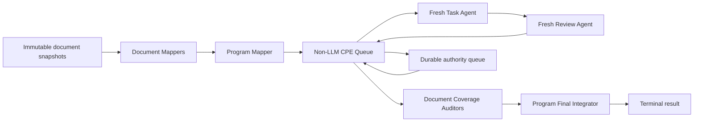

# CPE Durable Superpowers Queue Design

**Date:** 2026-07-13

**Status:** Approved design

**Repository:** `/Users/kws/source/private/Archive`

**Primary surface:** `skills/kws-codex-plan-executor/`

**Release boundary:** CPE next major (`4.0.0`, run schema `4`)

## 1. Summary

CPE 4 is a durable, non-LLM execution queue for large implementation programs
written with Superpowers. It is not another implementation methodology and it
does not keep a long-lived model controller alive.

The ordinary successful path has no persistent main-agent context. Short-lived
Codex sessions perform one bounded role and then exit:

- document mapper;
- program mapper;
- task implementer;
- task reviewer or consolidated fixer;
- document coverage auditor;
- program final integrator.

CPE owns immutable input snapshots, the task queue, dependency state, worktree
identity, child-session launch, authority waiting, interruption recovery, and
inspection. Superpowers owns TDD, implementation discipline, code review, and
verification before a quality claim.

This boundary gives CPE a purpose that direct Superpowers execution does not:
large work survives context compaction, process interruption, and multiple
days without a long-lived agent rereading accumulated history or redispatching
completed work.

The first version supports one or many specification documents and one or many
implementation-plan documents. An optional program plan may define cross-plan
order and ownership. No extra user-authored machine manifest is required.

## 2. Approved Decisions

1. CPE is for large approved specs and implementation plans. Small tasks use
   Superpowers directly and do not need a CPE mode.
2. Normal CPE execution has no long-lived LLM main controller.
3. CPE is a non-semantic queue. It validates schemas, hashes, state transitions,
   and process results but does not parse natural-language requirements.
4. Every model role runs in a fresh bounded session with file-backed inputs and
   outputs.
5. Full documents are read only by disposable mapping and final-audit sessions,
   not retained in a coordinating conversation.
6. Task briefs retain exact source material and source references; summaries
   alone are never authoritative.
7. Product TDD and focused tests belong to the task implementer.
8. Code review belongs to Superpowers reviewer sessions. Reviewers do not rerun
   identical tests already reported for the same revision.
9. Full repository verification runs once at the final program revision inside
   the Program Final Integrator. A later write invalidates that result.
10. Graphify, release proof, paid-live matrices, dogfood certification, and
    Superpowers compatibility scoring are removed from active CPE.
11. Existing schema 3 runs remain untouched and read-only inspectable. CPE 4
    does not migrate or resume them.
12. Python remains during the first reduction. A Bun rewrite is considered only
    after the lean queue is measured.
13. Ordinary implementation errors, bugs, regressions, test failures, review
    findings, integration defects, and recoverable environment problems are
    resolved autonomously. They do not become user questions.
14. Autonomous execution continues while any safe in-scope recovery strategy
    remains. The user is consulted only for genuine authority, irreversible
    external effects, credentials or payment, mutually exclusive approved
    product requirements, or material scope expansion.

## 3. Why CPE Must Differ From Direct Superpowers

Direct Superpowers is the preferred path for a bounded same-session task. Its
controller reads the plan, dispatches implementers and reviewers, keeps a
progress ledger, verifies completion, and finishes the branch.

Wrapping that workflow with another long-lived CPE agent adds no durable value.
It merely moves context from one controller to another.

CPE 4 instead moves coordination outside model context:

| Direct Superpowers | CPE 4 |
| --- | --- |
| One controller retains execution history | A non-LLM queue retains state |
| Context grows across tasks and reviews | Every model session starts fresh |
| Compaction recovery depends on conversation plus ledger | Resume starts from queue state, commits, and handoff files |
| A large plan may be reread after recovery | Input snapshots and task briefs are content-addressed once |
| User questions can hold the controller session open | Decisions are durable queue items |
| Completion is tied to one active conversation | Program Final Integrator is a disposable terminal session |

CPE is justified only when these durable properties are needed. If the queue,
multi-day resume, and multi-document coverage are not needed, direct
Superpowers is simpler.

## 4. Accepted Inputs

The public run surface accepts repeated specification and plan flags:

```bash
python3 scripts/cpe.py run \
  --spec /abs/spec-a.md \
  --spec /abs/spec-b.md \
  --plan /abs/plan-foundation.md \
  --plan /abs/plan-integration.md \
  --program-plan /abs/program.md \
  --workspace /abs/repo
```

Rules:

- at least one `--plan` is required;
- `--spec` is optional and repeatable;
- `--plan` is repeatable;
- at most one `--program-plan` is accepted in the first version;
- CLI order is input order only and never silently determines authority;
- every input is snapshotted before a model session starts;
- documents may be Markdown or UTF-8 YAML when the current Superpowers plan
  format supports it.

The optional program plan may explicitly define:

- plan order and wave boundaries;
- cross-plan dependencies;
- shared file ownership;
- spec coverage expectations;
- integration gates;
- explicit supersession or amendment relationships.

When no program plan exists, mapping sessions construct a proposed program map.
Technical ambiguity is resolved autonomously using the existing architecture,
the smallest reversible change, lower operational risk, and stronger testability
as tie-breakers. Only unresolved authority or mutually exclusive approved
requirements become user authority items before affected work starts.

## 5. Immutable Document Set

CPE creates one private run root with restrictive permissions:

```text
~/.codex/orchestrator/<run_id>/
  run.json
  events.jsonl
  result.json
  inputs/
    document-set.json
    spec-01.md
    spec-02.md
    plan-01.md
    plan-02.md
    program-plan.md
  maps/
    generation-0001/
      documents/
      program-map.json
      coverage.json
      authority-queue.json
  autonomy-decisions.jsonl
  briefs/
  reports/
  reviews/
  verification/
  logs/
```

`document-set.json` records:

- stable document ID;
- declared role: spec, plan, or program plan;
- original absolute path;
- snapshot path;
- byte length and SHA-256;
- input order;
- explicit user-provided relationship metadata when present.

CPE copies bytes and calculates hashes but does not interpret prose. All child
sessions read the immutable snapshots, not mutable source paths.

Changing a source document does not silently alter an active run. The operator
must explicitly create a new map generation from the changed inputs. Completed
work and the prior generation remain visible; the Program Final Integrator must
audit the newest approved generation.

## 6. Multi-Document Mapping

One session must not be forced to load an arbitrarily large document set. CPE
uses two disposable mapping levels.

### 6.1 Document Mapper

CPE launches one fresh read-only mapper per document. A mapper reads exactly
one immutable snapshot plus the repository instructions needed to interpret
that document.

A spec mapper emits:

- goals, non-goals, and approved decisions;
- normative requirement IDs;
- global and scoped constraints;
- explicit amendments or supersession statements;
- referenced interfaces and files;
- unresolved ambiguity;
- exact source headings, ranges, and hashes.

A plan mapper emits:

- globally unique task candidates;
- exact task source ranges;
- stated dependencies and ordering;
- relevant spec references;
- file claims and shared-file hints when present;
- acceptance commands when explicitly present;
- checkpoints, user authority decisions, and external effects;
- unmapped or contradictory text;
- exact source headings, ranges, and hashes.

A program-plan mapper emits:

- wave and plan ordering;
- cross-plan dependencies;
- ownership and integration rules;
- coverage and final-gate requirements;
- explicit authority and supersession rules.

Mapper output is a navigation artifact, not a replacement for source text.
Every extracted statement points back to the immutable snapshot.

### 6.2 Program Mapper

One fresh Program Mapper reads the small document-map outputs and the optional
program-plan map. It need not reread every full document.

It produces:

- a globally unique task graph;
- a plan and wave graph;
- task-to-spec coverage edges;
- spec-requirement disposition;
- shared-file and interface hotspots;
- one ordered ready queue;
- authority items that block only affected tasks;
- exact source references for every edge and authority item.

The accepted requirement dispositions are:

- `planned`: mapped to one or more executable tasks;
- `preexisting_verify`: claimed to exist and requires final evidence;
- `explicit_non_goal`: excluded by authoritative source text;
- `approved_deferred`: excluded by a recorded user authority decision;
- `conflict`: incompatible authorities and therefore blocking;
- `unmapped`: no implementation or disposition and therefore blocking.

Input order never resolves `conflict`. A later document overrides an earlier
one only when an authoritative document explicitly says so or the user records
the decision.

### 6.3 Lossless task briefs

For each mapped task, a brief contains:

- exact task source text;
- exact referenced spec sections;
- applicable global constraints;
- upstream interface commitments;
- acceptance commands present in the approved documents;
- source document IDs, headings, ranges, and hashes;
- expected report path.

The brief may add a small navigation header but cannot paraphrase away binding
requirements. If relevant material would exceed a task session's context, CPE
autonomously splits the task along explicit requirement or interface boundaries
and records the choice. Requirements are never truncated. Only a split that
would change approved product scope can require user authority.

## 7. Runtime Architecture



The CPE queue has no product-reasoning model. It performs only:

- task dependency and lifecycle transitions from `program-map.json`;
- one write-capable task session at a time;
- child-process launch, timeout, interruption, and session references;
- worktree and starting-commit identity;
- commit and handoff-path recording;
- authority waiting and resume;
- autonomous recovery dispatch and decision recording;
- map-generation identity;
- terminal-session launch;
- run inspection.

CPE does not decide implementation quality, infer new dependencies from prose,
or synthesize reviewer findings.

## 8. Task Execution

For each ready task, CPE launches one fresh Task Agent with:

- the immutable task brief path;
- the isolated worktree path;
- upstream interface-report paths;
- the report path;
- the required structured result schema.

The Task Agent:

1. reads the brief and applicable repository instructions;
2. inspects only the code needed for the task;
3. invokes applicable Superpowers skills;
4. follows TDD for behavior changes;
5. implements the task;
6. runs focused covering tests;
7. self-reviews the changed scope;
8. creates one durable task commit and leaves a clean tracked worktree;
9. writes the detailed report to disk;
10. returns a compact structured result.

The compact result contains only:

- status;
- global task ID;
- commit range;
- focused-test summary;
- failure or authority code;
- artifact paths.

Detailed logs and reasoning stay file-backed and do not enter another model
session unless that role needs them.

## 9. Review And Fix

After a task reports completion, CPE launches one fresh read-only Review Agent
with:

- the same task brief;
- the implementer report;
- the exact task commit diff package;
- relevant upstream interface reports.

The reviewer applies Superpowers code-review rules for plan alignment, code
quality, architecture, tests, errors, security, and production readiness. It
does not rerun the implementer's identical focused tests on the same revision.

Critical and Important findings are sent together to one fresh Fix Agent. The
fixer reruns only covering checks, creates one consolidated fix commit, and
appends to the task report. A fresh reviewer then checks the updated commit
range.

If the same material finding recurs without changed evidence, CPE stops that
task's current repair method, launches a fresh investigation session with the
accumulated evidence, and requires a different strategy. It does not ask the
user merely because a repair failed. Unrelated ready tasks may continue when
their dependency and file boundaries make that safe.

CPE has no internal `task_review`, `verification`, `repair`, or
`final_review` worker implementation. It launches bounded Superpowers role
sessions and records their results.

## 10. Autonomous Decisions And Authority Boundaries

### 10.1 Standing autonomy

The approved run grants standing authority for safe, reversible actions inside
the approved workspace and document scope. Agents do not ask the user before:

- diagnosing and fixing product bugs or regressions;
- correcting a test that is demonstrably inconsistent with approved behavior;
- addressing Critical or Important review findings;
- choosing between technically valid internal implementations;
- refactoring code required to complete the approved task safely;
- installing locked project dependencies through the repository's documented
  setup path;
- preserving the host `PATH` and correcting a broken local verification
  environment;
- removing ignored generated outputs from the disposable worktree;
- retrying an interrupted child process;
- splitting an oversized task without changing approved scope;
- escalating to a fresh investigator or more capable model;
- changing the recovery method when the same approach makes no progress.

When several technical choices are valid, the autonomous tie-break order is:

1. explicit approved requirement;
2. existing repository architecture and conventions;
3. smallest reversible change;
4. lowest security and operational risk;
5. strongest direct testability;
6. least new machinery and maintenance burden.

Every nontrivial autonomous choice is recorded in
`autonomy-decisions.jsonl` with the issue, considered alternatives, selected
option, rationale, evidence, affected tasks, and whether the choice is
reversible. Recording a decision does not create another approval gate.

### 10.2 Failure recovery ladder

An error, bug, test failure, or review defect follows one simple ladder owned by
fresh role sessions rather than a large Python policy engine:

1. reproduce or verify the failure from current evidence;
2. identify the root cause before editing;
3. apply the narrowest in-scope fix;
4. run the focused covering checks;
5. run the applicable fresh review;
6. if the same failure remains, preserve evidence and change strategy;
7. continue until the task is clean or a genuine authority boundary is proven.

No arbitrary attempt count turns incomplete work into success. Repeated failure
changes the investigator, model, task split, or technique; it does not weaken
tests, delete requirements, or ask the user to debug the implementation.

### 10.3 Genuine user authority decisions

An authority packet is durable and minimal:

```json
{
  "authority_id": "A3",
  "affected_tasks": ["plan-02:T4", "plan-02:T5"],
  "question": "Approved specifications assign the public interface to incompatible packages. Which authority governs?",
  "options": ["package-a", "package-b"],
  "recommended": "package-a",
  "source_refs": ["spec-02#api-ownership", "plan-02#task-4"],
  "exact_excerpts": ["..."],
  "artifact_paths": ["..."]
}
```

The user is consulted only when CPE has demonstrated one of these boundaries:

- missing login, credential, account access, or secret that cannot be obtained
  through an existing secure local flow;
- payment, production deployment, publication, external message, or another
  consequential external side effect not already authorized;
- destructive or irreversible action outside the disposable run worktree;
- two authoritative approved documents require mutually exclusive product
  behavior and neither explicitly supersedes the other;
- the only remaining solution materially expands scope beyond the approved
  documents;
- legal, security, or policy authority belongs to the user rather than the
  implementation agent.

Ordinary product choices, implementation details, defects, failing tests,
review findings, missing local dependencies, and recoverable tool problems are
not user authority decisions. Routine scheduling follows the approved program
map. There is no persistent main-agent conversation holding the run open.

## 11. Multi-Document Final Closure

One final agent should not be forced to load an unbounded document set. Closure
uses document-scoped audits followed by one program-level terminal session.

### 11.1 Document Coverage Auditors

CPE launches fresh read-only auditors for each spec and plan snapshot. An
auditor receives:

- one original immutable document;
- its document map;
- relevant task briefs, reports, reviews, and commit ranges;
- the final worktree revision;
- relevant diff slices.

Each auditor verifies:

- every normative requirement has an honest disposition;
- every planned task was implemented and reviewed;
- exact constraints were not lost during mapping;
- no documented non-goal was implemented accidentally;
- deferred and preexisting claims have evidence;
- no relevant cross-document conflict remains hidden.

These audits are coverage checks, not a second general code review.

### 11.2 Program Final Integrator

One fresh Program Final Integrator reads:

- the program map and coverage map;
- every document-auditor verdict;
- all autonomous decision records and unresolved authority items;
- the final whole-repository diff;
- the repository's final verification command.

It performs:

1. cross-plan and cross-spec integration review;
2. review of shared files and interface commitments;
3. confirmation that every auditor passed and every blocking authority item
   closed;
4. one fresh full repository verification at the exact final revision;
5. clean-status and revision binding;
6. the terminal quality verdict.

This same agent applies `verification-before-completion` and reads the complete
verification result before claiming readiness. CPE does not run the suite a
second time.

If the integrator finds issues, all findings go to one consolidated integration
Fix Agent. After any write, all affected document audits are invalidated and a
new Program Final Integrator runs against the new final revision.

## 12. State And Recovery

The schema 4 run lifecycle is intentionally small:

```text
mapping
  -> running
  -> waiting_authority
  -> interrupted
  -> final_audit
  -> completed
  -> failed
```

The append-only event set is:

- `run.created`;
- `documents.snapshotted`;
- `map.generation_created`;
- `task.started`;
- `task.reported`;
- `review.reported`;
- `autonomy.recorded`;
- `authority.opened`;
- `authority.resolved`;
- `run.interrupted`;
- `audit.reported`;
- `integration.reported`;
- `run.completed`;
- `run.failed`.

Events contain IDs, hashes, commit references, statuses, and artifact paths.
They do not embed full prompts, source files, diffs, test logs, or reports.

Resume:

1. validates the run manifest and event chain;
2. verifies the worktree and latest recorded commits;
3. verifies immutable input and map-generation hashes;
4. identifies the first nonterminal queue item;
5. never redispatches a completed task or clean review;
6. reopens only interrupted or explicitly retryable work;
7. preserves autonomous choices, authority items, and final-audit invalidation.

## 13. Public Result

CPE reports:

- `completed`: Program Final Integrator returned a terminal result;
- `waiting_authority`: genuine user authority blocks affected progress;
- `interrupted`: safe resume is available;
- `failed`: CPE infrastructure or run integrity cannot continue safely.

`completed` is a run-lifecycle statement. The separate terminal integration
artifact records `quality_verdict=pass|blocked|failed`, exact revision,
verification command, exit status, auditor verdicts, and residual limitations.
CPE does not synthesize a stronger claim than that artifact.

## 14. Existing Schema 3 Runs

Local inspection found eleven schema 3 runs. Existing directories and
worktrees are not deleted or rewritten.

- CPE 4 `inspect` reads a bounded schema 3 summary without mutation.
- CPE 4 `resume` returns `legacy_run_requires_historical_cpe`.
- the pre-change Git commit remains the implementation needed for an explicitly
  chosen legacy resume.
- release/live-matrix schema 3 artifacts are history, not active CPE inputs.

## 15. Removed Active Surfaces

The CPE 4 implementation removes:

- Graphify freshness scripts, evals, and completion requirements;
- live-model runners, paid matrices, oracles, and migration ledgers;
- release policies, release closure, dogfood certification, and release labels;
- Superpowers Markdown scanners and compatibility scoring;
- inferred Markdown plan graph and role-packet machinery;
- CPE-owned TDD evidence and `required_methods`;
- CPE implementation, task-review, verifier, repair, and final-review workers;
- candidate/verified checkpoint promotion;
- repeated repository-suite execution;
- maintained-check inventories and versioned pass baselines;
- documentation wording scanners as quality gates;
- unused shadow transition kernels and phase executors.

Repository-root `graphify-out/`, Waygent packages, and installed Superpowers
skill sources are unchanged by this CPE-only phase.

## 16. Lean Test Strategy

CPE tests only the durable queue boundary:

1. multiple specs and plans snapshot with stable IDs and hashes;
2. document maps compose into one global task and coverage graph;
3. conflicting or unmapped authority opens an authority item instead of
   guessing;
4. completed task and review are not redispatched after interruption;
5. one write-capable child runs at a time;
6. product errors, test failures, and review defects trigger autonomous
   investigation and repair rather than a user question;
7. repeated material failure changes strategy and preserves evidence;
8. only genuine authority boundaries become `waiting_authority`;
9. final audits bind to the final revision and invalidate after a write;
10. schema 3 inspect is read-only and schema 3 resume is rejected;
11. tampered manifest, event, input, map, worktree, or result fails closed;
12. export creates no run artifacts.

The suite uses fake child processes, temporary Git repositories, and no network
or credentialed model calls. The target runtime is under one minute.

There are no CPE tests for product TDD quality, reviewer intelligence,
Superpowers Markdown wording, Graphify, paid models, or release proof.

## 17. Python And Bun

The first pass deletes and consolidates the current Python implementation
before choosing another runtime. The queue spends most wall time waiting for
child model sessions and repository commands, not interpreting Python.

After the lean queue passes, measure:

- cold CLI and inspect latency;
- child-process launch and interruption handling;
- resume latency;
- dependency and packaging failures;
- active implementation and test size.

A Bun rewrite is justified only by measured maintenance or runtime benefit. It
must implement this small queue contract directly and may not port deleted
release, evidence, scheduler, or compatibility modules.

## 18. Delivery Sequence

1. Add the lean multi-document queue tests and confirm the intended failures.
2. Implement immutable input snapshots and repeated `--spec`/`--plan`
   intake.
3. Implement document-map, program-map, task-brief, autonomy-ledger, and
   authority-queue schemas.
4. Implement the non-LLM queue, child launcher, worktree ownership, and resume.
5. Implement bounded task, review, fix, document-audit, and program-final role
   launchers.
6. Switch the public CLI and active documentation to schema 4.
7. Delete release/live/Graphify/Superpowers-audit and task-level legacy runtime.
8. Delete superseded evals, fixtures, schemas, and baselines.
9. Run focused tests, the lean full suite, syntax checks, public CLI smoke,
   schema 3 read-only smoke, and `git diff --check`.
10. Measure file count, active lines, suite duration, and command latency before
    a Bun decision.

Deletion happens only after the replacement public path passes focused tests.
Historical code remains recoverable from Git rather than a second active
runtime.

## 19. Acceptance Criteria

- repeated spec and plan inputs work from the first release;
- no model session must load the complete multi-document corpus unless its
  bounded mapping or audit role requires it;
- every input is immutable and digest-bound;
- every task brief contains exact source text and references;
- every normative spec requirement has an honest disposition;
- document authority conflicts never resolve by CLI order;
- ordinary bugs, test failures, review defects, technical choices, and
  recoverable environment problems never become user questions;
- autonomous choices follow the approved tie-break order and are recorded;
- execution persists through changed recovery strategies while a safe
  in-scope path remains;
- only genuine authority boundaries enter `waiting_authority`;
- the ordinary path has no long-lived LLM main controller;
- CPE queue state survives process interruption without task redispatch;
- only one write-capable task or fix session runs at a time;
- every successful task and fix handoff is commit-bound and leaves a clean
  tracked worktree;
- task agents use Superpowers TDD and focused tests;
- reviewers use Superpowers review without duplicating the same test run;
- document audits check coverage without repeating general code review;
- Program Final Integrator performs one final full verification and owns the
  terminal quality claim;
- a write after audit or verification invalidates affected evidence;
- CPE active code has no Graphify, release, live-model, dogfood, or paid-proof
  dependency;
- schema 3 data remains untouched and inspectable;
- the deterministic CPE suite is credential-free and finishes in under one
  minute on the development machine;
- active implementation is materially smaller, with a directional target of
  five to eight runtime modules and roughly 5,000 active lines before deciding
  on Bun;
- Waygent, Superpowers source skills, and repository-root Graphify output are
  unchanged.

## 20. Risks And Mitigations

### Mapper omission

Task briefs preserve exact source references, coverage cannot pass with
`unmapped` requirements, document auditors reread original snapshots, and the
Program Final Integrator checks all auditor verdicts.

### Conflicting specifications

Input order has no authority. Explicit supersession or a recorded user authority
resolution is required before affected tasks run.

### Too many model calls

Every document is mapped once per approved generation, each task uses one
implementer and one reviewer on the normal path, fixes are consolidated, and
full verification runs once at the terminal revision.

### Autonomy causes an incorrect technical choice

Choices are constrained by approved requirements, repository conventions,
reversibility, risk, and testability. Task review, document audits, and final
integration can reject the choice and trigger a different strategy without
requiring the user to supervise ordinary debugging.

### Persistence becomes an infinite repair loop

The same failed strategy is not repeated unchanged. Evidence is preserved and
the next attempt must alter the investigator, task decomposition, model, or
technical method. CPE never weakens requirements to escape the loop. A run can
stop only at a proven authority boundary or a fail-closed runner-integrity
failure, not because product debugging is inconvenient.

### Loss of global architecture

The program map carries cross-document constraints and interface hotspots;
document auditors verify their source documents; the final integrator reviews
the complete repository diff and shared interfaces.

### Queue code grows into another orchestrator

CPE may validate structured state and launch roles but may not add semantic
requirement inference, model competition, release certification, or duplicate
quality scoring. New behavior must be justified by a demonstrated recovery or
durability failure.

### Superpowers workflow conflict

CPE does not claim to run the full `subagent-driven-development` controller
inside another controller. Each bounded role invokes only the applicable
Superpowers skill. The Program Final Integrator itself runs verification before
making the terminal quality claim.

## 21. Out Of Scope

- small-task execution mode;
- modifying Waygent CLI, API, console, runtime, or packages;
- modifying installed Superpowers skill source;
- deleting repository-root `graphify-out/`;
- running paid or credentialed release proof;
- migrating or resuming schema 3 runs in CPE 4;
- automatically merging, pushing, deleting branches, or cleaning externally
  owned worktrees;
- implementing a Bun rewrite in the first reduction pass.
