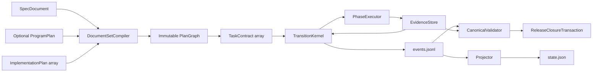

# CPE vNext Quality-First Workflow And Multi-Plan Execution Design

**Date:** 2026-07-13
**Status:** Approved design
**Repository:** `/Users/kws/source/private/Archive`
**Primary surface:** `skills/kws-codex-plan-executor/`

## 1. Purpose

CPE vNext must complete every approved implementation scope while removing the
review, verification, repair, and model-call duplication observed during CPE
v3.1 and v4 work. Quality, security, state integrity, evidence authenticity,
and truthful release claims remain hard requirements. Efficiency comes from
eliminating repeated judgment and reusing exact immutable evidence, not from
skipping work.

The same runtime must support both of these first-class input shapes:

1. one specification plus one implementation plan;
2. one specification plus multiple implementation plans, with an optional
   program or index plan that defines cross-plan order, ownership, coverage,
   and the final integration gate.

This is a clean-cut next-major design. It does not migrate, resume, validate,
or repair v3 or v4 runs. Historical artifacts remain external records that
require their original checkout if an operator later chooses to inspect them.

## 2. Approved Decisions

1. Implement one umbrella design through three sequential implementation
   plans:
   - release trust foundation and closure machinery;
   - runtime, validation, test, and multi-plan simplification;
   - quality-preserving workflow deduplication and measurement.
2. Complete all approved work. Attempt or call budgets never remove product
   scope or turn incomplete work into success.
3. Keep hard ceilings only where they prevent duplicate external effects,
   credentialed spend, or repeated same-root patch loops. Reaching such a
   ceiling changes the repair method; it does not abandon the task.
4. Treat a 50 percent reduction in model attempts, semantic reviews, and full
   suite executions as a measured optimization target, not a release gate.
5. Keep correctness and evidence non-regression as the release gates. A lower
   efficiency improvement may ship when all quality gates pass and the
   remaining optimization opportunity is recorded honestly.
6. Do not split files according to arbitrary line-count limits. Split only
   when ownership, state transitions, failure policies, or independent test
   boundaries justify it.
7. Preserve single-plan input as a vNext feature, not as compatibility code.
   Add multi-plan input directly to the vNext contract.

## 3. Evidence And Root Causes

### 3.1 Repeated review and repair dominated prior execution

The v3.1 subscription-matrix implementation run recorded 142 attempts over
19.59 hours:

| Attempt kind | Count |
| --- | ---: |
| Implementation | 16 |
| Task review | 59 |
| Repair | 50 |
| Verification | 17 |

The final provider matrix itself accounted for roughly 9.4 minutes of provider
latency. The dominant cost was the repeated review-repair cycle around the
implementation, not the paid matrix.

The v4 implementation history from `20020cc` through `5901a91` contained 29
commits: six feature commits, 21 fix commits, one test commit, and one chore
commit. The verification log mentions the full CPE eval command 29 times and
the repository Bun check 18 times. These counts are evidence of repeated
whole-surface closure attempts; they are not themselves proof that any
particular verification was unnecessary.

### 3.2 Large files are not equally risky

The relevant structural measurements are:

| Surface | Evidence | Design conclusion |
| --- | --- | --- |
| `scheduler.py` | 2,986 lines; one 603-line v4 task-cycle function; old and v4 cycles coexist; scheduling, execution, evidence, repair, and completion are coupled | Separate transition decisions from phase execution and remove old paths |
| `check_quality_matrix_v4.py` | 1,989 lines; one 561-line scenario; 13 v4 commits and high churn; manifest, prompt, sentinel, ledger, privacy, lineage, and release packaging share one test file | Split by contract family and retain one minimum authentic E2E |
| `validation.py` | 1,301 lines; checks already have named boundaries; the largest check is 174 lines; no change in the sampled v4 commit range | Preserve the public validator and extract only shared resolvers or genuinely independent profiles |

File length alone is not an acceptance criterion. A split requires at least
two of the following signals:

- multiple durable-state owners;
- multiple failure policies;
- one function directly controls several lifecycle phases;
- a focused change requires the broadest integration suite to diagnose;
- repeated fixes converge on the same file or invariant;
- independent contract testing is impossible;
- old and new runtime routes coexist.

### 3.3 Current release blockers

The v4 closeout register identifies:

- R1: policy and dogfood contract authority is read from mutable worktree
  bytes instead of exact Git objects;
- R2: the merged checkpoint has no current critical-path live proof;
- R3: no final four-lane review covers the exact merged checkpoint;
- R4: full paid-live certification is optional and deferred;
- R5: predecessor continuity is local evidence, not external cryptographic
  attestation;
- R6: account-side subscription cost attribution is unobservable.

The old order placed R2 before R3. That order can make live proof stale when an
R3 finding changes code. vNext closes R3 and its single consolidated fix wave
before freezing and proving the live checkpoint.

### 3.4 Multi-plan reference shape

Canvas-clone commit
[`6d41fb96aa34d4522a8af5bfd911680c2548be3e`](https://github.com/beyondwin/Canvas-clone/commit/6d41fb96aa34d4522a8af5bfd911680c2548be3e)
adds one specification, a program plan, and multiple wave plans. The program
plan owns authoritative stage order, specification coverage, file ownership,
cross-wave constraints, and the single final evidence gate. Wave plans own
executable task detail. CPE vNext must accept this structure without requiring
Superpowers or a user to create a new machine-specific manifest document.

### 3.5 Current OpenAI guidance

The current
[`Using GPT-5.6`](https://developers.openai.com/api/docs/guides/latest-model)
guide recommends lean prompts, stating each instruction once, exposing only
relevant tools, defining autonomy and approval boundaries in one place, and
measuring changes on representative tasks. It also says lower calls, turns,
tokens, or latency count as improvements only when the final result continues
to pass the existing quality bar.

The OpenAI cookbook example
[`Building Consistent Workflows with Codex CLI and Agents SDK`](https://developers.openai.com/cookbook/examples/codex/codex_mcp_agents_sdk/building_consistent_workflows_codex_cli_agents_sdk)
uses scoped role inputs, gated handoffs, parallel work only for independent
workstreams, and one coordinator that checks required artifacts before
advancing. vNext adopts these principles without requiring the Agents SDK or
Responses API as a runtime dependency.

## 4. Goals

- Close R1 before the runtime rewrite, then close R3 and R2 once against the
  final immutable vNext checkpoint.
- Preserve truthful R4, R5, and R6 limitations without letting them become
  ordinary implementation blockers.
- Replace old/v4 dual lifecycle paths with one vNext transition kernel.
- Support one spec with one or many plans under one run ID and event ledger.
- Preserve exact plan text, commands, claims, spec references, and evidence
  requirements in immutable task contracts.
- Make review, repair, and verification invalidation depend on changed
  invariants and exact revisions.
- Run full repository verification at meaningful immutable boundaries rather
  than after every local fix.
- Measure review, suite, model, token, retry, and wall-clock changes without
  weakening completion.
- Complete every approved task or report an actual external or authority
  blocker; never claim success because an attempt target was reached.

## 5. Non-Goals

- Migrating v3 or v4 run artifacts.
- Resuming v3 or v4 run IDs.
- Maintaining dual-schema readers inside the vNext runtime.
- Reintroducing old model routes or alias fallback.
- Requiring a program plan for the single-plan case.
- Requiring a new machine-only manifest file from Superpowers.
- Implementing external signed transparency infrastructure for R5.
- Proving account-side subscription-versus-credit attribution for R6.
- Running the optional full paid matrix without explicit authorization.
- Reducing review or test counts by suppressing required evidence.
- Enforcing line-count or function-count limits as architecture policy.

## 6. Umbrella Architecture



The kernel alone decides phase, retry, repair, wait, block, and completion.
Phase executors perform one requested operation and return a typed outcome.
Models never write executor state and never choose the next lifecycle phase.

## 7. DocumentSet And PlanGraph

### 7.1 Accepted input shapes

The vNext CLI accepts:

```text
--spec <design.md>
--plan <plan-a.md> [--plan <plan-b.md> ...]
[--program-plan <program.md>]
```

One `--plan` is the ordinary single-plan case. Repeated `--plan` flags create a
multi-plan program. `--program-plan` is optional.

### 7.2 Document identities

Every input document receives:

- a stable document ID derived from its declared title and canonical path;
- canonical path relative to the workspace;
- exact source bytes and SHA-256;
- document kind: spec, program, or implementation plan;
- parsed headings and source ranges;
- explicit references to other documents.

Document IDs must be unique. Paths, titles, or hashes that create ambiguous
identity block before allocating a run.

### 7.3 Program plan authority

An optional program plan owns only cross-document coordination:

- authoritative stage or wave order;
- cross-plan dependencies;
- specification coverage map;
- file ownership and explicit ownership-transfer points;
- shared global constraints;
- the single final integration and completion gate.

Implementation plans own executable task source, required methods, file
claims, acceptance commands, evidence requirements, and checkpoint messages.
A program plan may reference these tasks but may not redefine their executable
content. Duplicate or contradictory definitions block preflight.

### 7.4 No-program fallback

When several plans are supplied without a program plan, repeated `--plan`
order becomes an explicit conservative serial plan order. Any explicit
cross-plan dependency inside a plan takes precedence if it is compatible with
that order. CPE does not infer parallelism or file ownership from filenames or
natural-language similarity.

### 7.5 PlanGraph contract

`PlanGraph` contains:

```json
{
  "schema_version": "cpe.plan-graph.vnext",
  "spec_document_id": "spec:...",
  "program_document_id": "program:... or null",
  "plan_documents": [],
  "document_hashes": {},
  "tasks": {},
  "edges": [],
  "spec_coverage": {},
  "file_ownership": {},
  "plan_checkpoints": {},
  "global_integration_gate": {},
  "graph_sha256": "..."
}
```

Task IDs are qualified as `plan_id::task_id`. The compiler rejects duplicate
qualified IDs, dependency cycles, missing plan documents, orphan tasks,
uncovered required spec sections, contradictory file ownership, and a missing
global gate for multi-plan completion.

### 7.6 Shared files and ownership

A file may appear in several plans only when the graph orders the writers and
names either a stable shared interface or an ownership transfer. Write-capable
tasks remain sequential. Read-only scouts may run concurrently only when their
input contracts and file claims are independent.

### 7.7 Invalidation

- A task-source change invalidates that task and all downstream nodes.
- A plan-document change invalidates changed tasks and downstream nodes, not
  unrelated earlier plans.
- A spec-section change invalidates every task mapped to that section and its
  downstream nodes.
- A program order, ownership, or global-gate change invalidates the affected
  graph region.
- A plan checkpoint is valid only for its exact document and upstream graph
  hashes.
- Program completion requires every plan checkpoint plus one current global
  integration gate.

The entire program uses one run ID, isolated worktree, event ledger, evidence
store, and final public result.

## 8. Plan 1 - Release Trust Foundation And Closure Machinery

### 8.1 Correct program execution order

```text
Plan 1: R1 trust repair and closure machinery
  -> Plan 2: vNext runtime and multi-plan cutover
  -> Plan 3: quality deduplication and measurement
  -> final vNext checkpoint
  -> R3 four-lane review
  -> one consolidated fix wave
  -> final proof checkpoint
  -> one cost-free full gate
  -> R2 staged live proof
  -> metadata-only closeout
```

Plan 1 makes every later runtime path consume immutable Git-object trust
bindings, but it does not run credentialed proof. R3 and R2 execute only after
Plans 2 and 3 have stopped changing runtime behavior. R3 precedes R2 so any
required code repair happens before the one credentialed proof sequence.

### 8.2 GitObjectSource

The production policy and dogfood contract paths are fixed constants. The
production loader has no caller-selected path parameter. It reads policy and
contract bytes from the exact reviewed commit through Git object operations,
not through the worktree or index.

The loader returns one immutable `TrustRoot` binding:

- repository identity;
- reviewed commit and tree;
- fixed policy path, blob OID, and SHA-256;
- fixed dogfood contract path, blob OID, and SHA-256;
- trusted base commit and patch digest;
- release labels and attempt ceilings.

The manifest, ledger, launch envelope, dogfood record, terminal generation,
and public validation all bind the same `TrustRoot` digest.

Pre-provider checks reject dirty or staged substitution, alternate tracked
paths, blobs from another commit, missing Git objects, contract mismatch,
post-compilation mutation, and checkpoint drift.

### 8.3 ReleaseClosureTransaction

Allowed phases are:

```text
trust_repair
integration_review
frozen
cost_free_passed
live_proved
closed
```

Every transition requires the exact previous commit, tree, graph digest,
trust-root digest, event-chain head, and evidence references. A mismatch
invalidates downstream evidence. Resume replays the same transaction and may
not duplicate a terminal external call.

### 8.4 Four-lane integration review contract

Plan 1 defines the schemas, invariant registry, deterministic reducer, and
checkpoint bindings for these independent evidence-gathering lanes:

1. state and crash recovery;
2. trust and privacy;
3. public CLI and end-to-end dataflow;
4. live evidence and release lineage.

Each finding requires an `invariant_id`, severity, affected revision, evidence,
and recommended disposition. A deterministic reducer deduplicates the lane
reports by invariant. One reviewer produces one consolidated verdict. At most
one consolidated repair wave runs before the checkpoint is frozen.

The lanes do not produce a final release verdict during Plan 1. The Program
Final Gate runs them against the exact post-Plan-3 checkpoint. Before R2, the
fourth lane reviews the release machinery, historical/current evidence
separation, staged-proof policy, and lineage bindings. After R2, the terminal
generation is validated deterministically against that approved contract. A
new semantic review runs only when the proof fails or exposes a new invariant;
it cannot silently patch the already proved checkpoint.

A newly discovered P0 or P1 invariant after that wave returns the work to
design rather than starting another unbounded local patch loop. The work
remains active until the structural issue is redesigned and resolved.

### 8.5 Program Final Gate staged live proof

The Program Final Gate, not Plan 1, executes this sequence after the frozen
cost-free gate:

1. run the qualified security sentinel;
2. stop on any semantic, evidence, privacy, route, or binding failure;
3. run one normal-success regression;
4. resume one dogfood run for only the attempts needed to complete it;
5. aggregate and finalize only from terminal, privacy-clean, checkpoint-bound
   evidence.

The `2/4/6` critical, dogfood, and combined ceilings remain because these calls
are credentialed external effects. They are safety ceilings, not completion
targets. Reaching a ceiling cannot produce success; it produces a blocker or a
structural redesign requirement.

### 8.6 Program Final Gate metadata-only closeout

Live proof freezes runtime, policy, contract, prompt, fixture, oracle, and
validator bytes. A later closeout commit may change only allowlisted release
status, version documentation, verification log, and Graphify outputs.

Validation reports both:

- `proof_checkpoint`: the exact credentialed checkpoint;
- `closeout_commit`: the metadata-only descendant.

It proves that runtime and trust-root bytes are identical across them. Any
non-allowlisted change invalidates the proof.

## 9. Plan 2 - Runtime, Validation, Test, And Multi-Plan Simplification

### 9.1 Clean-cut runtime

Remove:

- old and v4 task-cycle functions;
- version-specific execution branches;
- v3/v4 resume, validation, reconciliation, and repair paths;
- migration helpers and compatibility projections;
- fixtures whose only purpose is successful old-version execution.

For an old run, the public boundary reads only enough manifest header data to
return `unsupported_version`. It does not open, rewrite, validate, or migrate
the historical artifact graph.

### 9.2 TransitionKernel

The kernel is a deterministic transition table over:

```text
(current state, event or typed outcome) -> (next state, command)
```

It owns phase, retry classification, repair routing, wait, block, and
completion. It has no subprocess, filesystem mutation, network, or model
execution logic.

### 9.3 PhaseExecutor

The executor performs exactly one kernel command:

- implementation;
- acceptance;
- semantic quality review;
- deterministic verification;
- repair;
- plan checkpoint;
- global integration;
- release proof.

It returns a typed outcome and immutable evidence references. It does not
append events or choose the next phase.

### 9.4 EvidenceStore And EvidenceResolver

`EvidenceStore` writes content-addressed artifacts and verifies their bytes.
`EvidenceResolver` gives validators one canonical interpretation of evidence,
revision, tree, patch, environment, task, plan, and invariant bindings.

Validators may not read the same artifact through independent ad hoc parsers.

### 9.5 Canonical validation

The public validation surface remains compact:

- `validate_integrity()` admits a healthy incomplete run;
- `validate_completion()` proves the complete program and public success.

Internally, only three independently testable profiles are justified:

- event, projection, and artifact integrity;
- task, plan-checkpoint, and current-revision completion;
- release trust and proof binding.

This is a responsibility split, not a target file-count split.

### 9.6 Quality test decomposition

Replace the monolithic v4 quality test with contract suites for:

- manifest, prompt, and worker output schema;
- sentinel, resume, and duplicate-call prevention;
- ledger and crash recovery;
- release transaction and lineage;
- privacy and hidden-oracle isolation;
- single-plan and multi-plan PlanGraph behavior.

Retain one minimum authentic E2E that passes through the production CLI,
compiler, kernel, provider fake, ledger, dogfood fake, finalizer, and public
validator. Contract suites diagnose failures; the E2E proves wiring.

### 9.7 Crash coverage

Generate crash-point tests from the transition table around:

- before and after evidence persistence;
- before and after event append;
- before and after projection replacement;
- before and after plan checkpoint publication;
- before and after external-call registration;
- before and after global completion.

Every retry must be idempotent or fail closed without duplicate side effects.

## 10. Plan 3 - Quality-Preserving Deduplication And Measurement

### 10.1 Review responsibilities

Replace overlapping verdicts with four distinct products:

- deterministic acceptance result;
- one `TaskQualityVerdict` for task semantics and evidence;
- integration findings only for cross-task or cross-plan invariants;
- release review only for trust and proof binding.

Findings use invariant IDs. A deterministic reducer consolidates independent
specialist reports before one repair attempt. Repair receives one finding
bundle, not a sequence of reviewer conversations.

After repair, review only affected invariants and the repair delta. Reopen the
full relevant boundary when security, privacy, state integrity, evidence
authenticity, or release trust changes.

### 10.2 VerificationPlanner

The planner selects verification using:

- canonical changed paths and patch;
- qualified task contracts;
- affected invariants;
- plan and program graph edges;
- lockfile, runtime, and toolchain fingerprint;
- existing immutable evidence.

Evidence is reusable only when all of these keys match:

```text
tree + patch + command + environment + dependency lock + invariant set
```

Ambiguity widens verification. It never narrows it.

### 10.3 Verification ladder

1. Run focused RED and GREEN while implementing a task.
2. Run the task suite once at the candidate task checkpoint.
3. Run affected-invariant checks after a repair.
4. Run the full CPE and repository suites once at the final frozen checkpoint.
5. Run only documentation, digest, and metadata allowlist checks for a
   metadata-only closeout.
6. Run credentialed proof only after every applicable cost-free gate passes.

A failed command may be rerun after a relevant change or confirmed environment
repair. An unchanged passing command at the same immutable evidence key is not
rerun merely because another role asks for it.

### 10.4 Model-call policy

Use models only for semantic work that deterministic code cannot decide:

- implementation and repair;
- task-level semantic quality judgment;
- specialist analysis of genuinely independent high-risk invariants.

Do not call a model for parsing, hashing, graph construction, diff filtering,
evidence binding, deduplication, command result classification, or exact
artifact validation.

Each role consumes the same digest-bound contract. Common constraints appear
once in the shared packet. Role prompts contain only role-specific work and
output requirements. Tools are exposed only when required for that role.

### 10.5 Persistence without scope budgets

Every approved task remains active until it is complete or blocked by real
missing authority or external state. There is no total local-work, test, or
elapsed-time budget that converts unfinished work to success.

Same-root repair limits change strategy:

```text
repeated same-root failure
  -> stop local patch repetition
  -> identify the missing invariant
  -> revise the design or contract
  -> implement the structural correction
  -> continue verification to completion
```

Provider, billing, and irreversible external effects retain explicit ceilings
and approval gates.

### 10.6 Measurement

Instrumentation records without extra model calls:

- model attempts by task, role, plan, and run;
- semantic-review calls;
- focused, task, affected, full, and metadata-only suite executions;
- evidence cache hits and invalidations;
- repairs and repeated invariant IDs;
- input, cached-input, and output tokens when observable;
- wall-clock and provider latency;
- false blocks, false successes, and escaped seeded defects.

Compare vNext with a frozen v4 control over the same representative fixtures.
The production vNext runtime does not contain the control implementation.

The optimization target is a 50 percent reduction in each of:

- median model attempts per completed task;
- semantic-review calls per task;
- full-suite executions per run.

This is a target and reported outcome, not a release gate. Missing the target
records residual optimization work; it does not justify skipped quality work
or a false failure of an otherwise correct release.

## 11. Hard Quality Gates

Efficiency claims are valid only when all applicable gates pass:

- every approved task and plan is complete;
- P0 and P1 seeded-defect detection remains 100 percent;
- critical fail-closed regressions are zero;
- false-success count is zero;
- false-block count does not increase against the representative baseline;
- acceptance, crash, resume, privacy, oracle, and release contracts pass;
- required evidence is complete and current;
- duplicate external provider calls are zero;
- runtime and trust-root drift across proof and closeout is zero;
- multi-plan global completion cannot occur before every plan checkpoint and
  the final integration gate.

If an efficiency change fails a quality gate, reject the change regardless of
its call, token, or time reduction.

## 12. Error And Recovery Policy

Every failure receives one typed classification at the lowest layer that has
enough evidence. The kernel alone maps it to an action.

| Failure | Kernel action |
| --- | --- |
| `document_set_invalid` | Block before run allocation |
| `plan_graph_invalid` | Block before task contracts |
| `contract_invalid` | Block before model dispatch |
| `unsupported_version` | Return public unsupported result without reading historical artifacts |
| `environment_unavailable` | Repair or bootstrap environment, then continue the same task |
| `provider_transient` | Resume the same registered attempt without duplicate effect |
| `authority_required` | Wait for explicit authority; independent graph nodes may continue |
| `product_defect` | Repair from consolidated invariant findings |
| `structural_invariant_missing` | Return to design or contract correction, then continue |
| `evidence_integrity_failure` | Fail closed and invalidate downstream evidence |
| `external_effect_blocked` | Preserve registration and wait without duplicate calls |

Typed failures are not repeatedly caught and reclassified by scheduler,
validator, and public CLI layers.

## 13. Verification Matrix

### 13.1 Document and graph compilation

- single spec plus single plan;
- single spec plus several plans without a program plan;
- single spec plus one program plan and several wave plans;
- exact Canvas-clone program fixture from commit `6d41fb9`;
- document hash and qualified task identity;
- explicit cross-plan dependency and conservative fallback order;
- dependency cycle, missing plan, orphan task, coverage gap, and ownership
  conflict rejection;
- downstream-only invalidation;
- plan checkpoint and one global final gate.

### 13.2 Runtime and lifecycle

- one vNext path with no old cycle dispatch;
- old run IDs return `unsupported_version` without mutation;
- transition-table parity and illegal-transition rejection;
- task and plan checkpoint recovery;
- crash-point idempotence;
- current evidence invalidation after writes;
- no duplicate external calls.

### 13.3 Review and verification

- deterministic checks do not trigger model review;
- one consolidated finding bundle per candidate;
- repair-delta review reopens only affected invariants;
- high-risk boundary changes reopen the whole relevant boundary;
- exact evidence-key reuse;
- environment or lock drift invalidates reuse;
- ambiguous impact widens verification;
- one frozen full gate and metadata-only closeout gate.

### 13.4 Release closure

- fixed policy and contract paths;
- Git-object bytes, blob OIDs, and hashes bound everywhere;
- dirty, staged, alternate-path, wrong-commit, missing-object, and
  post-compilation mutation rejection before provider launch;
- four-lane review before proof;
- sentinel-first proof and stop conditions;
- terminal generation and public validation;
- proof-checkpoint and closeout-commit runtime identity.

### 13.5 Quality and efficiency comparison

- P0/P1 seeded mutations;
- small single-plan fixture;
- synthetic ten-task plan;
- Canvas-style multi-plan program fixture;
- Waygent representative dogfood plan;
- calls, reviews, suite counts, tokens, retries, and wall-clock reporting;
- quality-gate comparison before accepting any efficiency claim.

## 14. Documentation And Artifact Shape

After this design is reviewed, the planning phase will produce one program
plan and three implementation plans:

```text
docs/superpowers/plans/2026-07-13-cpe-vnext-workflow-optimization-program.md
docs/superpowers/plans/2026-07-13-cpe-vnext-plan-1-release-trust-foundation.md
docs/superpowers/plans/2026-07-13-cpe-vnext-plan-2-runtime-multiplan-simplification.md
docs/superpowers/plans/2026-07-13-cpe-vnext-plan-3-quality-deduplication-measurement.md
```

The program plan will own order, cross-plan dependencies, spec coverage, file
ownership, checkpoints, and the Program Final Gate. That gate runs the final
R3 review, consolidated repair if needed, cost-free verification, R2 staged
proof, and metadata-only closeout after Plans 1 through 3. Each implementation
plan will own executable task detail. This artifact set also dogfoods the
vNext multi-plan input shape.

Behavior and documentation changes remain in the same implementation commits.
The existing risk register must be updated as R1 through R3 close and must keep
R4 through R6 truthful.

## 15. Completion Criteria

The umbrella program is complete only when:

1. R1 is closed before the runtime cutover, and R3 plus R2 are closed once
   against the final post-Plan-3 proof checkpoint.
2. R4, R5, and R6 are accurately classified and not overstated.
3. The vNext runtime contains one lifecycle path and no migration path.
4. v3 and v4 run IDs are rejected without artifact mutation.
5. Single-plan and Canvas-style multi-plan inputs compile and execute under one
   `PlanGraph` contract.
6. Every implementation plan has a valid checkpoint and the program has one
   current final integration gate.
7. State mutation is owned by one kernel and replay parity passes.
8. Quality-matrix tests are contract-local with one authentic production E2E.
9. Review and verification evidence reuse is exact and fail closed.
10. Every hard quality gate in Section 11 passes.
11. Efficiency metrics and the 50 percent target outcome are reported without
    changing release truth.
12. Cost-free repository verification passes on the final frozen checkpoint
    and the allowed closeout path.

## 16. Residual Risks

- Model behavior remains nondeterministic; representative evals reduce but do
  not eliminate this risk.
- A clean-cut next-major runtime means historical runs require their original
  checkout. This is accepted and intentional.
- Cross-plan natural-language documents can remain ambiguous. vNext blocks
  rather than inventing ownership, dependencies, or coverage.
- Local predecessor attestation is not a remote signature or transparency
  service.
- Account-side subscription and credit attribution remains unavailable.
- A 50 percent efficiency target may not be reached on every plan shape. The
  exact measured result remains advisory while hard quality gates stay fixed.

These residual risks do not justify compatibility branches, unbounded patch
loops, repeated whole-suite runs at unchanged revisions, or weakened quality
evidence.
