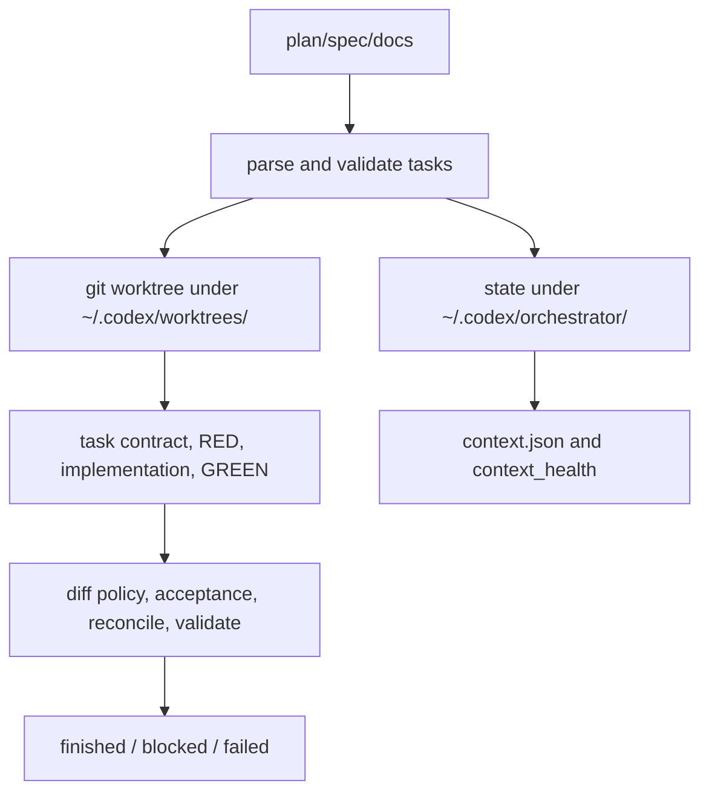

# Architecture

The executor separates code mutation from orchestration state.

`run_id` uses `<plan-slug>-<YYYYMMDD-HHMMSS>` and receives a short random suffix
on collision.

The worktree stores repository files only. The orchestrator directory stores
`state.json`, `context.json`, `hooks/`, `learning_events/`, raw evidence, and
headless result files.

Subagents are enabled by default through `subagents=on`, but delegation is
task-packet scoped rather than raw full-plan scoped. `subagents=auto` stays local
unless the user explicitly requests delegation or parallel work, and
`subagents=off` forces a local-only run. Each delegated worker must have a
bounded write scope; finished state cannot retain running or unreviewed
subagent records.

AgentLens events provide best-effort replay and learning telemetry. State in
`~/.codex/orchestrator/<run_id>/state.json` remains the source of truth.
