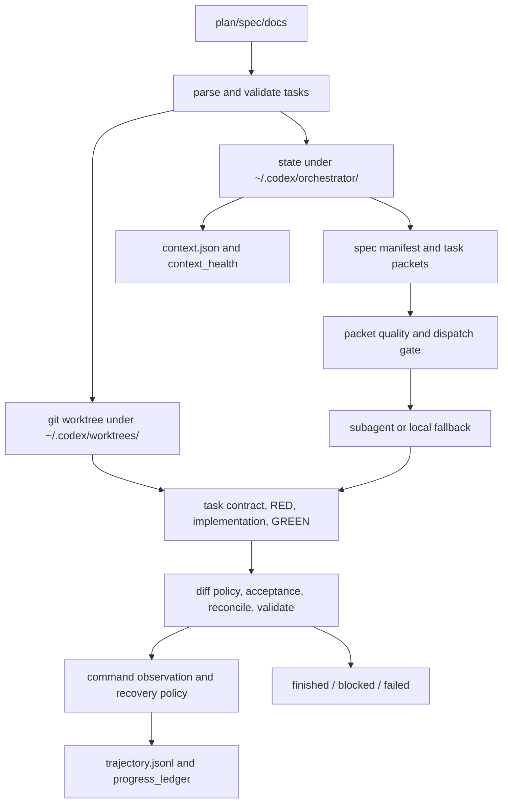

# Architecture

The executor separates code mutation from orchestration state.

```mermaid
flowchart TD
  Plan["plan/spec/docs"] --> Parse["parse and validate tasks"]
  Parse --> Worktree["git worktree under ~/.codex/worktrees/<run_id>"]
  Parse --> State["state under ~/.codex/orchestrator/<run_id>"]
  State --> Packet["spec manifest and task packets"]
  Packet --> Gate["packet quality and dispatch gate"]
  Gate --> Worker["subagent or local fallback"]
  Worktree --> Task["task contract, RED, implementation, GREEN"]
  State --> Context["context.json and context_health"]
  Worker --> Task
  Task --> Verify["diff policy, acceptance, reconcile, validate"]
  Verify --> Recovery["command observation and recovery policy"]
  Recovery --> Trajectory["trajectory.jsonl and progress_ledger"]
  Verify --> Done["finished / blocked / failed"]
```

`run_id` uses `<plan-slug>-<YYYYMMDD-HHMMSS>` and receives a short random suffix
on collision.

The worktree stores repository files only. The orchestrator directory stores
`state.json`, `context.json`, `hooks/`, `learning_events/`, raw evidence, and
headless result files.

New state should prefer `execution_worktree` for the actual edit and command
boundary. `workspace` remains a backward-compatible broad pointer for older
runs and fixture state. `command_cwd_evidence` records command, cwd, phase, and
status only; it never stores full logs or secrets.

Subagents remain available by default through `subagents=on`, but dispatch is
adaptive. CPE first proves delegation is safe, then checks whether it has value.
Small, low-risk, linear tasks may use local fast path and record
`subagent_strategy.mode = local_fallback` with an adaptive reason. Larger
parallel-worthy tasks still delegate from task packets with disjoint write
scopes and parent review. Finished state cannot retain running or unreviewed
subagent records.

`delegation_policy` records the requested mode, request source, active spawn
policy, explicit user delegation intent, effective mode, adaptive policy kind,
safety gate, value gate, and deterministic signals. The pre-dispatch script owns
deterministic fallbacks such as an explicit-request-only spawn policy and
adaptive local fast path.

`preflight_bootstrap` is detection-only. It suggests dependency or capability
bootstrap commands and records tool availability, but CPE never executes those
commands automatically.

AgentLens events provide best-effort replay and learning telemetry. State in
`~/.codex/orchestrator/<run_id>/state.json` remains the source of truth.

Prompt construction uses a stable prefix/hot tail split. The stable prefix
contains invariant execution rules; task/run payloads live in the hot tail and
are audited by `scripts/audit_prompt_cache.py`.

Graphify freshness and subagent dispatch readiness are represented as JSON
evidence. State remains authoritative; helper outputs are accepted only after
state validation and parent review.

`inspect_runs.py` can compute read-only `run_quality` for recent runs across
all plans, including stale non-terminal state, validation drift, delegation
counts, and workspace/execution-worktree mismatch.

Structured failure state separates machine-readable blockers from human
handoff summaries. `current_blocker` records recoverable blocked state,
`failure_decision` records non-success failure decisions, and
`recovery_attempts` tracks bounded retries by root signature. Finished runs must
clear active blockers and open recovery attempts.
