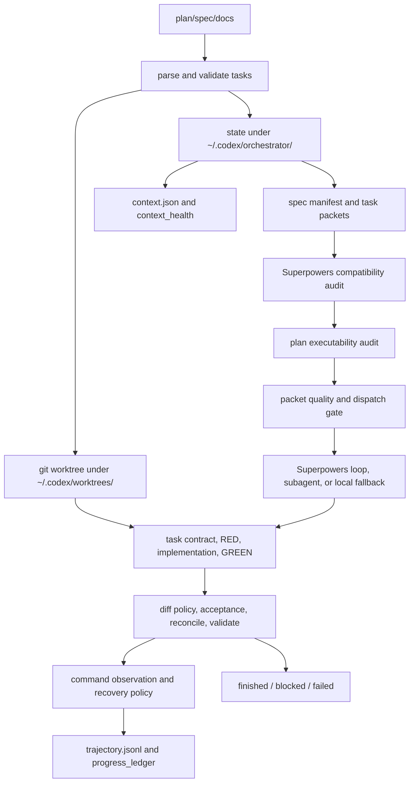

# Architecture

The executor separates code mutation from orchestration state.

```mermaid
flowchart TD
  Plan["plan/spec/docs"] --> Parse["parse and validate tasks"]
  Parse --> Worktree["git worktree under ~/.codex/worktrees/<run_id>"]
  Parse --> State["state under ~/.codex/orchestrator/<run_id>"]
  State --> Packet["spec manifest and task packets"]
  Packet --> Compat["Superpowers compatibility audit"]
  Compat --> ExecAudit["plan executability audit"]
  ExecAudit --> Gate["packet quality and dispatch gate"]
  Gate --> Worker["Superpowers loop, subagent, or local fallback"]
  Worktree --> Task["task contract, RED, implementation, GREEN"]
  State --> Context["context.json and context_health"]
  Worker --> Task
  Task --> Verify["diff policy, acceptance, reconcile, validate"]
  Verify --> Recovery["command observation and recovery policy"]
  Recovery --> Trajectory["trajectory.jsonl and progress_ledger"]
  Verify --> Done["finished / blocked / failed"]
```

`run_id` uses `<plan-slug>-<YYYYMMDD-HHMMSS>` and receives a short random suffix
on collision.

The worktree stores repository files only. The orchestrator directory stores
`state.json`, `context.json`, `hooks/`, `learning_events/`, raw evidence, and
headless result files.

CPE is a thin stateful bridge when current Superpowers contracts are available.
`scripts/audit_superpowers_compatibility.py` compares the installed
Superpowers workflow with CPE's stateful contracts and scores three routes:
CPE-primary execution, Superpowers-native-only execution, and the thin
stateful bridge. The bridge wins when Superpowers supplies the implementation
loop and CPE preserves run state, task packets, worktree isolation, validation,
prompt/handoff export, headless execution, resume, and inspection.

New state should prefer `execution_worktree` for the actual edit and command
boundary. `workspace` remains a backward-compatible broad pointer for older
runs and fixture state. `command_cwd_evidence` records command, cwd, phase, and
status only; it never stores full logs or secrets.

Subagents remain available by default through `subagents=on`, but dispatch is
adaptive. CPE first proves delegation is safe, then checks whether it has value.
Small, low-risk, linear tasks may use local fast path and record
`subagent_strategy.mode = local_fallback` with an adaptive reason. Larger
parallel-worthy tasks still delegate from task packets with disjoint write
scopes and parent review. Finished state cannot retain running or unreviewed
subagent records.

For approved interactive implementation plans, CPE should not duplicate the
current Superpowers implementation loop when the compatibility audit recommends
`thin_stateful_bridge`. Instead, Superpowers `subagent-driven-development`
handles implementer/reviewer flow while CPE records the durable state and audit
surface. Prompt, handoff, headless, resume, and inspection remain CPE-owned
because they depend on CPE-specific artifacts.

`delegation_policy` records the requested mode, request source, active spawn
policy, explicit user delegation intent, effective mode, adaptive policy kind,
safety gate, value gate, and deterministic signals. The pre-dispatch script owns
deterministic fallbacks such as an explicit-request-only spawn policy and
adaptive local fast path. Run-quality debt distinguishes expected local
fallback from prevented delegation, and separately reports missing dispatch
evidence for finished write-capable tasks.

`preflight_bootstrap` is detection-only. It suggests dependency or capability
bootstrap commands and records tool availability, but CPE never executes those
commands automatically.

AgentLens events provide best-effort replay and learning telemetry. State in
`~/.codex/orchestrator/<run_id>/state.json` remains the source of truth.

Prompt construction uses a stable prefix/hot tail split. The stable prefix
contains invariant execution rules; task/run payloads live in the hot tail and
are audited by `scripts/audit_prompt_cache.py`.

Human-readable task views are generated from task packet JSON and stored with
orchestration artifacts. They improve operator and subagent readability but do
not participate as source-of-truth state. State validation only trusts the JSON
packet, task state, and completion audit fields.

Graphify freshness and subagent dispatch readiness are represented as JSON
evidence. State remains authoritative; helper outputs are accepted only after
state validation and parent review. Finished runs that record `graphify_audit`
must also include Graphify evidence in `completion_audit.verification_evidence`.

`inspect_runs.py` can compute read-only `run_quality` for recent runs across
all plans, including stale non-terminal state, validation drift, delegation
counts, workspace/execution-worktree mismatch, and actionable follow-up markers
for stale or missing-worktree runs.

Run-quality operational debt is classified in
`scripts/run_quality_debt.py` so state validation and read-only inspection use
the same stable follow-up strings while keeping filesystem observations such as
missing execution worktrees out of finished-state hard validation.
Plan executability state keeps raw audit counts separate from
operator-reviewed effective counts, so a reviewed blocker reduction remains
auditable after finalization.

`scripts/normalize_cpe_run.py` turns a run state into deterministic replay JSON:
terminal outcome, completion status, run-quality grade, open followups,
dispatch decision reason counts, plan audit counts, residual risk classes, and
forbidden-pattern markers. It intentionally avoids raw transcripts and full
prompts.

Recent-run rubric reports sit beside inspection and normalized replay. They
aggregate state-derived evidence across runs so operator debt can be improved
without weakening per-run completion gates.

Structured failure state separates machine-readable blockers from human
handoff summaries. `current_blocker` records recoverable blocked state,
`failure_decision` records non-success failure decisions, and
`recovery_attempts` tracks bounded retries by root signature. Finished runs must
clear active blockers and open recovery attempts.
