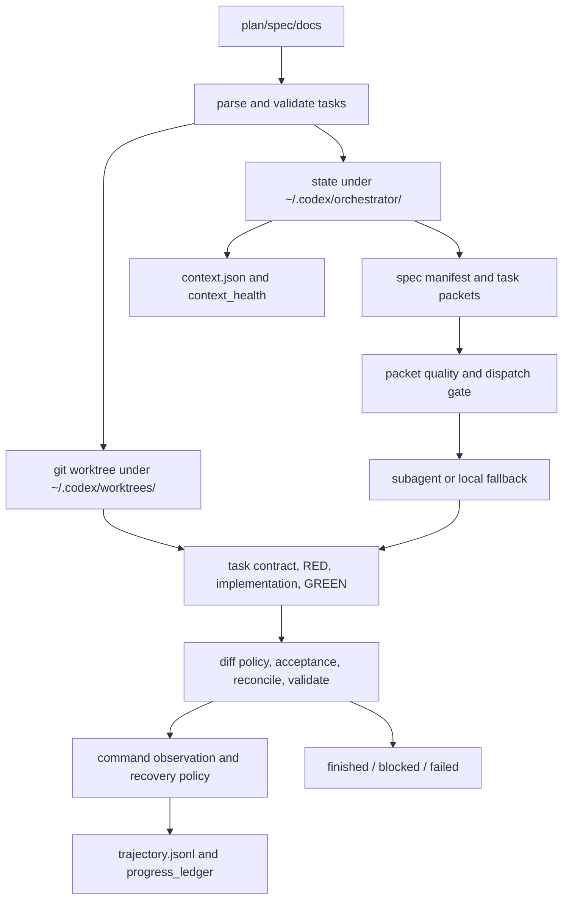

# Architecture

The executor separates code mutation from orchestration state.

```mermaid
flowchart TD
  Plan["plan/spec/docs"] --> Parse["parse and validate tasks"]
  Parse --> Worktree["git worktree under ~/.codex/worktrees/<run_id>"]
  Parse --> State["state under ~/.codex/orchestrator/<run_id>"]
  State --> Packet["spec manifest and task packets"]
  Packet --> Gate["packet quality and dispatch gate"]
  Gate --> Worker["subagent or local fallback"]
  Worktree --> Task["task contract, RED, implementation, GREEN"]
  State --> Context["context.json and context_health"]
  Worker --> Task
  Task --> Verify["diff policy, acceptance, reconcile, validate"]
  Verify --> Recovery["command observation and recovery policy"]
  Recovery --> Trajectory["trajectory.jsonl and progress_ledger"]
  Verify --> Done["finished / blocked / failed"]
```

`run_id` uses `<plan-slug>-<YYYYMMDD-HHMMSS>` and receives a short random suffix
on collision.

The worktree stores repository files only. The orchestrator directory stores
`state.json`, `context.json`, `hooks/`, `learning_events/`, raw evidence, and
headless result files.

Subagents are the default implementation path through `subagents=on`, but
delegation is task-packet scoped rather than raw full-plan scoped.
`subagents=auto` stays local unless the user explicitly requests delegation or
parallel work, and `subagents=off` forces a local-only run. Each delegated
worker must have a bounded write scope; finished state cannot retain running or
unreviewed subagent records. A write-capable task completed locally under
`subagents=on` records `subagent_strategy.mode = local_fallback` with the
concrete reason.

AgentLens events provide best-effort replay and learning telemetry. State in
`~/.codex/orchestrator/<run_id>/state.json` remains the source of truth.

Prompt construction uses a stable prefix/hot tail split. The stable prefix
contains invariant execution rules; task/run payloads live in the hot tail and
are audited by `scripts/audit_prompt_cache.py`.

Graphify freshness and subagent dispatch readiness are represented as JSON
evidence. State remains authoritative; helper outputs are accepted only after
state validation and parent review.

Structured failure state separates machine-readable blockers from human
handoff summaries. `current_blocker` records recoverable blocked state,
`failure_decision` records non-success failure decisions, and
`recovery_attempts` tracks bounded retries by root signature. Finished runs must
clear active blockers and open recovery attempts.
