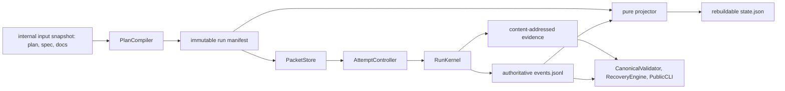

# CPE v3 Architecture

CPE v3 separates immutable inputs and events from rebuildable projections.

## Seven Runtime Owners

| Owner | Responsibility |
| --- | --- |
| `PlanCompiler` | Read plan/spec/docs into immutable internal input snapshot bytes, freeze source hashes, and reject unsafe plans before allocation |
| `PacketStore` | Export each task packet once and index its path and `packet_sha256` in the manifest |
| `AttemptController` | Enforce role policy, measure the real Git/filesystem delta, scope it, and advance `worktree_revision` with `worktree_patch_sha256` |
| `RunKernel` | Append typed events, attach immutable evidence, replay, and atomically project state |
| `CanonicalValidator` | Expose ordered `validate_integrity` and `validate_completion` profiles used by every consumer |
| `RecoveryEngine` | Classify evidence-derived resume phases and apply only declared, projection-checked compensating actions |
| `PublicCLI` | Own run/resume `PublicResult` JSON, export bundles, and exit-code behavior |

```mermaid
flowchart LR
  Input["internal input snapshot: plan, spec, docs"] --> Preflight["PlanCompiler"]
  Preflight --> Manifest["immutable run manifest"]
  Manifest --> Packet["PacketStore"]
  Packet --> Attempt["AttemptController"]
  Attempt --> Kernel["RunKernel"]
  Kernel --> Events["authoritative events.jsonl"]
  Kernel --> Evidence["content-addressed evidence"]
  Events --> Projector["pure projector"]
  Manifest --> Projector
  Projector --> State["rebuildable state.json"]
  Events --> Consumers["CanonicalValidator, RecoveryEngine, PublicCLI"]
  Evidence --> Consumers
```

## Boundaries

- `cpe.py` is the `PublicCLI` adapter for run, resume, and prompt/handoff export.
- `cpe_runtime.model_policy` owns the closed Sol/high core and Terra/high scout
  routes and launcher attestation.
- `plan_compiler` captures source bytes before allocation. Later parsing and
  packet slicing use this internal input snapshot, not mutable source paths.
- `packets` exports each task packet once; every role verifies the indexed path
  and `packet_sha256` before launch.
- `manifest`, `events`, `evidence`, `projector`, and `kernel` implement
  `RunKernel` durable state ownership.
- `worker` launches Codex; `scheduler` serializes write-capable tasks and may
  bound concurrency for read-only scouts.
- `validation` is `CanonicalValidator`. `validate_integrity` admits healthy
  incomplete runs; `validate_completion` additionally requires current
  acceptance, task review, verification, repository check, final review, and
  an exact completion audit.
- `reconciliation` detects drift. `repair` plans safe actions before applying
  an explicit action. `inspection` is read-only derived reporting.

The worktree contains product changes only. The run directory contains the
manifest, event stream, state projection, and immutable artifacts. A successful
transition appends and syncs an event before atomically replacing the state
projection. Replay therefore recovers an interrupted snapshot write without
rewriting history.

## Execution

Core attempts always use Sol/high: coordination, implementation, review,
verification judgment, repair, and completion. Terra/high can only produce
bounded findings from a read-only scout. A scout cannot write files or issue a
quality verdict.

Tasks with write claims execute one at a time. Only implementation and repair
may write product files. The controller captures the full delta, rejects
out-of-scope paths or Git metadata mutation, stores immutable patch evidence,
and advances `worktree_revision`. Every semantic evidence payload binds its
task packet, `worktree_revision`, and `worktree_patch_sha256`.

The ordered suffix is `acceptance -> task_review -> verification ->
repository_check -> final_review`. A repair write invalidates evidence from the
old revision and repeats every affected downstream gate. Completion checks
event integrity, replay parity, evidence digests, task states, git scope,
typed verdicts, and the exact final completion record.

V2 run directories are not migration inputs. Consumers read their schema marker,
return `unsupported_schema`, and leave their bytes unchanged.

## Subscription Live-Evidence Boundary

The live migration runner under `evals/live_model_runner.py` is intentionally
outside the seven plan-runtime owners. It compiles the checked-in treatments,
case fixtures, hidden oracles, worker schema, and policy into one digest-bound
32-slot manifest. Seven Terra-ineligible slots are recorded as expected policy
failures without a provider call; the remaining 25 slots each launch one
ephemeral, explicitly routed Codex turn in a fresh fixture worktree.

`start` requires ChatGPT login, rejects API-key environment credentials, checks
the exact model/reasoning catalog, strips API-key variables from child
environments, and writes only to an operator-selected evidence root outside the
repository and fixture inputs. Each slot records prompt, fixture, oracle,
implementation, model-catalog, event, output, and result digests in an
append-only ledger. Timeout, subscription-limit, malformed-output, source
drift, oracle drift, or attestation failures block the run; `resume` never
silently retries a failed slot and requires `--retry-failed` when applicable.

`evals/live_model_migration.py` replays a completely resolved ledger and is the
only checked-in aggregator for subscription results. The sanitized report keeps
`cost_usd=null` and `cost_observability=unavailable` because the runner cannot
observe which account-side subscription or existing-credit bucket was used.
The runner and aggregator cannot change release metadata; a separate reviewed
follow-up may do so only after `release_gate.passed=true`.
