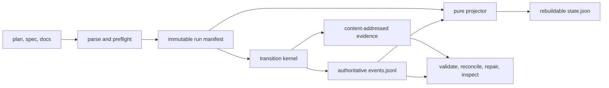

# CPE v3 Architecture

CPE v3 separates immutable inputs and events from rebuildable projections.

```mermaid
flowchart LR
  Input["plan, spec, docs"] --> Preflight["parse and preflight"]
  Preflight --> Manifest["immutable run manifest"]
  Manifest --> Kernel["transition kernel"]
  Kernel --> Events["authoritative events.jsonl"]
  Kernel --> Evidence["content-addressed evidence"]
  Events --> Projector["pure projector"]
  Manifest --> Projector
  Projector --> State["rebuildable state.json"]
  Events --> Consumers["validate, reconcile, repair, inspect"]
  Evidence --> Consumers
```

## Boundaries

- `cpe.py` owns run, resume, and prompt/handoff export routing.
- `cpe_runtime.model_policy` owns the closed Sol/high core and Terra/high scout
  routes and launcher attestation.
- `manifest`, `events`, `evidence`, `projector`, and `kernel` own durable state.
- `worker` launches Codex; `scheduler` serializes write-capable tasks and may
  bound concurrency for read-only scouts.
- `validation` is the shared integrity decision used by completion,
  reconciliation, repair, and inspection.
- `reconciliation` detects drift. `repair` plans safe actions before applying
  an explicit action. `inspection` is read-only derived reporting.

The worktree contains product changes only. The run directory contains the
manifest, event stream, state projection, and immutable artifacts. A successful
transition appends and syncs an event before atomically replacing the state
projection. Replay therefore recovers an interrupted snapshot write without
rewriting history.

## Execution

Core attempts always use Sol/high: coordination, implementation, review,
verification judgment, repair, and completion. Terra/high can only produce
bounded findings from a read-only scout. A scout cannot write files or issue a
quality verdict.

Tasks with write claims execute one at a time. Every attempt records route
attestation and immutable evidence. Completion checks event integrity, replay
parity, evidence digests, task states, git scope, review and verification, and
the final completion record.

V2 run directories are not migration inputs. Consumers read their schema marker,
return `unsupported_schema`, and leave their bytes unchanged.
