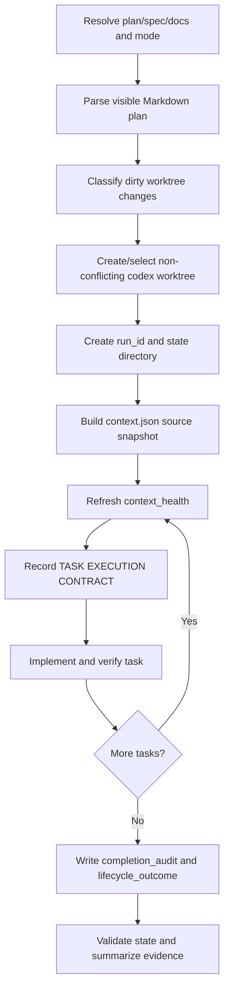

# kws-codex-plan-executor

`kws-codex-plan-executor` executes an implementation plan in Codex, or exports a
fresh-session/handoff prompt from the same source files.

This README is an index for maintainers and future agents. Runtime instructions
remain in [SKILL.md](SKILL.md); detailed contracts are split by topic so agents
can load only the context they need.

For a Korean human-facing guide with usage, structure, and design rationale,
read [docs/user-guide.ko.md](docs/user-guide.ko.md).

## Current Contract

- Skill version: `2.18.0` (2026-05-19 — AgentLens cutover, Task 13)
- Execution worktree: mandatory dedicated non-conflicting `codex/...` git
  worktree for `interactive` and `headless`
- Primary state: `.codex-orchestrator/runs/<run_id>/state.json`
- Compatibility state: `.codex-orchestrator/state.json`
- Source snapshot: `.codex-orchestrator/runs/<run_id>/context.json`
- Context budget: optional `context_budget` summary from context snapshotting
- Context health: `context_health` inside per-run `state.json`
- Event stream: AgentLens, `kws-cpe.<event>` types under
  `agentlens_orchestration_run` (replay evidence; state stays authoritative).
  Project-local `events.jsonl` was retired at the v2.18 cutover.
- Learning stream: AgentLens, `kws-cpe.learning.<event>` types under the same
  run. The user-local `~/.codex/learning/kws-codex-plan-executor/` archive is
  no longer written; cutover-pre-2026-05-19 directories remain read-only on
  disk.
- Unit manifest: completed execution tasks declare context, tool, and
  write-scope policy
- Diff policy: post-task check compares changed files against task contract and
  unit manifest
- Method audit: optional `method_audit` evidence for required phase methods
- Carried acceptance: optional task-level `carried_acceptance` for sequential
  metrics
- Subagent run store: optional opt-in `subagent_runs` records
- Command observations: optional bounded command triage evidence
- Headless result schema: `templates/headless-output-schema.json`
- Parent propagation: headless `codex exec` spawns receive
  `AGENTLENS_PARENT_RUN_ID="$ORCH_RUN_ID"` so child emits join the same
  AgentLens run.
- Run health reporting: terminal `final.json`, then project-local state, then
  AgentLens run-close `outcome`; helper pid liveness is informational only.

## Read Order

For normal use:

1. [SKILL.md](SKILL.md) - trigger, arguments, hard boundaries, mode matrix.
2. [references/execution-cycle.md](references/execution-cycle.md) - interactive
   run phases.
3. [references/headless-runner.md](references/headless-runner.md) - detached
   `codex exec` runs.
4. [references/prompt-export-checklist.md](references/prompt-export-checklist.md)
   - prompt/handoff export checks.

For maintenance or follow-up work:

1. [docs/user-guide.ko.md](docs/user-guide.ko.md) - Korean human-facing usage,
   structure, and design rationale.
2. [docs/doc-update-protocol.md](docs/doc-update-protocol.md) - what to update
   before finalizing package changes.
3. [docs/how-it-works.md](docs/how-it-works.md) - end-to-end runtime model.
4. [docs/state-and-logging.md](docs/state-and-logging.md) - state, context,
   learning logs, privacy rules.
5. [docs/evals-and-verification.md](docs/evals-and-verification.md) - how evals
   are organized and run.
6. [docs/verification-log.md](docs/verification-log.md) - compact record of
   verification commands and outcomes.
7. [docs/decisions.md](docs/decisions.md) - why the current design exists.
8. [docs/risks-limitations-deferrals.md](docs/risks-limitations-deferrals.md) -
   known risks, limits, and intentional deferrals.
9. [docs/future-agent-guide.md](docs/future-agent-guide.md) - safe change path
   and suggested next improvements.

For behavior history:

- [HISTORY.md](HISTORY.md) - versioned skill-level changes.
- [ARCHITECTURE.md](ARCHITECTURE.md) - stable design summary.
- [docs/experiments/2026-05-16-gsd-2-adoption/PLAN.md](docs/experiments/2026-05-16-gsd-2-adoption/PLAN.md)
  and
  [IMPLEMENTATION.md](docs/experiments/2026-05-16-gsd-2-adoption/IMPLEMENTATION.md)
  - source analysis and implementation details behind v1.9.0.
- [docs/experiments/2026-05-14-oh-my-codex-adoption/PLAN.md](docs/experiments/2026-05-14-oh-my-codex-adoption/PLAN.md)
  and
  [IMPLEMENTATION.md](docs/experiments/2026-05-14-oh-my-codex-adoption/IMPLEMENTATION.md)
  - source analysis and implementation plan behind v1.5.0.

## Modes

| Mode | Purpose | Mutates repo | Logging |
| --- | --- | --- | --- |
| `interactive` | Execute the plan in the current Codex session. | Yes, inside a dedicated `codex/...` worktree | Yes, notable boundaries only |
| `headless` | Execute via supervised `codex exec`. | Yes, inside a dedicated `codex/...` worktree unless `read-only` blocks | Yes, notable boundaries only |
| `prompt` | Export a fresh-session execution prompt. | No | No |
| `handoff` | Export a continuation prompt from existing state. | No | No |

Subagents are opt-in only. Use them only when the user explicitly asks for
subagents, delegation, parallel work, or passes `subagents=on`.

## Runtime In One Pass



The critical gates are:

- no edits before a five-field `TASK EXECUTION CONTRACT`
- no `interactive` or `headless` implementation from `main` or the original
  checkout; use a dedicated non-conflicting `codex/...` worktree first
- no execution without visible `Files` blocks in execution modes
- no successful finish without `lifecycle_outcome=finished` and a passing
  `completion_audit`
- no resume/handoff reliance on implicit session memory; use `context.json` and
  `state.json`
- no task close with unchecked changed files when `unit_manifest` is recorded
- no finished run with blocking drift from `scripts/reconcile_state.py`
- no finished run with running or unreviewed subagent records
- no finished run with an unknown command observation that is missing residual
  risk evidence
- no successful finish with `context_health.status=red` or
  `context_health.handoff_ready=false`
- no finished run with stale `context_health.last_checked_at` relative to
  `timestamps.updated_at`
- no finished run with unresolved `carried_acceptance.status=open`
- no applied `method_audit` entry without required evidence refs when a method
  is declared required

## Key Commands

From this directory:

```bash
python3 scripts/parse_plan.py --help
python3 scripts/build_context_snapshot.py --help
python3 scripts/validate_state.py --help
python3 scripts/check_learning_log_health.py --latest 5 --json
python3 scripts/compare_agentlens_events.py --self-test
python3 evals/check_state_schema.py
python3 evals/check_run_diffs.py
python3 evals/check_state_reconciliation.py
python3 evals/check_context_snapshot.py
python3 evals/check_headless_result.py
python3 evals/check_skill_contract.py --skill SKILL.md
bash evals/run.sh
python3 /Users/kws/.codex/skills/.system/skill-creator/scripts/quick_validate.py .
```

`bash evals/run.sh` launches real `codex exec` fixture runs and can take longer
than the deterministic unit checks. Use the narrower checks first when iterating.

## Maintenance Rule

Before changing runtime behavior, read
[references/change-protocol.md](references/change-protocol.md). Before
finalizing any package change, read
[docs/doc-update-protocol.md](docs/doc-update-protocol.md) and append compact
verification evidence to [docs/verification-log.md](docs/verification-log.md).
Behavior changes must update matching deterministic checks so prompt export,
headless execution, state validation, and runtime docs cannot drift
independently.
