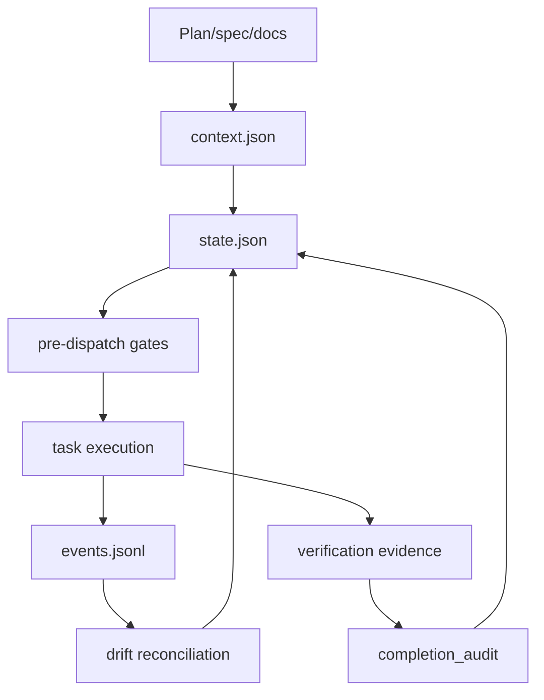

# GSD-2 Codex Plan Executor Adoption Implementation Details

This document expands `PLAN.md` into concrete implementation guidance. It is
written for a future implementation pass against `kws-codex-plan-executor`; it
does not claim the changes are already applied.

## Implementation Strategy

The key design choice is selective adoption.

GSD-2 is a standalone TypeScript product with a Pi SDK runtime, extensions,
SQLite-backed auto-mode, worktree projection, workflow templates, subagent
isolation, journals, and UI surfaces. `kws-codex-plan-executor` is a portable
Codex skill. The useful overlap is the execution-control pattern, not the
runtime substrate.

Implementation should therefore follow this layering:

1. Add reference contracts before code.
2. Add deterministic evals before validators or scripts.
3. Extend state validation before making SKILL-level invariants mandatory.
4. Add project-local evidence artifacts without replacing `state.json`.
5. Update prompt/headless exports only after runtime contracts are stable.
6. Update release docs and history at the end.

## Existing Contracts To Preserve

Do not break these current invariants:

| Contract | Current owner |
| --- | --- |
| Dedicated non-conflicting `codex/...` worktree before edits | `SKILL.md`, `references/execution-cycle.md`, `references/headless-runner.md` |
| `TASK EXECUTION CONTRACT` before edits | `SKILL.md`, `scripts/validate_state.py` |
| `.codex-orchestrator/runs/<run_id>/state.json` as source of truth | `references/state-schema.md` |
| `context.json`, `context_snapshot_path`, `context_basis_hash` | `scripts/build_context_snapshot.py`, `scripts/validate_state.py` |
| `context_health` before terminal success | `scripts/validate_state.py` |
| `completion_audit` before `lifecycle_outcome=finished` | `scripts/validate_state.py` |
| User-local learning log is not a project deliverable | `references/learning-log.md` |
| TDD is required for feature/bugfix/refactor/behavior implementation | `SKILL.md`, `references/execution-cycle.md` |
| Subagents are opt-in only | `SKILL.md`, `ARCHITECTURE.md` |

Every implementation step should preserve these tests:

```bash
python3 evals/check_state_schema.py
python3 evals/check_learning_log.py
python3 evals/check_skill_contract.py --skill SKILL.md
python3 /Users/kws/.codex/skills/.system/skill-creator/scripts/quick_validate.py .
```

## Task 1 Implementation: Contract-Only Reference Documents

### `references/unit-context-manifest.md`

Use this schema:

```json
{
  "unit_manifest": {
    "unit_type": "execute-task",
    "context_mode": "focused",
    "required_skills": ["using-superpowers", "test-driven-development"],
    "tool_policy": "implementation",
    "allowed_write_globs": ["scripts/*.py", "evals/*.py", "references/*.md"],
    "forbidden_write_globs": [".git/**", "graphify-out/**"],
    "artifact_policy": "inline-summary",
    "max_context_chars": 60000
  }
}
```

Document these enum values:

```text
unit_type:
  research
  plan
  execute-task
  reactive-execute
  validate
  complete
  docs
  review
  handoff

context_mode:
  minimal
  focused
  expanded
  full

tool_policy:
  read-only
  planning
  implementation
  docs
  verification

artifact_policy:
  inline
  inline-summary
  excerpt
  on-demand
```

Codex-specific interpretation:

| Policy | Reads | Writes | Commands |
| --- | --- | --- | --- |
| `read-only` | allowed | none | non-mutating inspection commands |
| `planning` | allowed | plan/docs only | inspection and validation commands |
| `implementation` | allowed | declared task files only | implementation and verification commands |
| `docs` | allowed | docs/reference globs only | docs validation commands |
| `verification` | allowed | run artifacts only | tests, builds, linters, validators |

Important wording:

```md
Codex skills cannot intercept every low-level file write through a custom hook. The manifest is enforced by contract, state validation, and post-diff checks rather than a true runtime write gate.
```

### `references/pre-dispatch-pipeline.md`

Document this exact gate order:

```text
1. version gate
2. state readability gate
3. worktree gate
4. dirty-file gate
5. context snapshot gate
6. context health gate
7. unit manifest gate
8. dispatch decision gate
9. event journal gate
10. task contract gate
```

Gate result shape:

```json
{
  "task_id": "task_2",
  "status": "passed",
  "checked_at": "2026-05-16T07:30:00Z",
  "gates": [
    {"name": "version", "status": "passed", "evidence": "skill version 1.9.0"},
    {"name": "state", "status": "passed", "evidence": "state schema valid"},
    {"name": "worktree", "status": "passed", "evidence": "branch codex/example"},
    {"name": "dirty-files", "status": "passed", "evidence": "no related dirty files"},
    {"name": "context", "status": "passed", "evidence": "context_health green"},
    {"name": "unit-manifest", "status": "passed", "evidence": "implementation policy"},
    {"name": "dispatch-decision", "status": "passed", "evidence": "task dependencies satisfied"},
    {"name": "event-journal", "status": "passed", "evidence": "events.jsonl seq 4"},
    {"name": "task-contract", "status": "passed", "evidence": "contract recorded in state"}
  ]
}
```

Failure rule:

```text
Any failed gate before edits blocks execution. Any failed gate after edits requires a checkpoint with lifecycle_outcome=blocked or failed unless the gate can be repaired safely and re-run.
```

### `references/event-journal.md`

Explain three layers:

| Layer | Location | Purpose | Source of truth |
| --- | --- | --- | --- |
| State | `.codex-orchestrator/runs/<run_id>/state.json` | Current resumable run state | yes |
| Event journal | `.codex-orchestrator/runs/<run_id>/events.jsonl` | Replayable project-local evidence | no |
| Learning log | `~/.codex/learning/kws-codex-plan-executor/` | Cross-repo process learning | no |

Event schema:

```json
{
  "schema_version": "1",
  "run_id": "20260516T073000Z-archive-codex-example-abcdef0-a1b2c3",
  "seq": 1,
  "timestamp": "2026-05-16T07:30:00Z",
  "type": "run_started",
  "payload": {
    "mode": "interactive",
    "state_path": ".codex-orchestrator/runs/20260516T073000Z-archive-codex-example-abcdef0-a1b2c3/state.json"
  }
}
```

Redaction policy:

```text
Reject or redact keys matching token, secret, password, api_key, authorization, cookie, private_key, session.
Store paths, command names, statuses, issue keys, and short summaries.
Do not store full prompt transcripts.
Do not store full command output.
```

### `references/drift-reconciliation.md`

Use this record shape:

```json
{
  "type": "stale-last-event-seq",
  "severity": "repairable",
  "detected_at": "2026-05-16T07:35:00Z",
  "message": "state.last_event_seq is 3 but events.jsonl ends at 4",
  "repair": "set state.last_event_seq to 4",
  "repaired_at": null
}
```

Severity enum:

```text
info
repairable
blocking
```

Safe repairs:

| Drift | Repair |
| --- | --- |
| `stale-root-state-pointer` | update `.codex-orchestrator/state.json` pointer/copy from per-run state |
| `missing-event-journal-path` | set expected path if journal exists |
| `stale-last-event-seq` | set from journal tail |
| `missing-context-health-timestamp` | set to `timestamps.updated_at` only when finished state is otherwise valid |

Blocking drift:

| Drift | Reason |
| --- | --- |
| `context-basis-hash-mismatch` | Source basis changed; agent must inspect. |
| `completed-task-missing-unit-manifest` | Cannot infer task write/context policy safely. |
| `finished-with-open-carried-acceptance` | Completion claim contradicts unresolved metric. |
| `finished-missing-completion-audit` | Existing state validator already blocks this. |
| `journal-run-id-mismatch` | Audit evidence may belong to another run. |

### `references/context-budget.md`

Budget status:

```text
green: estimated_chars <= 70% of max_chars
yellow: estimated_chars > 70% and <= 100% of max_chars
red: estimated_chars > max_chars or required source omitted
```

Section record:

```json
{
  "role": "plan",
  "path": "docs/superpowers/plans/example.md",
  "section": "Task 2: Implement validator",
  "estimated_chars": 4210,
  "sha256": "..."
}
```

Truncation rule:

```text
Truncate or omit at Markdown section boundaries. Never truncate inside fenced code blocks when the section is included.
```

### `references/headless-result-schema.md`

Final result shape:

```json
{
  "status": "success",
  "run_id": "20260516T073000Z-archive-codex-example-abcdef0-a1b2c3",
  "state_path": ".codex-orchestrator/runs/20260516T073000Z-archive-codex-example-abcdef0-a1b2c3/state.json",
  "summary": "Implemented task 2 and verified state schema checks.",
  "changed_files": ["scripts/validate_state.py", "evals/check_state_schema.py"],
  "verification": [
    {"command": "python3 evals/check_state_schema.py", "status": "passed"}
  ],
  "open_gaps": [],
  "residual_risk": [],
  "next_action": "Review diff and commit."
}
```

### `references/subagent-run-store.md`

Record shape:

```json
{
  "id": "agent_123",
  "owner_task": "task_4",
  "mode": "fork_context",
  "write_scope": ["docs/**"],
  "status": "completed",
  "result_summary": "Updated docs wording.",
  "changed_files": ["docs/example.md"],
  "review_status": "accepted",
  "merged_at": "2026-05-16T07:40:00Z"
}
```

Rules:

```text
subagent_runs requires explicit subagents=on or a recorded user request.
finished runs cannot have running, failed-without-review, or unreviewed subagent records.
changed_files must match write_scope.
Overlapping write_scope with another active subagent requires a rationale.
```

### `references/command-observations.md`

Observation shape:

```json
{
  "command": "pnpm test",
  "status": "failed",
  "category": "dependency_bootstrap",
  "evidence": "node_modules missing; install command not yet run",
  "next_action": "Run pnpm install before retrying tests"
}
```

Allowed categories:

```text
source_failure
missing_local_env
dependency_bootstrap
resource_oom
timeout_or_hang
flaky_test
permission_or_sandbox
tooling_bug
unknown
```

## Task 2 Implementation: Unit Manifest Validation

### Validator Constants

Add to `scripts/validate_state.py` near existing constants:

```python
VALID_UNIT_TYPES = {
    "research",
    "plan",
    "execute-task",
    "reactive-execute",
    "validate",
    "complete",
    "docs",
    "review",
    "handoff",
}
VALID_CONTEXT_MODES = {"minimal", "focused", "expanded", "full"}
VALID_TOOL_POLICIES = {"read-only", "planning", "implementation", "docs", "verification"}
VALID_ARTIFACT_POLICIES = {"inline", "inline-summary", "excerpt", "on-demand"}
REQUIRED_UNIT_MANIFEST_FIELDS = {
    "unit_type",
    "context_mode",
    "required_skills",
    "tool_policy",
    "allowed_write_globs",
    "forbidden_write_globs",
    "artifact_policy",
    "max_context_chars",
}
```

### Validator Function

Add:

```python
def _validate_unit_manifest(data: dict, errors: list[str]) -> None:
    outcome = data.get("lifecycle_outcome")
    tasks = data.get("tasks")
    if not isinstance(tasks, dict):
        return

    for task_id, task in tasks.items():
        if not isinstance(task, dict):
            continue
        manifest = task.get("unit_manifest")
        completed = task.get("status") in {"completed", "verified", "done"}
        if outcome == "finished" and completed and manifest is None:
            errors.append(f"{task_id}: unit_manifest is required for completed tasks when lifecycle_outcome is finished")
            continue
        if manifest is None:
            continue
        if not isinstance(manifest, dict):
            errors.append(f"{task_id}: unit_manifest must be an object")
            continue

        for key in sorted(REQUIRED_UNIT_MANIFEST_FIELDS):
            if key not in manifest:
                errors.append(f"{task_id}: unit_manifest missing field {key}")

        if manifest.get("unit_type") not in VALID_UNIT_TYPES:
            errors.append(f"{task_id}: unit_manifest.unit_type must be one of {sorted(VALID_UNIT_TYPES)}")
        if manifest.get("context_mode") not in VALID_CONTEXT_MODES:
            errors.append(f"{task_id}: unit_manifest.context_mode must be one of {sorted(VALID_CONTEXT_MODES)}")
        if manifest.get("tool_policy") not in VALID_TOOL_POLICIES:
            errors.append(f"{task_id}: unit_manifest.tool_policy must be one of {sorted(VALID_TOOL_POLICIES)}")
        if manifest.get("artifact_policy") not in VALID_ARTIFACT_POLICIES:
            errors.append(f"{task_id}: unit_manifest.artifact_policy must be one of {sorted(VALID_ARTIFACT_POLICIES)}")

        for key in ("required_skills", "allowed_write_globs", "forbidden_write_globs"):
            if key in manifest and not isinstance(manifest[key], list):
                errors.append(f"{task_id}: unit_manifest.{key} must be a list")

        max_chars = manifest.get("max_context_chars")
        if not isinstance(max_chars, int) or max_chars <= 0:
            errors.append(f"{task_id}: unit_manifest.max_context_chars must be a positive integer")

        policy = manifest.get("tool_policy")
        allowed = manifest.get("allowed_write_globs")
        if policy == "implementation" and not _has_substantive_value(allowed):
            errors.append(f"{task_id}: implementation unit_manifest requires allowed_write_globs")
        if policy == "read-only" and isinstance(allowed, list) and allowed:
            errors.append(f"{task_id}: read-only unit_manifest must not allow write globs")
```

Call it from `validate()` after task validation and before terminal completion checks:

```python
_validate_unit_manifest(data, errors)
```

### Eval Additions

In `evals/check_state_schema.py`, extend `base_state()` task:

```python
"unit_manifest": {
    "unit_type": "execute-task",
    "context_mode": "focused",
    "required_skills": ["using-superpowers", "test-driven-development"],
    "tool_policy": "implementation",
    "allowed_write_globs": ["docs/example.md"],
    "forbidden_write_globs": ["docs/unrelated.md"],
    "artifact_policy": "inline-summary",
    "max_context_chars": 60000,
},
```

Add negative cases:

```python
invalid_unit_type = base_state()
invalid_unit_type["tasks"]["task_0"]["unit_manifest"]["unit_type"] = "mystery"
result = run_validator(script, invalid_unit_type)
checks["invalid_unit_type_fails"] = result.returncode != 0 and "unit_manifest.unit_type" in (result.stderr + result.stdout)
```

Repeat for invalid `tool_policy`, read-only with write globs, implementation with empty write globs, and finished completed task missing manifest.

## Task 3 Implementation: Diff Policy Check

### Script Interface

Create `scripts/check_run_diffs.py` with:

```python
#!/usr/bin/env python3
"""Check changed files against the active task contract and unit manifest."""
```

Arguments:

```text
--repo-root required
--state required
--task required
--json optional
```

Output when passing:

```json
{
  "passed": true,
  "task_id": "task_2",
  "changed_files": ["scripts/validate_state.py"],
  "violations": []
}
```

Output when failing:

```json
{
  "passed": false,
  "task_id": "task_2",
  "changed_files": ["docs/unrelated.md"],
  "violations": [
    {
      "path": "docs/unrelated.md",
      "reason": "not allowed by contract.allowed_edits or unit_manifest.allowed_write_globs"
    }
  ]
}
```

Use only `fnmatch.fnmatchcase` for glob matching so the behavior is predictable.

### Changed File Collection

Collect the union of:

```python
def git_lines(repo_root: Path, args: list[str]) -> list[str]:
    result = subprocess.run(
        ["git", *args],
        cwd=repo_root,
        text=True,
        stdout=subprocess.PIPE,
        stderr=subprocess.PIPE,
    )
    if result.returncode != 0:
        raise RuntimeError(result.stderr.strip() or "git command failed")
    return [line.strip() for line in result.stdout.splitlines() if line.strip()]


changed = set()
changed.update(git_lines(repo_root, ["diff", "--name-only"]))
changed.update(git_lines(repo_root, ["diff", "--cached", "--name-only"]))
changed.update(git_lines(repo_root, ["ls-files", "--others", "--exclude-standard"]))
```

### Policy Logic

```python
def matches_any(path: str, patterns: list[str]) -> bool:
    return any(fnmatch.fnmatchcase(path, pattern) for pattern in patterns)


def classify(path: str, allowed: list[str], forbidden: list[str]) -> str | None:
    if matches_any(path, forbidden):
        return "forbidden"
    if matches_any(path, allowed):
        return None
    return "not_allowed"
```

Allowed patterns:

```text
task.contract.allowed_edits
task.unit_manifest.allowed_write_globs
```

Forbidden patterns:

```text
task.contract.forbidden_edits
task.unit_manifest.forbidden_write_globs
```

Forbidden wins.

## Task 4 Implementation: Project-Local Event Journal

### Script Interface

Create `scripts/append_run_event.py`:

```bash
python3 scripts/append_run_event.py \
  --state .codex-orchestrator/runs/<run_id>/state.json \
  --type task_contract_recorded \
  --payload '{"task_id":"task_2"}'
```

The script should:

1. Read state.
2. Resolve `event_journal_path` or create the expected path.
3. Read the last event seq if the file exists.
4. Append the next event.
5. Update `state.last_event_seq`.
6. Preserve JSON indentation and trailing newline in state.

### Redaction Function

Use a recursive redactor:

```python
SECRET_KEY_RE = re.compile(r"(token|secret|password|api[_-]?key|authorization|cookie|private[_-]?key|session)", re.I)


def redact(value: object) -> object:
    if isinstance(value, dict):
        return {
            str(key): "[REDACTED]" if SECRET_KEY_RE.search(str(key)) else redact(inner)
            for key, inner in value.items()
        }
    if isinstance(value, list):
        return [redact(item) for item in value]
    if isinstance(value, str) and len(value) > 400:
        return value[:397] + "..."
    return value
```

### State Validation

Add constants:

```python
VALID_EVENT_TYPES = {
    "run_started",
    "context_snapshot_created",
    "pre_dispatch_checked",
    "dispatch_gate_failed",
    "task_contract_recorded",
    "task_started",
    "task_completed",
    "verification_started",
    "verification_passed",
    "verification_failed",
    "drift_detected",
    "drift_repaired",
    "blocked",
    "failed",
    "finished",
}
```

For `lifecycle_outcome=finished`, validate:

```text
event_journal_path is a non-empty string
event_journal_path equals .codex-orchestrator/runs/<run_id>/events.jsonl
last_event_seq is a positive integer
```

The state validator should not parse the journal file; `evals/check_event_journal.py` owns journal file integrity.

## Task 5 Implementation: Drift Reconciliation

### Script Interface

Create `scripts/reconcile_state.py`:

```bash
python3 scripts/reconcile_state.py --state .codex-orchestrator/runs/<run_id>/state.json --check
python3 scripts/reconcile_state.py --state .codex-orchestrator/runs/<run_id>/state.json --repair-safe
```

Exit codes:

```text
0 -> no blocking drift after check/repair
1 -> blocking drift remains
2 -> unreadable state or invalid arguments
```

### Detection Functions

Implement one pure detector per drift type:

```python
def detect_stale_last_event_seq(state: dict, state_path: Path) -> list[dict]:
    journal_path = state_path.parent / "events.jsonl"
    if not journal_path.is_file():
        return []
    last_seq = read_last_seq(journal_path)
    if state.get("last_event_seq") == last_seq:
        return []
    return [{
        "type": "stale-last-event-seq",
        "severity": "repairable",
        "message": f"state.last_event_seq is {state.get('last_event_seq')} but events.jsonl ends at {last_seq}",
        "repair": f"set state.last_event_seq to {last_seq}",
    }]
```

Use the same shape for all detectors.

### Repair Function

Only repair these records:

```text
stale-root-state-pointer
missing-event-journal-path
stale-last-event-seq
missing-context-health-timestamp
```

After repair:

```text
write state.drift.last_checked_at
write state.drift.records
write state.drift.unrepaired_blockers
append drift_repaired event when event journal exists
```

Do not repair:

```text
context-basis-hash-mismatch
completed-task-missing-unit-manifest
finished-with-open-carried-acceptance
journal-run-id-mismatch
```

### Validator Integration

Add:

```python
def _validate_drift(data: dict, errors: list[str]) -> None:
    if data.get("lifecycle_outcome") != "finished":
        return
    drift = data.get("drift")
    if drift is None:
        return
    if not isinstance(drift, dict):
        errors.append("drift must be an object")
        return
    blockers = drift.get("unrepaired_blockers", [])
    if blockers:
        errors.append("drift.unrepaired_blockers must be empty when lifecycle_outcome is finished")
    records = drift.get("records", [])
    if isinstance(records, list):
        for index, record in enumerate(records):
            if isinstance(record, dict) and record.get("severity") == "blocking":
                errors.append(f"drift.records[{index}] blocking drift is not allowed when lifecycle_outcome is finished")
```

## Task 6 Implementation: Context Budget Snapshot

### Snapshot Extraction

Extend `scripts/build_context_snapshot.py` with:

```text
--max-chars default 120000
```

Use Markdown heading boundaries:

```python
HEADING_RE = re.compile(r"^(#{1,6})\s+(.+?)\s*$", re.MULTILINE)
```

Simple section extraction is enough:

```python
def markdown_sections(text: str) -> list[tuple[str, str]]:
    matches = list(HEADING_RE.finditer(text))
    if not matches:
        return [("document", text)]
    sections = []
    if matches[0].start() > 0:
        sections.append(("preamble", text[: matches[0].start()]))
    for index, match in enumerate(matches):
        end = matches[index + 1].start() if index + 1 < len(matches) else len(text)
        sections.append((match.group(2).strip(), text[match.start():end]))
    return sections
```

Budget status:

```python
def budget_status(estimated: int, max_chars: int) -> str:
    if estimated > max_chars:
        return "red"
    if estimated > int(max_chars * 0.7):
        return "yellow"
    return "green"
```

### Snapshot Shape

Add to `context.json`:

```json
{
  "context_budget": {
    "status": "green",
    "max_chars": 120000,
    "estimated_chars": 42100,
    "included_sections": [],
    "omitted_sections": []
  }
}
```

Keep existing `sources` and `basis_hash` behavior stable. `basis_hash` should
continue to hash source file roles, paths, and file hashes. Add a separate
`section_basis_hash` only if section-level hashing is needed later.

## Task 7 Implementation: Structured Headless Result

### JSON Schema

Create `templates/headless-output-schema.json`:

```json
{
  "$schema": "https://json-schema.org/draft/2020-12/schema",
  "type": "object",
  "additionalProperties": false,
  "required": [
    "status",
    "run_id",
    "state_path",
    "summary",
    "changed_files",
    "verification",
    "open_gaps",
    "residual_risk",
    "next_action"
  ],
  "properties": {
    "status": {"type": "string", "enum": ["success", "blocked", "failed", "cancelled"]},
    "run_id": {"type": "string", "minLength": 1},
    "state_path": {"type": "string", "minLength": 1},
    "summary": {"type": "string", "minLength": 1},
    "changed_files": {"type": "array", "items": {"type": "string"}},
    "verification": {
      "type": "array",
      "items": {
        "type": "object",
        "additionalProperties": false,
        "required": ["command", "status"],
        "properties": {
          "command": {"type": "string", "minLength": 1},
          "status": {"type": "string", "enum": ["passed", "failed", "skipped"]},
          "evidence": {"type": "string"}
        }
      }
    },
    "open_gaps": {"type": "array", "items": {"type": "string"}},
    "residual_risk": {"type": "array", "items": {"type": "string"}},
    "next_action": {"type": "string", "minLength": 1}
  }
}
```

### Eval Without External JSON Schema Package

Avoid adding dependencies. `evals/check_headless_result.py` can validate a
small set of sample payloads manually:

```python
def validate_sample(payload: dict) -> list[str]:
    errors = []
    if payload.get("status") not in {"success", "blocked", "failed", "cancelled"}:
        errors.append("invalid status")
    for key in REQUIRED:
        if key not in payload:
            errors.append(f"missing {key}")
    if not isinstance(payload.get("changed_files"), list):
        errors.append("changed_files must be a list")
    return errors
```

Also parse `templates/headless-output-schema.json` with `json.loads` to catch
syntax errors.

## Task 8 Implementation: Subagent Run Store

### State Field

Top-level:

```json
{
  "subagents_requested": true,
  "subagent_runs": []
}
```

Validation:

```text
subagent_runs must be list
non-empty subagent_runs requires subagents_requested=true
owner_task must reference an existing task id
write_scope must be non-empty list
changed_files must match write_scope when status=completed
finished run cannot contain status=running
finished run cannot contain review_status=unreviewed
```

Use `fnmatch.fnmatchcase` for write-scope validation, matching `check_run_diffs.py`.

### Why Not Use A Separate Store File First

GSD-2 has a richer run store for subagents. Codex should start with state-level
records because:

- subagents are opt-in;
- number of records is expected to be small;
- state-level validation is simpler;
- future `subagents/<agent_id>.json` files can be added after evidence shows the state file is too large.

## Task 9 Implementation: Command Observation Taxonomy

### State Shape

Per task:

```json
{
  "command_observations": [
    {
      "command": "pnpm test",
      "status": "failed",
      "category": "dependency_bootstrap",
      "evidence": "node_modules missing; install command not yet run",
      "next_action": "Run pnpm install before retrying tests"
    }
  ]
}
```

Validator:

```python
VALID_COMMAND_OBSERVATION_CATEGORIES = {
    "source_failure",
    "missing_local_env",
    "dependency_bootstrap",
    "resource_oom",
    "timeout_or_hang",
    "flaky_test",
    "permission_or_sandbox",
    "tooling_bug",
    "unknown",
}
```

Rules:

```text
command, status, category, evidence, next_action are required strings
category must be in enum
finished run with category=unknown requires completion_audit.residual_risk mentioning that command
```

This is not a root-cause engine. It forces evidence before confident claims.

## Task 10 Implementation: Release Integration

### `SKILL.md`

Only after the scripts/evals pass, add concise invariants:

```md
- Each completed execution task records a `unit_manifest` describing task type, context policy, required skills, tool policy, write globs, artifact policy, and context budget.
- Before dispatching a task, run the pre-dispatch gate sequence and record `dispatch_gate_result`.
- Execution runs maintain project-local `.codex-orchestrator/runs/<run_id>/events.jsonl` for replayable audit evidence; this does not replace `state.json` or user-local learning logs.
- Run drift checks before terminal `lifecycle_outcome=finished`; unrepaired blocking drift prevents a finished outcome.
```

### `ARCHITECTURE.md`

Add a section:

```md
## Control Planes Adopted From GSD-2

The executor now splits execution control into small file-backed planes:

- State plane: `state.json`
- Context plane: `context.json` and `context_budget`
- Dispatch plane: `unit_manifest` and `dispatch_gate_result`
- Audit plane: `events.jsonl`, `completion_audit`, and optional learning logs
- Drift plane: `drift.records` plus `scripts/reconcile_state.py`
- Subagent plane: opt-in `subagent_runs`
```

### `docs/state-and-logging.md`

Add a diagram:



### `evals/run.sh`

Add new checks near the deterministic script block:

```bash
python3 evals/check_event_journal.py
python3 evals/check_run_diffs.py
python3 evals/check_state_reconciliation.py
python3 evals/check_context_snapshot.py
python3 evals/check_headless_result.py
```

## Verification Matrix

| Change area | Required command |
| --- | --- |
| State validation | `python3 evals/check_state_schema.py` |
| Unit manifest contract | `python3 evals/check_state_schema.py` and `python3 evals/check_skill_contract.py --skill SKILL.md` |
| Diff policy | `python3 evals/check_run_diffs.py` |
| Event journal | `python3 evals/check_event_journal.py` |
| Drift reconciliation | `python3 evals/check_state_reconciliation.py` |
| Context budget | `python3 evals/check_context_snapshot.py` |
| Headless result schema | `python3 evals/check_headless_result.py` |
| Prompt/runtime drift | `python3 evals/check_skill_contract.py --skill SKILL.md` |
| Skill package validity | `python3 /Users/kws/.codex/skills/.system/skill-creator/scripts/quick_validate.py .` |
| Formatting | `git diff --check -- skills/kws-codex-plan-executor` |

## Expected Release Outcome

After implementation, a healthy finished run should prove:

1. It ran in a dedicated worktree.
2. It had a source snapshot with budget status.
3. Each completed task had a manifest.
4. Each task passed pre-dispatch gates.
5. Changed files matched allowed edit/write policy.
6. Important state transitions were journaled in `events.jsonl`.
7. Drift was checked and no blocking drift remained.
8. Verification evidence mapped to completion audit.
9. Headless runs returned a structured result when supported.
10. Subagent work, when explicitly requested, was reviewed before completion.

