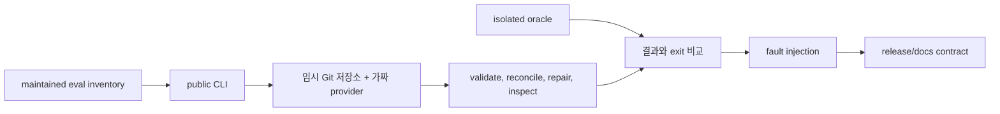

# CPE v3 검사 흐름

결정론적 harness는 실제 유료 모델을 호출하지 않고 v3 모듈과 임시 저장소를
검사합니다.

검사는 이벤트 해시와 replay, 순차 쓰기, 읽기 전용 조사, 모델 attestation,
증거 digest, 소비자 간 오류 코드, 안전한 수리, 조회의 비변경성, 오래된 경로와
과장된 릴리스 문구를 다룹니다.

하네스는 유지 목록의 각 검사가 실제 실행됐는지 확인합니다. 런타임 검사는
production parser, scheduler, validator, repair를 복제하지 않고 public CLI를
호출합니다. isolated oracle은 기대 결과만 계산하며 production projector나
validator를 import할 수 없습니다. 공개 결과는 `PublicResult` 하나이고 exit는
`success=0`, `blocked=1`, `failed=2`로 비교합니다.

`./evals/run.sh` 통과는 유료 라이브 품질 gate 통과를 뜻하지 않습니다. 현재
3.0.0은 integrity closure 중이며, 유료 gate는 별도 명시적 비용 승인 후 4개
treatment와 8개 case를 실행해 성공 보고서를 만들어야 합니다.
