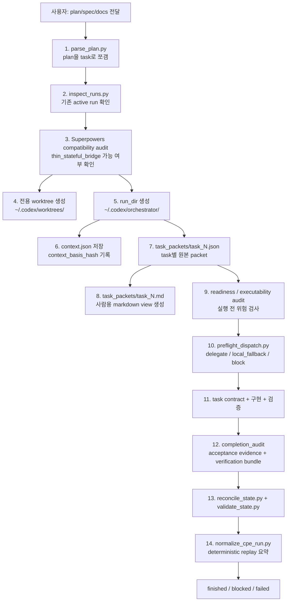
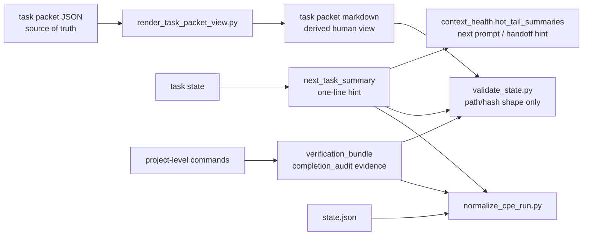
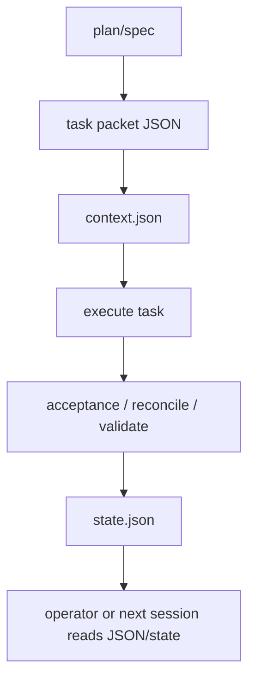
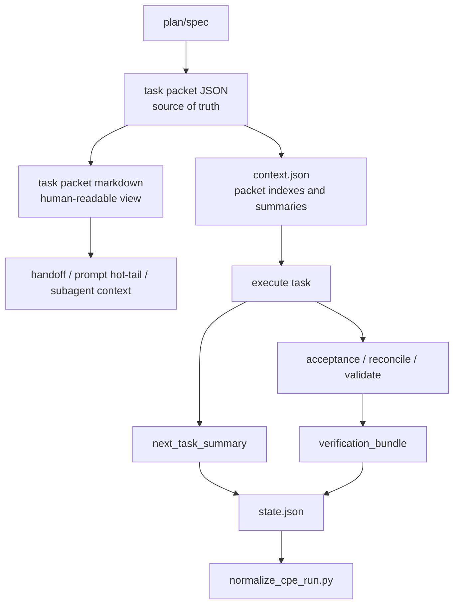

# CPE Human-Readable Harness Flow

이 문서는 2026-07 CPE human-readable harness 작업으로 무엇이 바뀌었는지
설명한다. 주니어 엔지니어가 CPE 전체 흐름을 읽고, 어느 파일을 봐야 하는지,
어떤 데이터가 원본이고 어떤 데이터가 보기 좋게 만든 파생물인지 구분하는 것을
목표로 한다.

## 한 줄 요약

이번 작업 전 CPE는 이미 안전한 실행 상태와 task packet JSON을 갖고 있었다.
하지만 사람이 읽기에는 불편했다. 이번 작업 후에는 같은 JSON 원본에서 사람용
markdown view, 다음 작업 요약, 검증 묶음, replay 요약을 만들고 검증한다.

```text
Before: 안전한 JSON 상태는 있음 -> 사람이 읽고 인수인계하기 불편함
After : JSON 원본은 그대로 유지 -> 사람용 요약/도식/검증 묶음을 파생 생성
```

중요한 원칙은 바뀌지 않았다.

- `state.json`과 `task_packets/task_<N>.json`이 source of truth다.
- `task_packets/task_<N>.md`는 보기 좋게 만든 파생 문서다.
- 사람용 요약은 실행 안전장치를 대체하지 않는다.
- 검증 bundle은 전체 프로젝트 검증을 묶어 보여줄 뿐, task별 acceptance command를
  대체하지 않는다.

## 왜 필요했나

CPE는 계획 문서를 task로 쪼개고, 전용 worktree에서 구현하고, 상태를
`~/.codex/orchestrator/<run_id>/state.json`에 남긴다. 이 구조는 안전하지만
작업자가 매번 JSON과 긴 상태 파일을 읽어야 한다는 문제가 있었다.

특히 다음 상황에서 읽기 비용이 컸다.

- subagent나 다음 세션에 task packet을 넘길 때 원본 JSON을 그대로 읽어야 했다.
- 완료 후 어떤 검증 묶음이 통과했는지 한눈에 보기 어려웠다.
- 다음 task로 넘어갈 때 이전 task의 핵심 요약이 hot tail에 안정적으로 남지 않았다.
- replay 요약은 run 품질을 보지만, 사람용 표면이 얼마나 만들어졌는지는 덜 보였다.
- markdown 정책 케이스가 문서로는 있어도 deterministic eval로 잠기지 않았다.

이번 작업은 이 문제를 "원본 JSON을 더 읽기 쉽게 복제"하는 방식으로 풀었다. 원본을
markdown으로 대체하지 않고, markdown을 원본에서 생성되는 보조 표면으로 둔다.

## 전후 비교

| 영역 | 이전 | 이후 |
|------|------|------|
| task packet | `task_packets/task_<N>.json`이 중심이었다. | JSON은 그대로 원본이고, `task_packets/task_<N>.md` 사람용 view를 생성할 수 있다. |
| 인수인계 | subagent, handoff, prompt hot-tail이 JSON 또는 긴 state를 읽어야 했다. | markdown view와 `next_task_summary`로 핵심 작업, 파일, 검증, 금지사항을 빠르게 읽는다. |
| state schema | task packet hash와 spec section은 있었지만 view 경로/해시는 없었다. | `task_packet_view_path`, `task_packet_view_sha256`, `next_task_summary`, `context_health.hot_tail_summaries`를 검증한다. |
| 완료 검증 | `completion_audit.verification_evidence`가 문자열 중심이어도 충분했다. | `class=verification_bundle` 객체로 전체 eval, compile, shell syntax 같은 command bundle을 구조화한다. |
| residual risk | 일부 risk class만 허용했다. | `environment_gap`, `test_scope_gap`, `third_party_drift`, `manual_review_needed`, `known_executor_debt` 같은 advisory class가 추가됐다. |
| replay | terminal state, run quality, dispatch reason, risk class 중심이었다. | verification bundle 이름, evidence class, task summary count, hot-tail summary count도 정규화한다. |
| eval coverage | task packet JSON과 실행 state 중심이었다. | human view, summary, markdown golden cases, verification bundle을 `./evals/run.sh`에 포함했다. |

## 전체 흐름

아래는 interactive/headless 실행에서 CPE가 대략 어떤 순서로 움직이는지 보여준다.



### 주니어용 설명

CPE를 "일감 관리자"라고 보면 이해하기 쉽다.

1. 사용자가 큰 계획서를 준다.
2. CPE가 계획서를 작은 일감으로 나눈다.
3. 각 일감마다 "어떤 파일을 읽고, 어떤 파일만 고치고, 어떻게 검증할지"를 적은
   task packet JSON을 만든다.
4. 이번 작업부터는 그 JSON을 사람이 읽기 쉬운 markdown으로도 만든다.
5. 실행 전에는 위험한 일감인지 검사한다.
6. 안전하면 직접 하거나 subagent에 맡긴다.
7. 끝나면 검증 결과를 `completion_audit`에 남긴다.
8. 마지막에는 state validator와 replay normalizer가 "기록이 말이 되는지" 검사한다.

## 이번 작업이 추가한 데이터 흐름



이 그림에서 가장 중요한 점은 화살표 방향이다. markdown view와 summary는 JSON/state에서
나온다. 반대로 markdown이 JSON/state를 덮어쓰거나 대신하지 않는다.

## 새로 생긴 핵심 구성요소

### `scripts/render_task_packet_view.py`

task packet JSON을 markdown으로 렌더링한다. 출력은 다음 섹션을 포함한다.

- `읽을 파일`
- `작업`
- `AC`
- `검증`
- `금지사항`
- `Context Notes`

렌더러는 필수 top-level field가 없으면 실패한다. 예를 들어 `write_policy`가 없으면
사람용 문서를 억지로 만들지 않고 오류를 낸다. 이 덕분에 잘못된 packet이 조용히
handoff로 흘러가는 일을 줄인다.

### `task_packet_view_path`와 `task_packet_view_sha256`

각 task state가 생성된 markdown view의 위치와 해시를 기록할 수 있다.

```json
{
  "task_packet_view_path": "<run_dir>/task_packets/task_0.md",
  "task_packet_view_sha256": "64-character sha256"
}
```

validator는 이 값이 비어 있지 않은지, 경로가 `.codex/orchestrator` 아래인지, 해시가
64자 sha256 모양인지 검사한다. markdown 내용 자체를 source of truth로 신뢰하지는 않는다.

### `next_task_summary`와 `hot_tail_summaries`

task가 끝났을 때 다음 prompt나 handoff에 넣기 좋은 한 줄 요약을 저장할 수 있다.

```json
{
  "tasks": {
    "task_0": {
      "next_task_summary": "Rendered task_0 view and validated summary storage."
    }
  },
  "context_health": {
    "hot_tail_summaries": [
      {
        "task_id": "task_0",
        "summary": "Rendered task_0 view and validated summary storage."
      }
    ]
  }
}
```

검증 규칙은 의도적으로 보수적이다.

- 한 줄이어야 한다.
- 알려진 task id를 참조해야 한다.
- `sk-`, `/Users/`, `BEGIN FULL PROMPT` 같은 durable output 금지 패턴을 담으면 안 된다.
- task status, acceptance evidence, dispatch decision, completion audit을 대체할 수 없다.

### `verification_bundle`

완료 audit 안에 프로젝트 단위 검증 묶음을 구조화해서 넣을 수 있다.

```json
{
  "class": "verification_bundle",
  "name": "cpe_skill_change",
  "commands": [
    "./evals/run.sh",
    "python3 -m py_compile scripts/*.py evals/*.py",
    "bash -n evals/run.sh"
  ],
  "status": "passed",
  "required": false
}
```

이건 "전체 검증 묶음이 어떻게 됐는지" 보여주는 증거다. task별 acceptance command를
없애거나 생략하기 위한 필드가 아니다.

### `scripts/normalize_cpe_run.py` replay 확장

replay 요약이 다음 값도 보게 됐다.

- `verification_evidence_classes`
- `verification_bundle_names`
- `task_summary_count`
- `hot_tail_summary_count`

즉, 이제 replay는 "완료됐는가"뿐 아니라 "사람용 인수인계 표면과 검증 bundle이
상태에 남았는가"도 확인한다.

## 실행 전후를 플로우로 비교하기

### 이전 흐름



이전 흐름도 안전했다. 문제는 마지막 단계였다. 사람이 JSON/state를 직접 읽어야 해서
handoff와 디버깅 비용이 컸다.

### 이후 흐름



이후 흐름은 읽기 좋다. 하지만 안전 기준은 더 약해지지 않았다. JSON/state는 계속
원본이고, markdown과 summary는 파생물이다.

## 검증이 막아주는 실패 모드

| 검증 | 막는 문제 |
|------|-----------|
| `check_task_packet_view.py` | markdown view가 필수 섹션을 빠뜨리거나 full-spec fallback을 숨기는 문제 |
| `check_context_summary.py` | 다음 task 요약이 여러 줄이거나, 모르는 task를 가리키거나, 금지 패턴을 담는 문제 |
| `check_markdown_golden_cases.py` | dirty related worktree, ambiguous resume, unsafe verification 같은 정책 케이스가 문서에서 드리프트하는 문제 |
| `check_verification_bundle.py` | 검증 bundle에 이름, command, status가 빠지는 문제 |
| `check_cpe_replay.py` | replay가 bundle, summary, forbidden pattern을 놓치는 문제 |
| `validate_state.py` | finished state가 사람이 보기 좋은 필드만 있고 실제 completion evidence가 부족한 문제 |

## 이번 병합에서 확인한 명령

병합된 `main`에서 다음 검증을 통과했다.

```bash
bun install --frozen-lockfile
bun run check
cd skills/kws-codex-plan-executor && ./evals/run.sh
cd skills/kws-codex-plan-executor && python3 -m py_compile scripts/*.py evals/*.py
cd skills/kws-codex-plan-executor && bash -n evals/run.sh
git diff --check
python3 skills/kws-codex-plan-executor/scripts/check_graphify_freshness.py \
  --repo-root <repo-root> \
  --update-ran \
  --output /tmp/cpe-human-harness-main-graphify-after.json
```

`bun run check` 결과는 `820 pass`, `10 skip`, `0 fail`이었다.

## 파일별로 어디를 보면 되나

| 파일 | 역할 |
|------|------|
| `scripts/render_task_packet_view.py` | task packet JSON을 사람용 markdown으로 변환한다. |
| `scripts/validate_state.py` | 새 state 필드, verification bundle, summary, residual risk class를 검증한다. |
| `scripts/normalize_cpe_run.py` | run state를 deterministic replay JSON으로 요약한다. |
| `evals/check_task_packet_view.py` | markdown view가 핵심 섹션과 fallback 경고를 보존하는지 검사한다. |
| `evals/check_context_summary.py` | `next_task_summary`와 `hot_tail_summaries` 규칙을 검사한다. |
| `evals/check_markdown_golden_cases.py` | markdown 정책 케이스가 필수 섹션과 기대 결정을 갖는지 검사한다. |
| `evals/check_verification_bundle.py` | structured verification bundle 형식을 검사한다. |
| `evals/check_cpe_replay.py` | replay 요약이 새 필드를 놓치지 않는지 검사한다. |
| `docs/state-and-logging.md` | state와 human-readable task surface의 운영 의미를 설명한다. |
| `references/execution-cycle.md` | 실행 순서에서 human view 생성과 bundle 기록 시점을 설명한다. |
| `references/state-schema.md` | 새 state 필드와 JSON 예시를 설명한다. |

## 버전 관리 관점에서 보면

이번 작업은 CPE의 문서와 검증 표면을 넓혔다. 그래서 앞으로는 CPE 업데이트마다
버전 관리 기준을 더 명확히 두는 것이 좋다.

권장 기준은 다음과 같다.

- state schema나 실행 contract가 바뀌면 `SKILL.md` metadata version을 올린다.
- 새 state field를 추가하면 `references/state-schema.md`와 `validate_state.py`를 같이 바꾼다.
- 새 실행 단계가 생기면 `references/execution-cycle.md`와 `docs/how-it-works.md`를 같이 바꾼다.
- 새 검증기가 생기면 `docs/evals-and-verification.md`와 `evals/run.sh`에 같이 넣는다.
- 사람용 설명이 필요한 큰 변화는 `docs/*.ko.md`에 별도 explanation 문서로 남긴다.

이번 작업은 이 기준이 왜 필요한지 보여준다. 기능은 작아 보여도 실제로는 state,
handoff, replay, verification, docs가 함께 움직인다.

## 주니어가 기억할 규칙

1. CPE에서 원본은 JSON이다. markdown은 읽기 좋은 복사본이다.
2. 사람이 보기 좋은 필드를 추가해도 validator가 통과해야 한다.
3. 한 줄 summary에는 secret, 절대 home path, full prompt를 넣으면 안 된다.
4. verification bundle은 전체 검증 묶음이고, task별 acceptance evidence는 따로 남긴다.
5. 실행 흐름을 바꾸면 문서, state schema, eval, replay를 같이 갱신해야 한다.
6. `./evals/run.sh`는 CPE 변경의 기본 안전망이다.
