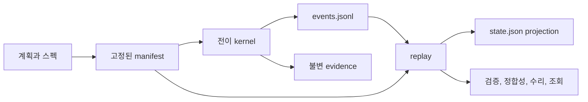

# CPE v3 멘탈 모델

CPE를 “기록이 먼저인 계획 실행기”로 이해하면 됩니다.



핵심은 세 가지입니다.

1. 계획, 스펙, 모델 정책은 실행 시작 때 manifest에 고정합니다.
2. 상태 변화는 먼저 `events.jsonl`에 기록합니다. `state.json`은 이벤트를
   다시 읽어 언제든 만들 수 있는 화면용 현재 상태입니다.
3. 모델 출력은 바로 상태가 되지 않습니다. 실행 kernel이 증거와 정책을
   확인한 뒤 이벤트를 추가합니다.

## 작업 흐름

```text
계획 파싱
  → 읽기 전용 사전 점검
  → 별도 worktree 생성
  → 명시적 task/spec 매핑과 작업 패킷
  → Sol 구현
  → Sol 리뷰
  → 결정론적 명령 실행
  → Sol 검증 판단
  → 필요하면 Sol 수리와 재검증
  → 전체 diff 리뷰와 완료 gate
```

파일을 쓸 수 있는 작업은 순서대로 실행합니다. Terra/high는 자료 위치나 관련
코드처럼 읽기 전용 사실만 조사할 수 있고, 구현·리뷰·완료 판정을 할 수
없습니다.

## 장애를 보는 법

- 이벤트는 정상이고 현재 상태 파일만 다르면 replay로 복원할 수 있습니다.
- 이벤트 해시가 깨졌거나 입력 해시가 바뀌면 자동 수리 대상이 아닙니다.
- 모델 attestation, 검증 증거, 파일 범위가 하나라도 맞지 않으면 완료를
  기록할 수 없습니다.
- 이전 스키마는 내용을 해석해 새 상태로 바꾸지 않고
  `unsupported_schema`로만 분류합니다.

## 릴리스 상태를 보는 법

결정론적 검사 통과와 유료 라이브 품질 gate 통과는 별개입니다. 현재 상태는
`deterministic-ready; paid-live-pending`입니다. 실제 유료 매트릭스가 명시적
비용 승인 후 통과하기 전에는 “3.0.0 라이브 검증 완료”라고 해석하면 안 됩니다.
