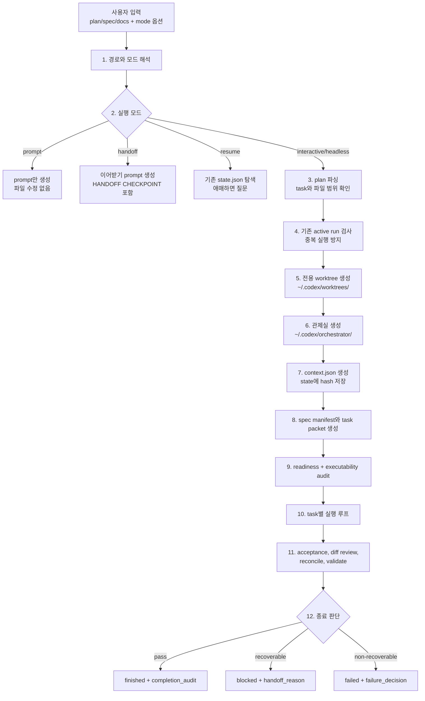
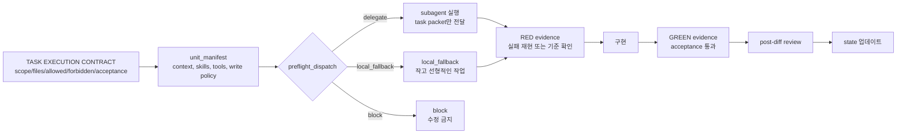
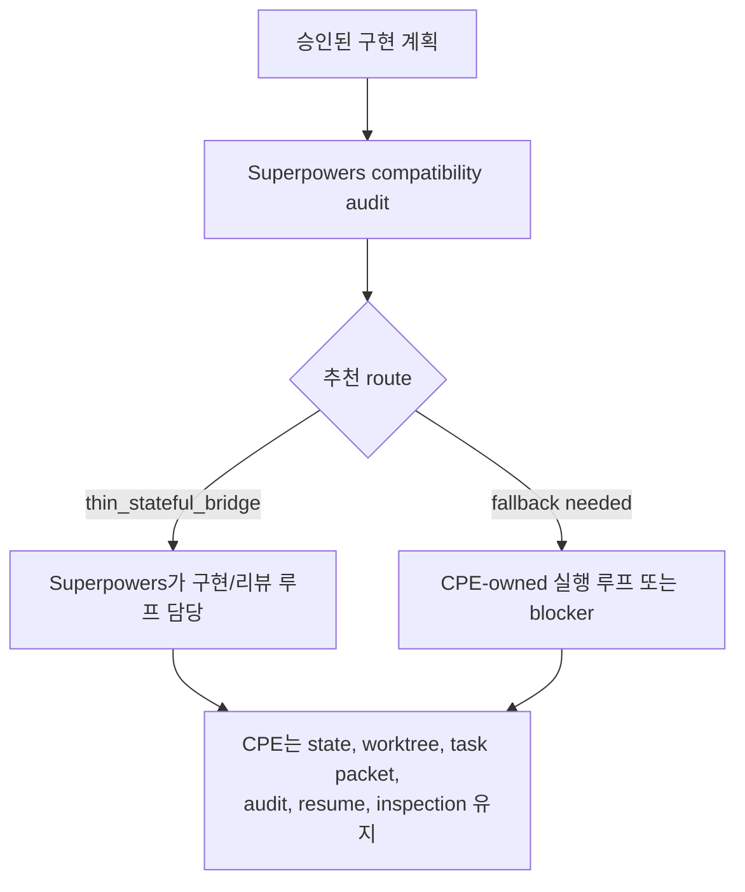
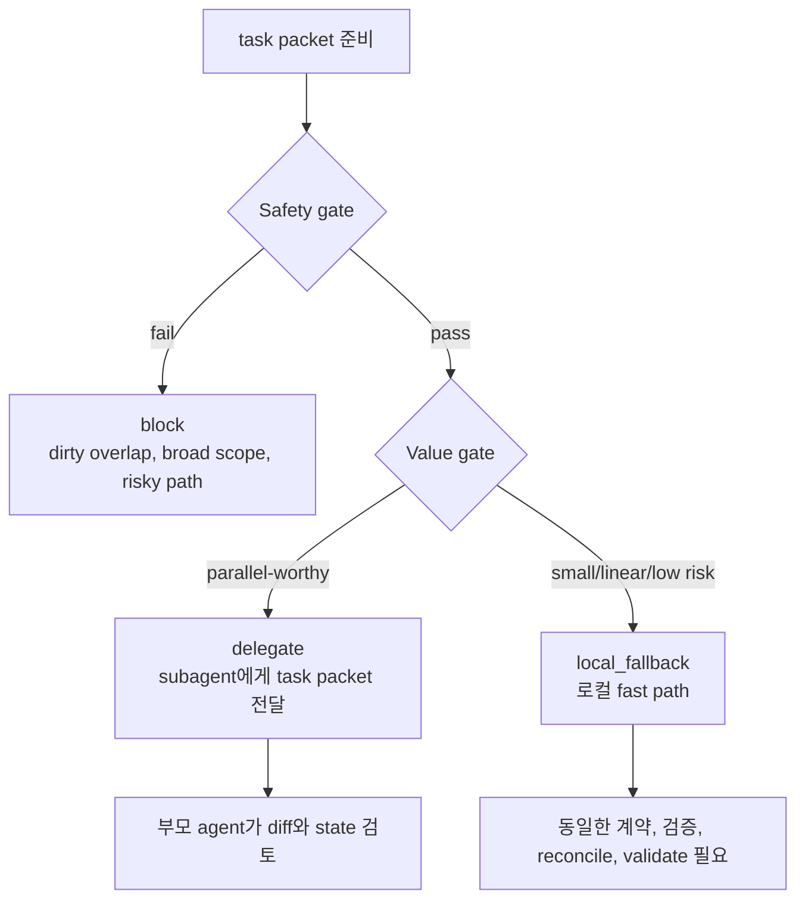
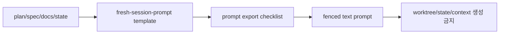

# CPE 주니어 멘탈 모델

`kws-codex-plan-executor`, 줄여서 CPE는 "계획서를 보고 안전하게 구현을
진행하게 해주는 실행 관리자"입니다. 직접 코드를 마음대로 고치는 도구라기보다,
계획을 작은 작업 티켓으로 나누고, 격리된 작업실에서 실행하고, 상태와 검증 증거를
남기는 운영 루프에 가깝습니다.

한 문장으로 보면:

```text
계획서(plan) -> 작업 티켓(task packet) -> 격리 작업실(worktree)
-> 작업 계약(task contract) -> 구현/검증 -> 완료 감사(completion audit)
```

## 먼저 잡을 비유

| CPE 용어 | 주니어에게 설명하면 | 왜 필요한가 |
| --- | --- | --- |
| `plan` | 해야 할 일 목록이 적힌 주문서 | 무엇을 만들지 정합니다. |
| `spec/docs` | 주문서 옆의 상세 요구사항과 참고 문서 | 작업자가 추측하지 않게 합니다. |
| `run_id` | 이번 실행의 접수 번호 | 상태, 작업실, 로그를 한 묶음으로 찾게 합니다. |
| `worktree` | 원래 repo와 떨어진 별도 작업실 | `main`이나 사용자의 현재 checkout을 망가뜨리지 않습니다. |
| `orchestrator dir` | 관제실 서랍 | `state.json`, `context.json`, 감사 결과를 저장합니다. |
| `state.json` | 관제판의 현재 상태 | 어디까지 했고 무엇이 막혔는지 권위 있게 기록합니다. |
| `task packet` | 한 작업자에게 줄 작업 티켓 | 전체 계획 대신 필요한 범위만 전달합니다. |
| `TASK EXECUTION CONTRACT` | 작업 시작 전 5줄 안전 계약 | 수정 범위와 검증 기준을 먼저 잠급니다. |
| `completion_audit` | 종료 전 납품 검사표 | 실제로 끝났는지 증거로 확인합니다. |

## 전체 흐름



`prompt`와 `handoff`는 export-only입니다. 이 모드에서는 worktree도 만들지 않고
`~/.codex/orchestrator` 아래 state도 만들지 않습니다. 반대로 `interactive`와
`headless`는 실제 실행 모드이므로 worktree, state, context, audit가 필요합니다.

## 실행 화면처럼 보면

```text
┌──────────────────────── CPE RUN ────────────────────────┐
│ run_id: feature-x-20260703-141500                       │
│ mode: interactive                                       │
│ route: thin_stateful_bridge or CPE-owned fallback       │
├─────────────────────── 작업실 ──────────────────────────┤
│ code:  ~/.codex/worktrees/feature-x-20260703-141500     │
│ state: ~/.codex/orchestrator/feature-x-20260703-141500  │
├─────────────────────── 현재 태스크 ─────────────────────┤
│ task: task_0                                            │
│ packet: task_packets/task_0.json                        │
│ allowed edits: packages/foo/**, tests/foo/**             │
│ forbidden edits: bun.lock, secrets, unrelated files      │
├─────────────────────── 검증 상태 ───────────────────────┤
│ context_health: green                                   │
│ readiness: green                                        │
│ plan_executability: yellow with operator decision        │
│ completion_audit: pending                               │
└─────────────────────────────────────────────────────────┘
```

중요한 점은 작업 코드와 실행 상태가 다른 곳에 저장된다는 것입니다.

```text
~/.codex/
  worktrees/<run_id>/       # repo 파일과 git metadata만 둡니다.
  orchestrator/<run_id>/    # state.json, context.json, task_packets, logs
```

이 분리는 사고를 줄입니다. 작업자는 격리된 worktree에서만 코드를 바꾸고,
오케스트레이터는 별도 디렉터리에 상태와 증거를 남깁니다.

## 모드별로 하는 일

| 모드 | 쉽게 말하면 | CPE가 하는 일 | 수정 가능 여부 |
| --- | --- | --- | --- |
| `interactive` | 현재 Codex 세션에서 구현 | 격리 worktree, task packet, audit, state 관리 | 가능 |
| `headless` | 새 `codex exec` 같은 비대화 실행 | fresh prompt bootstrap, 구조화된 결과, state 관리 | sandbox에 따름 |
| `prompt` | 새 세션에 붙여넣을 실행 prompt 만들기 | 템플릿 채우기와 checklist | 불가 |
| `handoff` | 이어받기용 prompt 만들기 | `HANDOFF CHECKPOINT`와 state 경로 포함 | 불가 |
| `resume` | 멈춘 실행 이어가기 | `~/.codex/orchestrator/*/state.json` 탐색 | 기존 run 기준 |

## Interactive 실행의 내부 루프



작업마다 먼저 5줄 `TASK EXECUTION CONTRACT`가 필요합니다.

```text
scope: 이번 task의 목적
files_to_inspect: 먼저 읽을 파일
allowed_edits: 바꿔도 되는 파일 범위
forbidden_edits: 절대 건드리면 안 되는 파일 범위
acceptance_command_or_honest_substitute: 끝났다고 판단할 검증 명령 또는 대체 근거
```

이 계약이 없으면 CPE는 실행을 시작하면 안 됩니다. 이유는 단순합니다. 작업 범위와
검증 기준을 먼저 잠그지 않으면, agent가 전체 repo를 넓게 추측하며 바꿀 수 있기
때문입니다.

## Superpowers Bridge는 무엇인가

최신 CPE는 interactive 구현에서 Superpowers와 경쟁하지 않습니다. 먼저
`scripts/audit_superpowers_compatibility.py`로 현재 Superpowers 실행 루프와 CPE의
상태 계약이 맞는지 확인합니다.



즉, Superpowers가 실제 implementer/reviewer 흐름을 더 잘 제공하면 그 루프를 쓰고,
CPE는 실행의 장부와 안전 장치를 담당합니다. `prompt`, `handoff`, `headless`,
`resume`, `inspection`은 여전히 CPE가 소유합니다.

## Subagent 판단은 감이 아니라 preflight 결과

기본값은 `subagents=on`입니다. 하지만 모든 일을 무조건 subagent에게 던지는 뜻은
아닙니다. CPE는 먼저 안전한지 보고, 그 다음 맡길 가치가 있는지 봅니다.



`local_fallback`은 "검증 생략"이 아닙니다. subagent spawn과 review 루프만 줄일 뿐,
task contract, unit manifest, acceptance command, diff review, reconciliation,
state validation은 그대로 필요합니다.

## 상태 파일을 읽는 감각

`state.json`은 CPE 실행의 source of truth입니다. 사람이 긴 transcript를 다시 읽지
않아도 run의 현재 위치를 판단하게 해줍니다.

| 보고 싶은 것 | state에서 보는 대표 필드 |
| --- | --- |
| 이번 run이 무엇인가 | `run_id`, `mode`, `plan`, `execution_worktree` |
| 지금 어디까지 왔나 | `current_task`, `current_phase`, `last_completed_task` |
| context가 안전한가 | `context_snapshot_path`, `context_basis_hash`, `context_health` |
| subagent를 썼나 | `subagents_requested`, `dispatch_decisions`, `subagent_runs` |
| 막혔나 | `current_blocker`, `handoff_reason`, `failure_decision` |
| 정말 끝났나 | `lifecycle_outcome`, `completion_audit`, `run_quality` |
| 검증 증거가 있나 | `verification`, `completion_audit.verification_evidence` |

완료 상태에서 중요한 규칙:

- `lifecycle_outcome=finished`이면 `completion_audit.passed=true`여야 합니다.
- 완료된 write-capable task는 `subagent_strategy`가 있어야 합니다.
- `dispatch_decisions`에 unresolved `block`이 남으면 안 됩니다.
- `completion_audit.residual_risk`는 리스트여야 하며, release-blocking risk를
  숨기면 안 됩니다.
- Graphify audit를 기록했다면 completion audit의 verification evidence에서도
  연결해야 합니다.

## 실행 전 audit는 왜 많은가

CPE는 일을 시작하기 전에 read-only audit를 먼저 돌립니다.

| Audit | 언제 | 잡아내는 문제 |
| --- | --- | --- |
| run readiness | task packet 생성 뒤 | acceptance 누락, write scope 형식 오류, context budget 압박 |
| plan executability | task contract 전 | 파일 범위 누락, 너무 넓은 write glob, risky path, full-spec fallback |
| prompt cache audit | prompt 생성/완료 전 | stable prefix에 동적 경로와 timestamp가 섞인 문제 |
| Graphify audit | repo 지침이 있을 때 | graphify output이 현재 HEAD와 맞는지 |
| state validation | 완료 전 | state schema, task, audit, completion evidence 불일치 |

이 audit들은 구현을 느리게 하려는 장치가 아니라, 실패를 늦게 발견하지 않게 하는
장치입니다. 특히 plan이나 task packet이 부실하면 파일을 건드리기 전에 멈춥니다.

## Stop Rule을 직관적으로 이해하기

CPE는 다음 상황에서 멈추는 것이 정상입니다.

| 상황 | 왜 멈추나 |
| --- | --- |
| plan을 읽을 수 없음 | 주문서가 없으니 실행 기준이 없습니다. |
| `Files:` 같은 파일 범위가 없음 | 어디를 바꿔도 되는지 알 수 없습니다. |
| 관련 dirty file이 있음 | 사용자 변경을 덮어쓸 수 있습니다. |
| dedicated worktree를 못 만듦 | 원본 checkout에서 구현하면 안전 경계가 깨집니다. |
| acceptance 기준이 불명확함 | 끝났다고 말할 증거가 없습니다. |
| 같은 root cause로 검증 실패가 반복됨 | 무한 재시도 대신 handoff가 필요합니다. |

멈춤은 실패가 아닙니다. 안전한 실행을 위해 "지금은 사람이 결정을 내려야 한다"는
상태를 명확하게 기록하는 것입니다.

## Prompt와 Handoff는 실행이 아니다

`prompt`와 `handoff` 모드는 문서를 만들어 반환하는 export 기능입니다.



`handoff`는 반드시 `HANDOFF CHECKPOINT`를 포함해야 합니다. 그래야 다음 세션이
어떤 state에서 이어받아야 하는지 찾을 수 있습니다.

## 완료라고 말하기 전 체크리스트

```text
[ ] task별 TASK EXECUTION CONTRACT가 기록됐다.
[ ] task packet과 state가 서로 맞다.
[ ] acceptance command 또는 honest substitute가 있다.
[ ] diff가 allowed_edits 밖으로 새지 않았다.
[ ] reconcile_state.py --check가 통과했다.
[ ] validate_state.py가 통과했다.
[ ] completion_audit가 list-shaped evidence를 가진다.
[ ] residual risk가 release-blocking이 아니거나 명확히 차단됐다.
[ ] Graphify가 필요한 repo라면 audit evidence가 completion audit에 연결됐다.
```

## 흔한 오해

| 오해 | 실제 |
| --- | --- |
| CPE는 그냥 자동 구현 봇이다. | CPE는 계획 실행의 상태, 범위, 검증을 관리하는 실행 관리자입니다. |
| `subagents=on`이면 항상 delegate한다. | 안전성과 가치가 모두 있어야 delegate합니다. |
| `local_fallback`이면 품질 게이트를 줄인다. | spawn만 줄이고 검증 게이트는 유지합니다. |
| `state.json`은 로그 중 하나다. | `state.json`이 권위 소스이고 transcript는 보조 정보입니다. |
| prompt/handoff도 실행 run이다. | export-only라서 worktree와 orchestrator artifact를 만들면 안 됩니다. |
| AgentLens가 실패하면 run도 실패다. | AgentLens는 best-effort입니다. state validation이 더 중요합니다. |

## 파일별 역할 지도

| 파일 | 역할 |
| --- | --- |
| `SKILL.md` | 최상위 실행 계약과 모드별 필수 규칙 |
| `README.md` | 빠른 개요, 기본값, 검증 명령 |
| `ARCHITECTURE.md` | 구조와 책임 분리 |
| `docs/how-it-works.md` | 압축된 실행 흐름 |
| `docs/user-guide.ko.md` | 운영자용 한국어 사용 가이드 |
| `docs/state-and-logging.md` | state, logging, run quality 필드 설명 |
| `references/execution-cycle.md` | interactive/headless 실행 순서 |
| `references/mode-contracts.md` | 모드별 소유권과 금지 사항 |
| `references/pre-dispatch-pipeline.md` | delegate/local_fallback/block 판단 |
| `references/state-schema.md` | `state.json` 검증 기준 |

처음 읽는 사람은 이 문서로 큰 그림을 잡고, 실제 수정이나 실행을 할 때는
`SKILL.md`와 해당 `references/*` 문서를 기준으로 확인하면 됩니다.
